<link href="github.css" rel="stylesheet"></link>

 Mambaを知ろう 

「Transformer一強の時代」ーーーあらゆる最新LLMはアーキテクチャとしてTransformerを採用していて，隠れ層の次元数や活性化関数，学習データの品質などで差別化を図っています．
そんな中，Mambaという全く新しい手法が登場しました．
ざっと調べただけでも「**Transformerを凌駕しうる**」　「**RNNとTransformerの良いところ取り**」などの魅力的なワードが見られます．
そこで，そんな注目の最新手法Mambaについて解説していこうと思います．

 目次 

- [0. 注意](#0-注意)
- [1. はじめに](#1-はじめに)
- [2. 事前知識](#2-事前知識)
  - [2.1. RNN](#21-rnn)
  - [2.2. LSTM](#22-lstm)
- [3. LMU (Legendre Memory Unit)](#3-lmu-legendre-memory-unit)
  - [ルジャンドル多項式による近似](#ルジャンドル多項式による近似)
    - [ルジャンドル多項式とは？](#ルジャンドル多項式とは)
    - [ルジャンドル多項式による関数近似](#ルジャンドル多項式による関数近似)
    - [なぜ入力を近似するのか？](#なぜ入力を近似するのか)
  - [LMUの工夫](#lmuの工夫)
- [HiPPO (Higher-order polynomial projection operations)](#hippo-higher-order-polynomial-projection-operations)
  - [問題設定](#問題設定)
  - [HiPPOフレームワーク](#hippoフレームワーク)
  - [HiPPOの具体化](#hippoの具体化)
    - [HiPPO-LegT (Translated Legendre)](#hippo-legt-translated-legendre)
    - [HiPPO-LagT (Translated Laguerre)](#hippo-lagt-translated-laguerre)
    - [HiPPO-LegS (Scaled Legendre)](#hippo-legs-scaled-legendre)
  - [離散化](#離散化)
  - [HiPPO-LegSの性質](#hippo-legsの性質)
  - [実験](#実験)
- [LSSL (Linear State-Space Layers)](#lssl-linear-state-space-layers)
  - [定式化](#定式化)
  - [LSSL ⇔ RNN](#lssl--rnn)
    - [LSSL ⇒ RNN](#lssl--rnn-1)
    - [RNN ⇒ LSSL](#rnn--lssl)
  - [LSSL ⇔ Convolution](#lssl--convolution)
    - [LSSL ⇒ Convolution](#lssl--convolution-1)
    - [Convolution ⇒ LSSL](#convolution--lssl)
  - [表現力](#表現力)
  - [学習](#学習)
- [S4](#s4)
  - [対角化のモチベーション](#対角化のモチベーション)
  - [Normal Plus Low-Rank (NPLR)とDiagonal Plus Low-Rank (DPLR)](#normal-plus-low-rank-nplrとdiagonal-plus-low-rank-dplr)
  - [計算アルゴリズム](#計算アルゴリズム)
    - [定式化](#定式化-1)
    - [アルゴリズムの詳細](#アルゴリズムの詳細)
  - [アーキテクチャ](#アーキテクチャ)
  - [実験結果](#実験結果)
    - [Long Range Arena](#long-range-arena)
    - [時系列予測](#時系列予測)
    - [画像・テキスト](#画像テキスト)
  - [考察](#考察)
- [Mamba vs Transformer](#mamba-vs-transformer)

# 0. 注意
解説中たくさんの数式が出てきますが，数学的な知識が乏しいため，完全に理解できていなかったり，数学的に正確な表現ではなかったりすると思います．
また，note機能を使って，ちょっとした解説や脱線，小言などを挟むので若干読みにくいものになってしまうかもしれません．

>[!NOTE]
>小言

これらの点にご了承ください．

# 1. はじめに
Mambaは理論にガチガチに固められた手法です．
そのため，Mambaの論文だけを解説するのではなく，Mambaにいたる軌跡をたどることで理解を深めていきます．
ここでは以下の流れに沿って解説します．

1. LMU (Legendre Memory Unit)　　*NeurIPS 2019
2. HiPPO (Higher-order polynomial projection operations)　　*NeurIPS 2020
3. LSSL (Linear State Space Layer)　　*NeurIPS 2021
4. S4 (Structured State Space Sequence model)　　*ICLR 2022
5. Mamba

錚々たる顔ぶれです．
怖いです．  
ちなみに，LMUを除く全ての論文の第一著者が同じ人です．（すごい）

# 2. 事前知識
本題に入る前に事前知識について確認していきましょう．
できる限り事前知識を必要としないように解説していきますが，RNNとLSTMについては軽くでも知っておいた方がいいので触れておきます．
RNNとLSTMについてある程度の理解がある人はこのセクションを飛ばしてください．

## 2.1. RNN
後で書く

## 2.2. LSTM
後で書く

# 3. LMU (Legendre Memory Unit)
LMUとはLSTMの改良手法のようなものです．
手法のミソは**入力信号をルジャンドル多項式によって近似する**ところにあります．
これにより効率的にデータを記憶することができ，長期的な依存関係を学習することができるそうです．
それでは詳細を見ていきましょう．

<section style="text-align: center;">

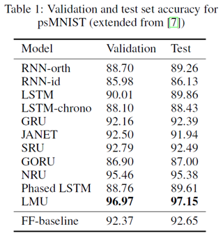

</section>

## ルジャンドル多項式による近似
### ルジャンドル多項式とは？
ルジャンドル多項式とは，「ルジャンドルの微分方程式」を満たすルジャンドル関数のうち次数が非負整数のものを言い，次のような形をしています．

$$ P_n(x) = \frac{1}{2^n n!} \frac{d^n}{dx^n} \left( (x^2 - 1)^n \right) $$

この数式はロドリゲスの公式による表現らしいですが，結構分かりにくい気がします．
そこで帰納的定義にしたがった形も紹介します．

$$  P_n(x) = 2^{n} \cdot \sum_{k=0}^{n} x^{k} \binom{n}{k} \binom{\frac{n+k-1}{2}}{2} $$

こっちの方が個人的には分かりやすいです．
$n$に具体的な数字を入れてみると次のような多項式が得られます．

$$ \begin{align*}
P_0(x) &= 1, \\
P_1(x) &= x, \\
P_2(x) &= \frac{1}{2} (3x^2 - 1), \\
P_3(x) &= \frac{1}{2} (5x^3 - 3x), \\
P_4(x) &= \frac{1}{8} (35x^4 - 30x^2 + 3), \\
P_5(x) &= \frac{1}{8} (63x^5 - 70x^3 + 15x).
\end{align*} $$

図示するとこんな感じ．なかなか美しいですね．

<section style="text-align: center;">

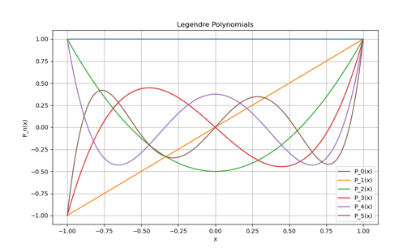  
*図2　ルジャンドル多項式*

</section>

図を見て気付いた人もいるかもしれませんが，ルジャンドル多項式は区間 $[-1,1]$ に対して定義されています．
そして重要なのは，ルジャンドル多項式は**直交多項式系**の1つということです．
直交多項式系については後ほど詳しく触れますが，「直交」とは2つの多項式 $P_n,P_m(n\neq m)$ について以下が成り立つことをいいます．

$$ \langle P_n, P_m \rangle = \int P_n(x)P_m(x)dx = 0 $$

### ルジャンドル多項式による関数近似
ルジャンドル多項式によって関数 $f(x)$ を近似するとき，次の式が成り立ちます．

$$
f(x) \approx \sum_{n=0}^{N-1} c_n P_n(x) \\
c_n = \frac{2n + 1}{2} \int_{-1}^{1} f(x)P_n(x)dx
$$

$f(x)$をルジャンドル多項式の線形和によって表現し，その係数が $c_n$ になっています．

こんなのでちゃんと近似できるのかと思いましたが，しっかり近似できるようです．
以下は，$f(x)=\sin(\pi x) + \sin(2\pi x) + \sin(3\pi x)$ を近似した様子です．
$N$が大きくなるほど，近似の精度が高いことが分かるかと思います．

<section style="text-align: center;">

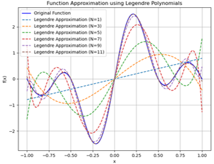  
*図2　ルジャンドル多項式による近似*

</section>

### なぜ入力を近似するのか？
さて，ここまではルジャンドル多項式がどのようなもので，どうやって関数近似するかを見てきました．
しかし，なぜ入力信号をルジャンドル多項式で近似するのでしょうか？
それには，「情報の圧縮」と「情報の分離」という2つの大きなメリットがあります．

まずは「情報の圧縮」についてですが，LMUでは入力信号が連続的だった場合を考えています．
連続的ということは，$\varDelta t = 0$ でデータが入力されるということであり，膨大なデータポイントを扱うことになります．
しかしメモリは有限です．
連続的な信号を扱うことができません．
これを有限のメモリで対処するための手段として，ルジャンドル多項式で近似するのです．
ルジャンドル多項式で近似すると，その係数をベクトルとして保存すれば，入力信号の特性を保持することができます．
そしてこれが「情報の圧縮」になるというわけです．

次に「情報の分離」についてです．
先ほど，ルジャンドル多項式は直交多項式であるという話をしました．
多項式が直交するということは，他の多項式と独立した情報を持つということです．
そのため，抽出した係数は互いに独立した情報を保持しており，効率的に情報を得ることができるのです．

## LMUの工夫
ここまで「ルジャンドル多項式とは何か？」から「どうして入力を近似するのか？」までの流れを見てきましたが，実は大きな落とし穴があります．
それは，係数 $c_n$ を計算することが難しいということです．
理由は連続信号を仮定しているため， $f(x)$ を保持するために膨大なメモリが必要になるからです．
連続信号を扱うためには，オンラインで信号を受け取り，過去の信号は捨てていかなければなりません．

ということでここまでの話は使い物にならなくなりました．（完）

・・・

さすがに終われないですね．
LMUでは，係数 $c_n$ の更新式を導きました．
それがこちら．

$$
\theta \dot{\mathbf{m}}(t) = \mathbf{A} \mathbf{m}(t) + \mathbf{B} u(t)
$$
$$
\begin{align*}
\mathbf{A} &= \begin{bmatrix} a \end{bmatrix}_{ij} \in \mathbb{R}^{d\times d}, \quad a_{ij} = (2i+1)\begin{cases} -1 & \text{ if } i < j \\ (-1)^{i-j+1} & \text{ if } i \geq j \end{cases} \\

\mathbf{B} &= \begin{bmatrix} b \end{bmatrix}_{ij} \in \mathbb{R}^{d\times 1}, \quad b_i = (2i+1)(-1)^i
\end{align*} \\
\quad i,j\in [0,d-1]
$$

$\mathbf{m}=[c_n]_{n=0,...,N-1}$ です．
なんのこっちゃ．

かろうじて分かることは， $c_n$ に関する線形常微分方程式を導いているということです．

# HiPPO (Higher-order polynomial projection operations)
HiPPOはLMUを一般化した手法といえます．
HiPPOの流れは大まかに以下のようになります．
1. 入力信号 $f(x)$ を近似する
2. 近似式から係数 $c_n$ を抽出する
3. 係数 $c_n$ を用いて記憶をアップデートする

流れとしてはLMUと全く同じです．
異なるのは，近似に用いる多項式をルジャンドル多項式に限らないことです．
直交多項式である必要もありません．
とにかく基底となる多項式の集合を選び，その基底が張る空間に入力信号を射影してやればいいのです（雑）．

>[!NOTE]
>後に紹介しますが，実は基底が多項式である必要もありません．しかしこの論文では基底を多項式として進めています．

## 問題設定
時刻 $t\geq 0$ における入力信号を $f(t) \in \mathbb{R}$，時刻 $t$ までに得られた入力信号の履歴を $f_{\leq t}:=f(x)|_{x\leq t}$ と表記します．

任意の確率測度 $\mu$ が区間 $[0, \infty)$ 上で定義されているとき，二乗可積分関数の空間に内積
$$
\langle f, g \rangle_\mu = \int_{0}^{\infty} f(x)g(x) \, d\mu(x)
$$
が与えられ，これによりヒルベルト空間構造$H_\mu$と対応するノルム
$$
\|f\|_{L^2(\mu)} = \langle f, f \rangle_\mu^{1/2}
$$
が定義されます．

任意の時刻 $t$ における $f_t$ の近似を気にしているため，測度も時間とともに変化するものとします．
各時刻 $t$ に対して，$\mu^{(t)}$ を $(-1, t]$ 上で定義される測度とします．
このとき，$f_t$ を近似する $g^{(t)} \in \mathcal{G}$ は，$\|f_t - g^{(t)}\|_{L^2(\mu(t))}$ を最小化します．
課題は，与えられた $\mu(t)$ に対して最適化問題を閉じた形でどのように解くか，そしてこれらの係数を $t \to \infty$ のときにオンラインでどのように維持するかです．

>[!NOTE]
>### 測度ってどんなものだろうか？
>

>
 詳細 

>
>「測度とは？」と検索をかけてみると，「集合の大きさを測るもの」という説明とともに定義やら性質やらが出てきます．
>ただ，数式では分かりにくいので直感的なイメージを考えてみることにします．
>
>目の前に大きさが全く同じ鉄球と木球があるとします．
>この2つの球の大きさを比べてみます．
>大きさを比べるとなると，直径を比較したり，表面積を比較したり，体積を比較したり色々ありますが，今回は全く同じ大きさの球なのでいずれも同じになりますね．
>しかし質量で比較した場合はどうでしょう？
>当然鉄球の方が重いですよね．
>なぜなら鉄球の方が**密度**が高いから．
>鉄球の方が中身がギュッとしてるわけです．
>このギュッと具合，あるいは空間内の「濃さ」みたいなものが測度にあたるのだろうと思います．
>
>

>
>

>
>
>これを空間で考えてみます．
>例えば2次元空間を考えたとき，私たちは当たり前のように空間内の「濃さ」は考えません．
>これは逆に，空間内の「濃さ」が一様であることを仮定しています．
>ちょうど左図のようなイメージを持つと思います．
>でももし（サーモグラフィ的な目で見たとき）右図のように空間内の「濃さ」が場所によって
>違ったら．
>鉄球の方が重いということのイメージも付きやすいのではないでしょうか？
>このような空間内の「濃さ」の分布を決めているのが測度になります．
>実際この先，測度 $\mu$ に対して
>$$
>d\mu=\omega(x)dx
>$$
>なんて関係式が出てきますが，これはまさに $x$ に対して $\omega(x)$ で重み付けしたものを測度 $\mu$ としているのです．
>

>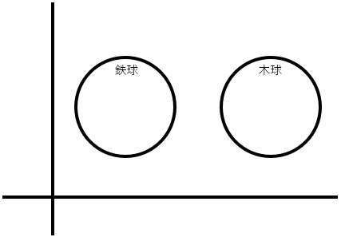　　　　
>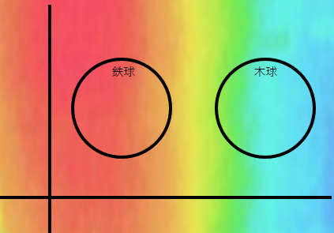
>

>
>さて，長くなりましたが以上を踏まえると，今回の問題設定における測度とは，過去データの重要度にあたります．
>以下の図を考えた場合，これは最近のデータほど重要視する（＝大きな重みを付ける）という意味になります．
>このことさえ理解できていれば，この先に出てくる測度には困りません．（多分）
>

>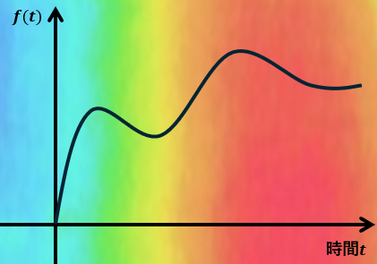
>

>（体積と密度の関係や期待値なんかは，測度と関わりがありそうな気がする...）
>

## HiPPOフレームワーク
HiPPOフレームワークの定義を紹介します．

時間変化する $(-\infty, t]$ でサポートされる測度族 $\mu^{(t)}$，$N$ 次元の多項式が張る部分空間 $\mathcal{G}$，そして連続入力信号 $f: \mathbb{R}_{\geq 0} \to \mathbb{R}$ が与えられたとき，$f$ を最適化された投影係数 $c:\mathbb{R}_{\geq 0} \to \mathbb{R}^N$ に移す演算 HiPPO を定義する．この演算は，以下の性質を持つ投影演算子 $\text{proj}_t$ と，係数抽出演算子 $\text{coef}_t$ をすべての時間ステップ $t$ で求め，それらの合成 $\text{coef}_t \circ \text{proj}_t$ である．（つまり，$(\text{hippo}(f))(t) = \text{coef}_t(\text{proj}_t(f))$ である．）

1. $\text{proj}_t$ は，時刻 $t$ までの信号 $f$，つまり $f_{\leq t} := f(x)|_{x \leq t}$ を，推論誤差 $|f_{\leq t} - g^{(t)}|_{L_2(\mu^{(t)})}$ を最小にする多項式 $g^{(t)} \in \mathcal{G}$ に射影する．
2. $\text{coef}_t : \mathcal{G} \to \mathbb{R}^N$ は，多項式 $g^{(t)}$ を，測度 $\mu^{(t)}$ に関して定義された直交多項式の基底関数の係数ベクトル $c(t) \in \mathbb{R}^N$ に射影する．

さて，LMUでもあったようにこれらの演算子を使って係数 $c_n$ を計算することは簡単ではありません．
なのでHiPPOでもLMUと同様に $c_n$ が常微分方程式 $\frac{d}{dt}\bm{c}(t)=\bm{A}(t)\bm{c}(t)+\bm{B}(t)f(t)$ の形を取ることを導いていきます．

まずは常微分方程式の一般形を紹介します．  
入力信号を $f(x)$，時間変化する測度 $\mu^{(t)}$ のルベーグ測度 $d\lambda(x):=dx$ に対する密度を $\omega$ ，正規直交多項式を $p_n(t,x)$ ，正規直交多項式のスケーリング変数を $\chi$ ，スケーリングして得た直交多項式 $p_n(t,x)\chi(x)$ における測度に対する密度を $\zeta(t)$ ，スケーリング変数を $\lambda_n$ とすると，以下のような常微分方程式を得ます．
$$
\frac{d}{dt}c_n(t)=\zeta (t)^{-\frac{1}{2}}\lambda_n \left\{ \int f(x)\left( \frac{\partial}{\partial t}p_n(t,x) \right) \frac{\omega}{\chi}dx + \int f(x) p_n(t,x)  \left( \frac{\partial}{\partial t}\frac{\omega}{\chi}(t,x)\right) dx \right\}
$$
かなり複雑な式が出てきました．
この式の各変数に具体的な数値を入れることで，いくつかの手法を定義することができます．
特に重要なのは $p_n(t,x)$ で，ここに直交多項式を入れていきます．

と，その前になぜこんな式が導出されるのか証明していきます．
証明はいいやという人は飛ばしてください．

 証明 

任意の時刻 $t$ で，近似の質は $(-\infty, t]$ 上でサポートされる測度 $\mu^{(t)}$ に関して定義されます．
私たちは次数が最大で $N-1$ の多項式 $g(t)$ を求め，その誤差 $\|f|_{x \leq t} - g(t)\|_{L^2(\mu^{(t)})}$ を最小化します．
簡単のために，測度 $\mu^{(t)}$ がその定義域および時間にわたって十分に滑らかであると仮定します．
特に，これらの測度はルベーグ測度 $d\lambda(x) := dx$ に関して密度 $\omega(t, x) := \frac{d\mu^{(t)}}{d\lambda}(x)$ を持ち，$\omega$ はほぼ至る所で $C^1$ （1回微分可能で，1次導関数が連続）であるとします．
したがって，$d\mu^{(t)}(x)$ に対する積分は，$\omega(t, x) dx$ に対する積分として書き直すことができます．
また，簡単のために，測度 $\mu^{(t)}$ は確率測度と仮定します．

>[!NOTE]
>### 密度って何？
>

>
 詳細 

>
>密度とは，測度の比のことです．
>2つの測度 $\mu$ ， $\nu$ があるとき，その密度 $\frac{d\nu}{d\mu}(x)$ は， $\nu$ が $\mu$ に対してどのように分布しているかを記述します．
>
>密度を使えば，新たな測度を定義することができます．
>測度 $\mu$ と密度 $f(x)=\frac{d\nu}{d\mu}(x)$ が与えられているとき，
>$$
>\nu(A)=\int_A f(x)d\mu(x)
>$$
>となるそうです．
>測度における重み付けとこの密度は同じことを言っているような気がしますね．
>そして最も基礎となる測度がルベーグ測度 $d\mu(x) = dx$ （＝一様な重み）ということなんですかね？

正規直交多項式基底  
$\{P_n\}_{n \in \mathbb{N}}$ を基準測度 $\mu$ に関しての正規直交多項式の列とします．
同様に， $\{P_n^{(t)}\}_{n \in \mathbb{N}}$ を時間変化する測度 $\mu^{(t)}$ に関しての正規直交多項式の列と定義します．
$P_n^{(t)}$ の正規化バージョンを $p_n^{(t)}$ （つまり，ノルムが1のもの）とし，次のように定義します．

$$
p_n(t, x) = p_n^{(t)}(x)
$$

$P_n^{(t)}$ は正規化されている必要はありませんが， $p_n^{(t)}$ は正規化されています．

傾斜測度と基底  
私たちの目標は，関数の圧縮表現を格納することです．このため，必ずしも正規直交多項式（OP）である必要はなく，任意の基底を使用することができます．任意のスケーリング関数 $\chi(t, x)$ に対して，
$$
\chi(t, x) = \chi^{(t)}(x),
$$
関数 $p_n(x) \chi(x)$ は各時刻 $t$ における密度 $\omega / \chi^2$ に関して直交します．したがって，この代替基底と測度を使用して射影を行うことができます．

>[!NOTE]
>### $p_n(x) \chi(x)$ が密度 $\omega / \chi^2$ に関して直交する理由
>

>
 詳細 

>
>ここではなぜ「$p_n(x) \chi(x)$ は密度 $\omega / \chi^2$ に関して直交」するのかを解説します．
>
>直交する多項式 $\{P_n(x)\}$ が測度 $\mu(x)$ に対して直交しているとします．
すなわち，
>$$
>\int P_n(x) P_m(x) d\mu = \int P_n(x) P_m(x) \omega(x) dx = 0 \quad \text{for} \quad n \neq m.
>$$
>ここで，この多項式をスケーリング関数 $\chi(x)$ でスケーリングした多項式 $\chi(x) P_n(x)$ を考えます．
>
>スケーリング後の多項式 $\{\chi(x) P_n(x)\}$ が直交する測度を求めるためには，これらの多項式の直交性条件を再度書き直す必要があります．
>新しい測度 $\nu(x)$ に対して直交するためには，
>
>$$
>\int \left( \chi(x) P_n(x) \right) \left( \chi(x) P_m(x) \right) \nu(x) \, dx = 0 \quad \text{for} \quad n \neq m
>$$
>
>が成立する必要があります．
>
>元の直交性と比較すると
>$$
>\nu(x) = \frac{\omega(x)}{\chi(x)^2}.
>$$
>
>を得ることができます．
>

>[!NOTE]
>### 「測度に関して直交性を持つ」と「密度に関して直交性を持つ」にはどんな違いがあるんだろう？
>

>
 詳細 

>
>- **「測度に関して直交性を持つ」**
>
>これは，特定の測度に基づいて定義された**内積**に関する直交性を表しています．
>具体的には，関数 $f(x)$ と $g(x)$ が測度 $\mu$ に関して直交であるとは，次の条件を満たすことを意味します：
>$$
>\int f(x) g(x) \, d\mu(x) = 0.
>$$
>ここで，測度 $\mu$ は通常のルベーグ測度であることもあれば，他の一般的な測度であることもあります．
>例えば，重み付き内積や確率論における期待値計算でも測度を使います．
>
>- **「密度に関して直交性を持つ」**
>
>これは，「密度関数を用いて定義された新しい測度」に関しての直交性を指します．
>仮に密度関数 $w(x)$ が測度 $\mu$ に対して定義されている場合，**密度 $w(x)$ に関して直交性を持つ**という表現は，次の条件を満たすことを意味します：
>$$
>\int f(x) g(x) \, w(x) \, d\mu(x) = 0.
>$$
>ここで，$w(x) \, d\mu(x)$ は密度 $w(x)$ に基づく新しい測度 $d\nu(x) = w(x) \, d\mu(x)$ です．
>このような場合，関数 $f(x)$ と $g(x)$ は「新しい測度 $\nu$ に関して直交」であるとも言います．
>

新たに得た密度 $\omega / \chi^2$ を用いて，新たな正規化された測度 $\nu^{(t)}$ を定義します．
正規化定数として
$$
\zeta(t) = \int \frac{\omega}{\chi^2} = \int \frac{\omega^{(t)}(x)}{(\chi^{(t)}(x))^2} \, dx
$$
とすると $\nu^{(t)}$ は密度 $\frac{\omega^{(t)}(x)}{\zeta(t)(\chi^{(t)}(x))^2}$ を持ちます．
もし $\chi(t, x) = 1$ （傾斜なし）であれば，この定数は $\zeta(t) = 1$ です．（ $\mu^{(t)}$ を確率測度としているため，積分したら1になる．）
一般に， $\zeta$ はすべての $t$ に対して定数であると仮定します．

このとき以下が成り立ちます．（積分内の $x$ への依存性を省略しています）．
$$
\begin{align*}
\left\| (\zeta(t)^{\frac{1}{2}} p_n^{(t)} \chi^{(t)}) \right\|_{\nu^{(t)}}^2 &= \int \left( (\zeta(t)^{\frac{1}{2}} p_n^{(t)} \chi^{(t)}) \right)^2 d\nu^{(t)} \\
&= \int \left( (\zeta(t)^{\frac{1}{2}} p_n^{(t)} \chi^{(t)}) \right)^2 \frac{\omega^{(t)}}{\zeta(t) (\chi^{(t)})^2} \\
&= \int (p_n^{(t)})^2 \omega^{(t)} \\
&= \int (p_n^{(t)})^2 d\mu^{(t)} \\
&= \| p_n^{(t)} \|_{\mu^{(t)}}^2 \\
&= 1
\end{align*}
$$

したがって， $\nu^{(t)}$ に対する直交基底を以下のように定義します．

$$
g_n^{(t)} = \lambda_n \zeta(t)^{\frac{1}{2}} p_n^{(t)} \chi^{(t)}, \quad n \in \mathbb{N}.
$$

$\lambda_n=\pm 1$ のとき，$g_n^{(t)}$ 正規直交基底となります．
また， $g_n^{(t)}$ は直交基底なので次が成り立ちます．

$$
\langle g_n^{(t)}, g_m^{(t)} \rangle_{\nu^{(t)}}=\lambda_n^2 \delta_{n,m}
$$

入力信号 $f:[0,\infty)\rightarrow \mathbb{R}$ を $C^1$ であるとし，各時刻 $t$ までの信号 ${f(x)}_{\leq t}={f(x)}_{x\leq t}$ の圧縮表現を得ることを考える．
基底 $g_n^{(t)}$ を用いると，展開係数は次のように計算できる．
$$
\begin{align*}
c_n(t) &= \langle {f(x)}_{\leq t},g_n^{(t)} \rangle_{\nu^{(t)}} \\
&= \int fg_n^{(t)}d\nu^{(t)} \\
&= \int fg_n^{(t)} \frac{\omega^{(t)}}{\zeta(t) (\chi^{(t)})^2} \\
&= \int f \lambda_n \zeta(t)^{\frac{1}{2}} p_n^{(t)} \chi^{(t)} \frac{\omega^{(t)}}{\zeta(t) (\chi^{(t)})^2} \\
&= \zeta(t)^{-\frac{1}{2}} \lambda_n \int f p_n^{(t)} \frac{\omega^{(t)}}{\chi^{(t)}}
\end{align*}
$$
また， ${f(x)}_{\leq t}$ の近似式は以下のように計算できる．
$$
\begin{align*}
f_{\leq t} \approx g^{(t)} :=& \sum_{n=0}^{N-1} \langle f_{\leq t},g_n^{(t)} \rangle_{\nu^{(t)}} \frac{g_n^{(t)}}{\|g_n^{(t)}\|_{\nu^{(t)}}^2} \\
=& \sum_{n=0}^{N-1} c_n(t)\lambda_n^{-2}g_n^{(t)} \\
=& \sum_{n=0}^{N-1} \lambda_n^{-1} \zeta(t)^{\frac{1}{2}} c_n(t)p_n^{(t)} \chi^{(t)}
\end{align*}
$$
この式こそが $\text{proj}_t$ である．また， $\text{coef}_t$ は，係数ベクトル $c(t)=(c_n(t))_{n\in[N]}$ を抽出する操作である．

さらに係数 $c_n^{(t)}$ をオンラインで計算するため，時間微分する．
$$
\begin{align*}
\frac{d}{dt}c_n(t) &= \frac{d}{dt}\zeta(t)^{-\frac{1}{2}} \lambda_n \int f p_n^{(t)} \frac{\omega^{(t)}}{\chi^{(t)}} \\
&= \zeta (t)^{-\frac{1}{2}}\lambda_n \left\{ \int f(x)\left( \frac{\partial}{\partial t}p_n(t,x) \right) \frac{\omega}{\chi}dx + \int f(x) p_n(t,x)  \left( \frac{\partial}{\partial t}\frac{\omega}{\chi}(t,x)\right) dx \right\}
\end{align*}
$$
ここで， $\zeta$ は時間に対して定数であると仮定している．
あれ，基底は直交多項式に限らないと言っていたけど，結局直交多項式前提で証明が進んでいた気がする...グラムシュミットの直交化を使えばいいってことかな...？

>[!NOTE]
>### なんで微分した？
>

>
 詳細 

>
>今回の問題設定は**オンライン学習**である．
>つまり，データが到着する度に計算を行う．
>そのため，いちいち $c_n(t)$ を真面目に計算するよりは，更新式を導いた方が良いという考えだと思われる．
>

重要なアイデアは，もし $\frac{\partial}{\partial t} P_n$ と $\frac{\partial}{\partial t} \frac{\omega}{\chi}$ が多項式 $P_k$ に関連する閉じた形で表現できるならば，係数 $c(t)$ に対する常微分方程式 (ODE) を記述できるということです．
これにより，これらの係数 $c(t)$ および最適な多項式近似をオンラインで計算することが可能になります．
特に，$\frac{d}{dt} P^{(t)}_n$ は $n-1$ 次の多項式（$x$ の多項式）であるため，$P_0, \ldots, P_{n-1}$ の線形結合として書けますので，式 (20) の最初の項は $c_0, \ldots, c_{n-1}$ の線形結合になります．
多くの重み関数 $\omega$ に対して，$\frac{\partial}{\partial t} \frac{\omega}{\chi}$ を $\frac{\omega}{\chi}$ 自身の式で表現できるようなスケーリング関数 $\psi$ を見つけることができます．
この場合，式 (20) の第二項も $c_0, \ldots, c_{N-1}$ および入力 $f$ の線形結合となります．
したがって，これによりしばしば $c(t)$ に対する閉じた形の線形 ODE が得られます．

## HiPPOの具体化
さて，いよいよ具体的な基底を定め，これまで求めた式から手法を求めていきます．

### HiPPO-LegT (Translated Legendre)
この手法では，基底としてルジャンドル多項式を用います．
ルジャンドル多項式は，ルベーグ測度に対して直交性を持つため，測度はルベーグ測度となります．
また， $\chi=1,\zeta=1$ とします．
なお，ルジャンドル多項式は区間 $[-1,1]$ を定義域としているため，区間 $[t-\theta, t]$ を定義域とするように変形します．
以上より
$$
\begin{align*}
\omega(t, x) &= \frac{1}{\theta} \mathbb{I}_{[t-\theta, t]} \\
p_n(t, x) &= (2n + 1)^{\frac{1}{2}} P_n\left( \frac{2(x - t)}{\theta} + 1 \right) \\
g_n(t, x) &= \lambda_n p_n(t, x)
\end{align*}
$$
$P_n\left( \frac{2(x - t)}{\theta} + 1 \right)$ は区間 $[t-\theta, t]$ を定義域とするルジャンドル多項式， $p_n(t, x)$ は正規化したものです．
なお，区間の端では以下が成り立ちます．
$$
\begin{align*}
g_n(t,t) &= \lambda_n(2n+1)^{\frac{1}{2}} \\
g_n(t,t-\theta) &= \lambda_n(-1)^n(2n+1)^{\frac{1}{2}}
\end{align*}
$$
また，
$$
\begin{align*}
\frac{\partial}{\partial t}\omega(t,x) &= \frac{1}{\theta}\delta_t - \frac{1}{\theta}\delta_{t-\theta} \\
\frac{\partial}{\partial t} g_n(t, x) &= \lambda_n (2n + 1)^{\frac{1}{2}} \cdot \frac{-2}{\theta} P_n'\left( \frac{2(x - t)}{\theta} + 1 \right) \\
&= \lambda_n (2n + 1)^{\frac{1}{2}} \frac{-2}{\theta} \left[ (2n - 1) P_{n-1}\left( \frac{2(x - t)}{\theta} + 1 \right) + (2n - 5) P_{n-3}\left( \frac{2(x - t)}{\theta} + 1 \right) + \ldots \right] \\
&= -\lambda_n (2n + 1)^{\frac{1}{2}} \frac{2}{\theta} \left[ \lambda_{n-1}^{-1} (2n - 1)^{\frac{1}{2}} g_{n-1}(t, x) + \lambda_{n-3}^{-1} (2n - 5)^{\frac{1}{2}} g_{n-3}(t, x) + \ldots \right]
\end{align*}
$$

さらに $c_n$ の更新式を計算する過程で $f(t-\theta)$ が必要になるのですが，オンライン問題であるため時刻 $t$ において $f(t-\theta)$ は保持していません．
そこで， $f(t-\theta)$ を近似した式を用います．
$\text{proj}_t$および$p_n(t,x)$より
$$
\begin{align*}
f_{\leq t}(x) &\approx \sum_{k=0}^{N-1} \lambda_k^{-1}c_k(t)(2k+1)^{\frac{1}{2}}P_k\left( \frac{2(x - t)}{\theta} + 1 \right) \\
f(t-\theta) &\approx \sum_{k=0}^{N-1} \lambda_k^{-1}c_k(t)(2k+1)^{\frac{1}{2}}(-1)^k
\end{align*}
$$

これを $c_n$ の更新式に代入すると以下の式を得ます．
$$
\frac{d}{dt}c_n(t) = - \frac{\lambda_n}{\theta}(2n+1)^{\frac{1}{2}} \sum_{k=0}^{N-1} M_{nk}(2k+1)^{\frac{1}{2}}\frac{c_k(t)}{\lambda_k} + \frac{\lambda_n}{\theta}(2n+1)^{\frac{1}{2}}f(t)
$$
where
$$
M_{nk}=
\begin{cases}
1 & \text{if}\quad k\leq n \\
(-1)^{n-k} & \text{if}\quad k\geq n
\end{cases}
$$

 式変形の詳細 

$$
\begin{align*}
\frac{d}{dt}c_n(t) &= \zeta (t)^{-\frac{1}{2}}\lambda_n \left\{ \int f(x)\left( \frac{\partial}{\partial t}p_n(t,x) \right) \frac{\omega}{\chi}dx + \int f(x) p_n(t,x)  \left( \frac{\partial}{\partial t}\frac{\omega}{\chi}(t,x)\right) dx \right\} \\
&= \int f(x)\left( \frac{\partial}{\partial t}g_n(t,x) \right) \omega (t,x)dx + \int f(x) g_n(t,x)  \left( \frac{\partial}{\partial t}\omega(t,x)\right) dx \\
&= \int -f(x)\lambda_n (2n + 1)^{\frac{1}{2}} \frac{2}{\theta} \left[ \lambda_{n-1}^{-1} (2n - 1)^{\frac{1}{2}} g_{n-1}(t, x) + \lambda_{n-3}^{-1} (2n - 5)^{\frac{1}{2}} g_{n-3}(t, x) + \ldots \right] \omega (t,x)dx \\
&\quad + \int f(x) g_n(t,x)  \left( \frac{1}{\theta}\delta_t - \frac{1}{\theta}\delta_{t-\theta}\right) dx \\
&= -\lambda_n (2n + 1)^{\frac{1}{2}} \frac{2}{\theta} \left[ \lambda_{n-1}^{-1} (2n - 1)^{\frac{1}{2}} \int f(x)g_{n-1}(t, x)\omega (t,x)dx + \lambda_{n-3}^{-1} (2n - 5)^{\frac{1}{2}} \int f(x)g_{n-3}(t, x)\omega (t,x)dx + \ldots \right] \\
&\quad + \frac{1}{\theta}f(t) g_n(t,t) - \frac{1}{\theta}f(t-\theta) g_n(t,t-\theta) \\
&= -\lambda_n (2n + 1)^{\frac{1}{2}} \frac{2}{\theta} \left[ \lambda_{n-1}^{-1} (2n - 1)^{\frac{1}{2}} c_{n-1}(t) + \lambda_{n-3}^{-1} (2n - 5)^{\frac{1}{2}} c_{n-3}(t) + \ldots \right] \\
&\quad + \frac{1}{\theta}f(t) g_n(t,t) - \frac{1}{\theta}f(t-\theta) g_n(t,t-\theta) \\
&= -\lambda_n (2n + 1)^{\frac{1}{2}} \frac{2}{\theta} \left[ \lambda_{n-1}^{-1} (2n - 1)^{\frac{1}{2}} c_{n-1}(t) + \lambda_{n-3}^{-1} (2n - 5)^{\frac{1}{2}} c_{n-3}(t) + \ldots \right] \\
&\quad + \frac{1}{\theta}f(t) \lambda_n(2n+1)^{\frac{1}{2}} - \frac{1}{\theta}f(t-\theta) \lambda_n(-1)^n(2n+1)^{\frac{1}{2}} \\
&\approx -\lambda_n (2n + 1)^{\frac{1}{2}} \frac{2}{\theta} \left[ \lambda_{n-1}^{-1} (2n - 1)^{\frac{1}{2}} c_{n-1}(t) + \lambda_{n-3}^{-1} (2n - 5)^{\frac{1}{2}} c_{n-3}(t) + \ldots \right] \\
&\quad + (2n+1)^{\frac{1}{2}}\frac{\lambda_n}{\theta}f(t) - (2n+1)^{\frac{1}{2}}\frac{\lambda_n}{\theta}(-1)^n \sum_{k=0}^{N-1} \lambda_k^{-1}c_k(t)(2k+1)^{\frac{1}{2}}(-1)^k \\
&= -\frac{\lambda_n}{\theta} (2n + 1)^{\frac{1}{2}} \cdot 2 \left[ (2n - 1)^{\frac{1}{2}} \frac{c_{n-1}(t)}{\lambda_{n-1}} + (2n - 5)^{\frac{1}{2}} \frac{c_{n-3}(t)}{\lambda_{n-3}} + \ldots \right] \\
&\quad - \frac{\lambda_n}{\theta}(2n+1)^{\frac{1}{2}} \sum_{k=0}^{N-1} (-1)^{n-k}(2k+1)^{\frac{1}{2}}\frac{c_k(t)}{\lambda_k} + \frac{\lambda_n}{\theta}(2n+1)^{\frac{1}{2}}f(t) \\
&= - \frac{\lambda_n}{\theta}(2n+1)^{\frac{1}{2}} \sum_{k=0}^{N-1} M_{nk}(2k+1)^{\frac{1}{2}}\frac{c_k(t)}{\lambda_k} + \frac{\lambda_n}{\theta}(2n+1)^{\frac{1}{2}}f(t)
\end{align*}
$$
where
$$
M_{nk}=
\begin{cases}
1 & \text{if}\quad k\leq n \\
(-1)^{n-k} & \text{if}\quad k\geq n
\end{cases}
$$

>[!NOTE]
>### 最後に何が起きた？
>

>
 詳細 

>
>最後の式変形で何が起きたのかを解説します．
>最後の項は変わっていないため，1項目と2項目で計算しています．
>さらに $-\frac{\lambda_n}{\theta} (2n + 1)^{\frac{1}{2}}$ の部分は一致しているため，
>$$
>2 \left[ (2n - 1)^{\frac{1}{2}} \frac{c_{n-1}(t)}{\lambda_{n-1}} + (2n - 5)^{\frac{1}{2}} \frac{c_{n-3}(t)}{\lambda_{n-3}} + \ldots \right] + \sum_{k=0}^{N-1} (-1)^{n-k}(2k+1)^{\frac{1}{2}}\frac{c_k(t)}{\lambda_k} \\
>= \sum_{k=0}^{N-1} M_{nk}(2k+1)^{\frac{1}{2}}\frac{c_k(t)}{\lambda_k}
>$$
>となっています．
>この部分を表にしてみます．
>
>||||||||||||
>|---|---|---|---|---|---|---|---|---|---|---
>|$k$       |...|$n-3$|$n-2$|$n-1$|$n$|$n+1$|$n+2$|$n+3$|...|$N-1$
>|1項目の係数|   | $2$| $0$ | $2$ | $0$ | $0$ | $0$ | $0$ |  | $0$
>|2項目の係数|   | $-1$| $1$ |$-1$| $1$|$-1$| $1$|$-1$|  | $(-1)^{n-(N-1)}$
>
>表を見ると一目瞭然かもしれません．
>1項目は $k=n-1$ まで1つ飛ばしで係数2を持っていて，2項目は$1,-1$を交互に繰り返します．
>この和をとると， $k=n-1$ までは係数が全て1になり， $k=n$ 以降は $(-1)^{n-k}$が係数になります．
>これを表現しているのが $M_{nk}$ ということです．
>

ここで， $\lambda_n$ の値について考えます．
もし， $\lambda_n=1$ とした（基底を正規直交基底と考える）場合，上式は次のような線形常微分方程式に変形できます．
$$
\begin{align*}
\frac{d}{dt}c(t) &= -\frac{1}{\theta}Ac(t)+\frac{1}{\theta}Bf(t) \\
A_{nk} &= (2n + 1)^{\frac{1}{2}}(2k + 1)^{\frac{1}{2}}
\begin{cases}
1 & \text{if}\quad k\leq n \\
(-1)^{n-k} & \text{if}\quad k\geq n
\end{cases} \\
B_n &= (2n + 1)^{\frac{1}{2}}
\end{align*}
$$
もし， $\lambda_n=(2n + 1)^{\frac{1}{2}}(-1)^n$ とした場合，次のような線形常微分方程式に変形できます．
$$
\begin{align*}
\frac{d}{dt}c(t) &= -\frac{1}{\theta}Ac(t)+\frac{1}{\theta}Bf(t) \\
A_{nk} &= (2n + 1)
\begin{cases}
1 & \text{if}\quad k\leq n \\
(-1)^{n-k} & \text{if}\quad k\geq n
\end{cases} \\
B_n &= (2n + 1)(-1)^n
\end{align*}
$$
さて，気付きましたでしょうか？
実はこの式は，LMUの式になっています．
このことから，従来手法LMUがHiPPO-LegTの特殊化であることが導けました．

### HiPPO-LagT (Translated Laguerre)
次に基底として，直交多項式の1つであるラゲール多項式を選んでみましょう．

ラゲール多項式について軽く紹介します．
- 定義
$$
L_n(x) = e^x \frac{d^n}{dx^n} \left( x^n e^{-x} \right)
$$
- 直交性
$$
\int_{0}^{\infty} L_m(x) L_n(x) e^{-x} \, dx = \delta_{mn} \frac{(n!)^2}{(2n+1)!}
$$

また，一般化ラゲール多項式というものも存在します．
- 定義
$$
L_n^{(\alpha)}(x) = \frac{x^{-\alpha} e^x}{n!} \frac{d^n}{dx^n} \left( e^{-x} x^{n + \alpha} \right)
$$
- 直交性
$$
\int_{0}^{\infty} L_m^{(\alpha)}(x) L_n^{(\alpha)}(x) x^{\alpha} e^{-x} \, dx = \frac{(\alpha + n)!}{n!} \delta_{mn}
$$

一般化ラゲール多項式において $\alpha=0$ がラゲール多項式ということです．

ここでは一般化ラゲール多項式を基底として採用します．
一般化ラゲール多項式は，区間 $[0,\infty)$ を定義域としているため，区間 $(-\infty,t]$ を定義域とするように変形します．
まとめると以下の通りです．
$$
\begin{align*}
\omega(t, x) &= 
\begin{cases} 
(t - x)^{\alpha} e^{x - t} & \text{if } x \leq t \\
0 & \text{if } x > t 
\end{cases} \\
&= (t - x)^{\alpha} e^{-(t - x)} \mathbb{I}_{(-\infty, t]} \\

p_n(t, x) &= \frac{\Gamma(n + 1)^{\frac{1}{2}}}{\Gamma(n + \alpha + 1)^{\frac{1}{2}}} L_n^{(\alpha)}(t - x)
\end{align*}
$$
スケーリング $\chi$ は以下のように定義します． $\beta \in \mathbb{R}$ は定数です．
$$
\chi(t, x) = (t - x)^{\alpha} \exp \left( -\frac{1 - \beta}{2}(t - x) \right) \mathbb{I}_{(-\infty, t]}
$$
このとき，正規化項は
$$
\begin{align*}
\zeta &= \int \frac{\omega}{\chi^2} = \int (t - x)^{-\alpha} e^{-\beta(t - x)} \mathbb{I}_{(-\infty, t]} dx \\
&= \Gamma(1 - \alpha) \beta^{\alpha - 1}
\end{align*}
$$
となり，スケーリングされた測度は次の密度を持ちます．
$$
\zeta(t)^{-1} \frac{\omega^{(t)}}{(\chi^{(t)})^2} = \Gamma(1 - \alpha)^{-1} \beta^{1 - \alpha} (t - x)^{-\alpha} \exp(-\beta(t - x)) \mathbf{1}_{(-\infty, t]}.
$$

また， $\lambda_n$ を一般化ラゲール多項式のノルムに設定することで， $\lambda_n p_n^{(t)} = L_n^{(\alpha)}(t - x)$ という関係が成り立ちます．
$$
\lambda_n = \frac{\Gamma(n + \alpha + 1)^{\frac{1}{2}}}{\Gamma(n + 1)^{\frac{1}{2}}}
$$

このとき，
$$
g_n^{(t)} = \lambda_n \zeta^{\frac{1}{2}} \chi^{(t)} p_n^{(t)} = \zeta^{\frac{1}{2}} \chi^{(t)} L_n^{(\alpha)}(t - x)
$$

最後に $c_n$ の更新式に必要な2つの微分項を計算していきます．

$$
\frac{\omega}{\chi}(t, x) = \exp \left( \frac{1 + \beta}{2} (t - x) \right) \mathbf{1}_{(-\infty, t]}.
$$

より，

$$
\frac{\partial}{\partial t} \frac{\omega}{\chi}(t, x) = - \left( \frac{1 + \beta}{2} \right) \frac{\omega}{\chi}(t, x) +\exp \left( - \left( \frac{1 + \beta}{2} \right) (t - x) \right) \delta_t
$$

一般化ラゲール多項式の微分は次のようになります．

$$
\begin{align*}
\frac{\partial}{\partial t} \lambda_n p_n(t, x) &= \frac{\partial}{\partial t} L_n^{(\alpha)}(t - x) \\
&= -L_0^{(\alpha)}(t - x) - \cdots - L_{n-1}^{(\alpha)}(t - x) \\
&= -\lambda_0 p_0(t, x) - \cdots - \lambda_{n-1} p_{n-1}(t, x) \\
&= -\sum_{k=0}^{n-1} \lambda_kp_k(t,x)
\end{align*}
$$

さて，ようやく準備が整いました．
あとは $c_n$ の更新式に代入していくだけです．
代入すると次の式が得られます．
$$
\begin{align*}
\frac{d}{dt} c(t) &= -Ac(t) + Bf(t) \\

A &= \begin{bmatrix}
\frac{1 + \beta}{2} & 0 & \cdots & 0 \\
1 & \frac{1 + \beta}{2} & \cdots & 0 \\
\vdots & \ddots & \ddots & \vdots \\
1 & 1 & \cdots & \frac{1 + \beta}{2}
\end{bmatrix} \\

B &= \zeta^{-\frac{1}{2}} \cdot 
\begin{bmatrix}
\binom{\alpha}{0} \\
\vdots \\
\binom{N-1+\alpha}{N-1}
\end{bmatrix}
\end{align*}
$$

 式変形の詳細 

$$
\begin{align*}
\frac{d}{dt}c_n(t) &= \zeta^{-\frac{1}{2}} \int f \cdot \left( \frac{\partial}{\partial t} \lambda_n p_n^{(t)} \right) \frac{\omega^{(t)}}{\chi^{(t)}} \\
&\quad + \int f \cdot \left( \zeta^{-\frac{1}{2}} \lambda_n p_n^{(t)} \right) \left( \frac{\partial}{\partial t} \frac{\omega^{(t)}}{\chi^{(t)}} \right) \\
&= \zeta^{-\frac{1}{2}} \int f \cdot \left( -\sum_{k=0}^{n-1} \lambda_kp_k(t,x)\right) \frac{\omega^{(t)}}{\chi^{(t)}} \\
&\quad + \int f \cdot \left( \zeta^{-\frac{1}{2}} \lambda_n p_n^{(t)} \right) \left\{ - \left( \frac{1 + \beta}{2} \right) \frac{\omega}{\chi}(t, x) +\exp \left( - \left( \frac{1 + \beta}{2} \right) (t - x) \right) \delta_t \right\} \\
&= \zeta^{-\frac{1}{2}} \int f \cdot \left( -\sum_{k=0}^{n-1} \lambda_kp_k(t,x)\right) \frac{\omega^{(t)}}{\chi^{(t)}} \\
&\quad - \left( \frac{1 + \beta}{2} \right) \int f \cdot \left( \zeta^{-\frac{1}{2}} \lambda_n p_n^{(t)} \right) \frac{\omega^{(t)}}{\chi^{(t)}} + \int f \cdot \left( \zeta^{-\frac{1}{2}} \lambda_n p_n^{(t)} \right) \exp \left( - \left( \frac{1 + \beta}{2} \right) (t - x) \right) \delta_t \\
&= \zeta^{-\frac{1}{2}} \int f \cdot \left( -\sum_{k=0}^{n-1} \lambda_kp_k(t,x)\right) \frac{\omega^{(t)}}{\chi^{(t)}} \\
&\quad - \left( \frac{1 + \beta}{2} \right) \int f \cdot \left( \zeta^{-\frac{1}{2}} \lambda_n p_n^{(t)} \right) \frac{\omega^{(t)}}{\chi^{(t)}} + f(t) \cdot \left( \zeta^{-\frac{1}{2}} \lambda_n p_n(t,t) \right) \\
&= -\sum_{k=0}^{n-1} \int f \cdot \left( \zeta^{-\frac{1}{2}} \lambda_k p_k^{(t)} \chi^{(t)} \right) \frac{\omega^{(t)}}{(\chi^{(t)})^2} \\
&\quad - \left( \frac{1 + \beta}{2} \right) \int f \cdot \left( \zeta^{-\frac{1}{2}} \lambda_n p_n^{(t)}\chi^{(t)} \right) \frac{\omega^{(t)}}{(\chi^{(t)})^2} + f(t) \cdot \zeta^{-\frac{1}{2}} L_n^{(\alpha)}(0) \\
&= -\sum_{k=0}^{n-1} \int f \cdot g_n^{(t)} \frac{\omega^{(t)}}{(\chi^{(t)})^2} \\
&\quad - \left( \frac{1 + \beta}{2} \right) \int f \cdot g_n^{(t)} \frac{\omega^{(t)}}{(\chi^{(t)})^2} + f(t) \cdot \zeta^{-\frac{1}{2}} L_n^{(\alpha)}(0) \\
&= -\sum_{k=0}^{n-1} c_k(t) - \left( \frac{1 + \beta}{2} \right) c_n(t) + \Gamma(1 - \alpha)^{-\frac{1}{2}} \beta^{\frac{1 - \alpha}{2}} \binom{n + \alpha}{n} f(t) \\

\frac{d}{dt} c(t) &= -Ac(t) + Bf(t) \\

A &= \begin{bmatrix}
\frac{1 + \beta}{2} & 0 & \cdots & 0 \\
1 & \frac{1 + \beta}{2} & \cdots & 0 \\
\vdots & \ddots & \ddots & \vdots \\
1 & 1 & \cdots & \frac{1 + \beta}{2}
\end{bmatrix} \\

B &= \zeta^{-\frac{1}{2}} \cdot 
\begin{bmatrix}
\binom{\alpha}{0} \\
\vdots \\
\binom{N-1+\alpha}{N-1}
\end{bmatrix}
\end{align*}
$$

HiPPO-LegTと同様に線形常微分方程式が得られました．
論文中では， $\alpha=0, \beta=1$ として
$$
A_{nk}=
\begin{cases}
1 & \text{if} \quad n\geq k \\
0 & \text{if} \quad n\leq k
\end{cases},
\quad
B_n=1
$$
という行列をHiPPO-LagTとして提案しています．

### HiPPO-LegS (Scaled Legendre)
さて，最後にもう一つだけ紹介します．
もったいぶってしまいましたが，この手法がメインとなります．
名前の通り，この手法でもルジャンドル多項式を基底として採用しますが，HiPPO-LegTとは考え方に違いがあります．
HiPPO-LegTでは，区間 $[t-\theta,t]$ を定義域としていました．
これは $\theta$ をウィンドウサイズとして，スライディングさせていると考えることができます．
一方で，区間 $[0,t]$ を定義域とした場合，これは $t=0$ から現在までの情報をすべて見るということになります．ウィンドウサイズが可変であると解釈しても良いかもしれません．

これまでの手法と比較すると次の図のようになります．
<section style="text-align: center;">

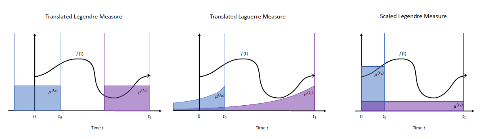

</section>

HiPPO-LegTはウィンドウの外の信号は忘れてしまいますが，HiPPO-LegSでは忘れることはありません．
単純ですが，そのように考えるとこちらの方が上手くいきそうな予感があります．

それではこれまでと同様にして，サクッと導出していきます．

$$
\begin{align*}
\omega(t, x) &= \frac{1}{t} \mathbb{I}_{[0, t]} \\
g_n(t, x) &= p_n(t, x) = (2n + 1)^{\frac{1}{2}} P_n\left( \frac{2x}{t} + 1 \right)
\end{align*}
$$

ここで， $\chi(t,x)=1, \zeta(t)=1, \lambda_n=1$ としています．
また，

$$
\begin{align*}
\frac{\partial}{\partial t} \omega(t, \cdot) &= -t^{-2} \mathbb{I}_{[0,t]} + t^{-1}\delta_t = t^{-1}(-\omega(t) + \delta_t) \\
\frac{\partial}{\partial t} g_n(t, x) &= - (2n+1)^{\frac{1}{2}} 2xt^{-2} P'_n \left( \frac{2x}{t} - 1 \right) \\
&= - (2n+1)^{\frac{1}{2}} t^{-1} \left( \frac{2x}{t} - 1 + 1 \right) P'_n \left( \frac{2x}{t} - 1 \right)
\end{align*}
$$

ここで， $z = \frac{2x}{t} - 1$ と置くと，

$$
\begin{align*}
\frac{\partial}{\partial t} g_n(t, x) &= - (2n+1)^{\frac{1}{2}} t^{-1} (z+1) P'_n(z) \\
&= - (2n+1)^{\frac{1}{2}} t^{-1} \left[ nP_n(z) + (2n-1) P_{n-1}(z) + (2n-3) P_{n-2}(z) + \ldots \right] \\
&= - t^{-1} (2n+1)^{\frac{1}{2}} \left[ n (2n+1)^{-\frac{1}{2}} g_n(t, x) + (2n-1)^{\frac{1}{2}} g_{n-1}(t, x) + (2n-3)^{\frac{1}{2}} g_{n-2}(t, x) + \ldots \right]
\end{align*}
$$

これを $c_n$ の更新式に代入すれば次を得ます．
$$
\begin{align*}
\frac{d}{dt}c(t) &= -\frac{1}{t}Ac(t)+\frac{1}{t}Bf(t) \\
A_{nk} &= 
\begin{cases}
(2n + 1)^{\frac{1}{2}}(2k + 1)^{\frac{1}{2}} & \text{if}\quad n>k \\
n+1 & \text{if}\quad n=k \\
0 & \text{if}\quad n<k
\end{cases} \\
B_n &= (2n + 1)^{\frac{1}{2}}
\end{align*}
$$

 式変形の詳細 

$$
\begin{align*}
\frac{d}{dt}c_n(t) &= \zeta (t)^{-\frac{1}{2}}\lambda_n \left\{ \int f(x)\left( \frac{\partial}{\partial t}p_n(t,x) \right) \frac{\omega}{\chi}dx + \int f(x) p_n(t,x)  \left( \frac{\partial}{\partial t}\frac{\omega}{\chi}(t,x)\right) dx \right\} \\
&=  \int f(x)\left( \frac{\partial}{\partial t}g_n(t,x) \right) \omega(t,x) dx + \int f(x) g_n(t,x)  \left( \frac{\partial}{\partial t}\omega(t,x)\right) dx \\
&=  \int f(x)\left( - t^{-1} (2n+1)^{\frac{1}{2}} \left[ n (2n+1)^{-\frac{1}{2}} g_n(t, x) + (2n-1)^{\frac{1}{2}} g_{n-1}(t, x) + (2n-3)^{\frac{1}{2}} g_{n-2}(t, x) + \ldots \right] \right) \omega(t,x) dx \\
&\quad + \int f(x) g_n(t,x) t^{-1}(-\omega(t) + \delta_t) dx \\
&=  - t^{-1} (2n+1)^{\frac{1}{2}} \left[ n (2n+1)^{-\frac{1}{2}} c_n(t) + (2n-1)^{\frac{1}{2}} c_{n-1}(t) + (2n-3)^{\frac{1}{2}} c_{n-2}(t) + \ldots \right] \\
&\quad -t^{-1}c_n(t,x) + t^{-1}f(t)g_n(t,t) \\
&=  - t^{-1} (2n+1)^{\frac{1}{2}} \left[ (n+1) (2n+1)^{-\frac{1}{2}} c_n(t) + (2n-1)^{\frac{1}{2}} c_{n-1}(t) + (2n-3)^{\frac{1}{2}} c_{n-2}(t) + \ldots \right] \\
&\quad + t^{-1}f(t)g_n(t,t) \\
&=  - t^{-1} (2n+1)^{\frac{1}{2}} \left[ (n+1) (2n+1)^{-\frac{1}{2}} c_n(t) + (2n-1)^{\frac{1}{2}} c_{n-1}(t) + (2n-3)^{\frac{1}{2}} c_{n-2}(t) + \ldots \right] \\
&\quad + t^{-1}(2n+1)^{-\frac{1}{2}}f(t) \\
&= -\frac{1}{t}Ac(t)+\frac{1}{t}Bf(t) \\
A_{nk} &= 
\begin{cases}
(2n + 1)^{\frac{1}{2}}(2k + 1)^{\frac{1}{2}} & \text{if}\quad n>k \\
n+1 & \text{if}\quad n=k \\
0 & \text{if}\quad n<k
\end{cases} \\
B_n &= (2n + 1)^{\frac{1}{2}}
\end{align*}
$$

このあと確かめますが，実はこの手法が最も良い精度を示します．
そのため，これ以降の論文では，この手法における $A_{nk}$ をHiPPO Matrixと呼んでいます．

## 離散化
これまで線形常微分方程式を導いてきましたが，実用上，離散化する必要があります．
そのため，いくつか離散化の手法を紹介します．
ここでは，以下の式を離散化します．
$$
\frac{d}{dt}c(t)=Ac(t)+Bf(t)
$$
このとき，ステップサイズを $\Delta t$ とすると
$$
c(t+\Delta t) - c(t) = \int_{t}^{t+\Delta t} (Ac(s)+Bf(s))ds
$$
となります．
この右辺の積分をどのように近似するかで手法が分かれます．
近似手法については難しく考える必要はなく，幅 $\Delta t$ の長方形の面積を求めると考えてくれれば問題ないです．

forward Euler 

この手法は，長方形の高さを $s=t$ のときに合わせる方法です．
$$
\int_{t}^{t+\Delta t} (Ac(s)+Bf(s))ds \approx \Delta t (Ac(t)+Bf(t))
$$

backward Euler 

この手法は，長方形の高さを $s=t+\Delta t$ のときに合わせる方法です．
$$
\begin{align*}
\int_{t}^{t+\Delta t} (Ac(s)+Bf(s))ds \approx \Delta t (Ac(t+\Delta t)+Bf(t+\Delta t))
\end{align*}
$$

Bilinear 

この手法は，長方形の高さを $s=t$ のときと $s=t+\Delta t$ のときの平均にする方法です．
$$
\begin{align*}
\int_{t}^{t+\Delta t} (Ac(s)+Bf(s))ds \approx \frac{\Delta t}{2} (Ac(t)+Bf(t)) + \frac{\Delta t}{2} (Ac(t+\Delta t)+Bf(t+\Delta t))
\end{align*}
$$

Generalized Bilinear Transformation (GBT) 

この手法は，長方形の高さを $s=t$ のときと $s=t+\Delta t$ のときを $\alpha : 1-\alpha$ で内分したものにする手法です．
この手法は前の3つを含んだ一般化になり，$\alpha =0$ がforward Euler， $\alpha =1$ がbackward Euler， $\alpha =\frac{1}{2}$ がBilinearに対応します．
$$
\begin{align*}
\int_{t}^{t+\Delta t} (Ac(s)+Bf(s))ds \approx (1-\alpha)\Delta t (Ac(t)+Bf(t)) + \alpha \Delta t (Ac(t+\Delta t)+Bf(t+\Delta t))
\end{align*}
$$

実際に$\alpha=\frac{1}{2}$のGBT（=Bilinear）を用いて離散化してみます．  
ここではゼロ次ホールド $f(t+\Delta t)=f(t)$ を仮定します．
$$
\begin{align*}
c(t+\Delta t) - c(t) &= \frac{1}{2}\Delta t (Ac(t)+Bf(t)) + \frac{1}{2} \Delta t (Ac(t+\Delta t)+Bf(t+\Delta t)) \\
(I-\frac{1}{2} \Delta t A)c(t+\Delta t) &= (I+\frac{1}{2} \Delta t A)c(t) + \Delta tBf(t+\Delta t) \\
c(t+\Delta t) &= (I-\frac{1}{2} \Delta t A)^{-1}(I+\frac{1}{2} \Delta t A)c(t) + (I-\frac{1}{2} \Delta t A)^{-1}\Delta tBf(t+\Delta t) \\
c_{t} &= \bar{A}c_{t-1} + \bar{B}f_{t}
\end{align*}
$$
ただし，
$$
\bar{A} = (I-\frac{1}{2} \Delta t A)^{-1}(I+\frac{1}{2} \Delta t A) \\
\bar{B} = (I-\frac{1}{2} \Delta t A)^{-1}\Delta tB
$$

## HiPPO-LegSの性質
さて，なぜHiPPO-LegSが最も良い精度を示すのでしょうか？
もちろんスライディングウィンドウではなく，すべての履歴を考慮するからというのもありますが，実はHiPPO-LegSにはいくつかの好ましい性質があります．
それは次の通りです．

1. 時間ステップに非依存
2. 計算が $O(N)$
3. 勾配消失しない （勾配の大きさが時間ステップに反比例する）
4. 入力信号が滑らかなほど，近似誤差が減少する

ここでは，「1. 時間ステップに非依存」のみ解説していきます．

HiPPO-LegSを離散化してみます．
離散化にはGBT ($\alpha=\frac{1}{2}$)，つまりbilinearを適用します．
$$
\begin{align*}
\frac{d}{dt}c(t) &= -\frac{1}{t}Ac(t)+\frac{1}{t}Bf(t) \\
c(t+\Delta t) - c(t) &= \int_{t}^{t+\Delta t} \left(-\frac{1}{s}Ac(s)+\frac{1}{s}Bf(s)\right) ds \\
&\approx \frac{\Delta t}{2} \left(-\frac{1}{t}Ac(t)+\frac{1}{t}Bf(t)\right) + \frac{\Delta t}{2} \left(-\frac{1}{t+\Delta t}Ac(t+\Delta t)+\frac{1}{t+\Delta t}Bf(t+\Delta t)\right)
\end{align*}
$$
ここでゼロ次ホールド $f(t+\Delta t)=f(t)$ を仮定すると，
$$
\begin{align*}
c(t+\Delta t) - c(t) &= \frac{\Delta t}{2} \left(-\frac{1}{t}Ac(t)+\frac{1}{t}Bf(t)\right) + \frac{\Delta t}{2} \left(-\frac{1}{t+\Delta t}Ac(t+\Delta t)+\frac{1}{t+\Delta t}Bf(t)\right) \\
c(t+\Delta t) + \frac{\Delta t}{2(t+\Delta t)}Ac(t+\Delta t) &= \left( I-\frac{\Delta t}{2t}A \right)c(t) + \frac{\Delta t}{2} \left( \frac{1}{t}+\frac{1}{t+\Delta t} \right)Bf(t) \\
\left(I + \frac{\Delta t}{2(t+\Delta t)}A\right)c(t+\Delta t) &= \left( I-\frac{\Delta t}{2t}A \right)c(t) + \left( \frac{\Delta t}{2t}+\frac{\Delta t}{2(t+\Delta t)} \right)Bf(t) \\
\end{align*}
$$
ここで時間を離散化し， $t=k\Delta t$ とおいて， $c_k:=c(k\Delta t)$ ， $f_k:=f(k\Delta t)$ としてみると
$$
\begin{align*}
\left(I + \frac{\Delta t}{2(k\Delta t+\Delta t)}A\right)c(k\Delta t+\Delta t) &= \left( I-\frac{\Delta t}{2k\Delta t}A \right)c(k\Delta t) + \left( \frac{\Delta t}{2k\Delta t}+\frac{\Delta t}{2(k\Delta t+\Delta t)} \right)Bf(k\Delta t) \\
\left(I + \frac{1}{2(k+1)}A\right)c_{k+1} &= \left( I-\frac{1}{2k}A \right)c_k + \left( \frac{1}{2k}+\frac{1}{2(k+1)} \right)Bf_k \\
\end{align*}
$$
$\Delta t$ がすべて消えました．
このことから，HiPPO-LegSは時間ステップに非依存となります．
この性質は，HiPPO-LegS特有のもののようで，他の手法には見られないそうです．

## 実験
最後に実験結果を示して，HiPPOの解説を終わりにしようと思います．
実験では，HiPPOを次のようにしてRNNに組み込みました．

<section style="text-align: center;">

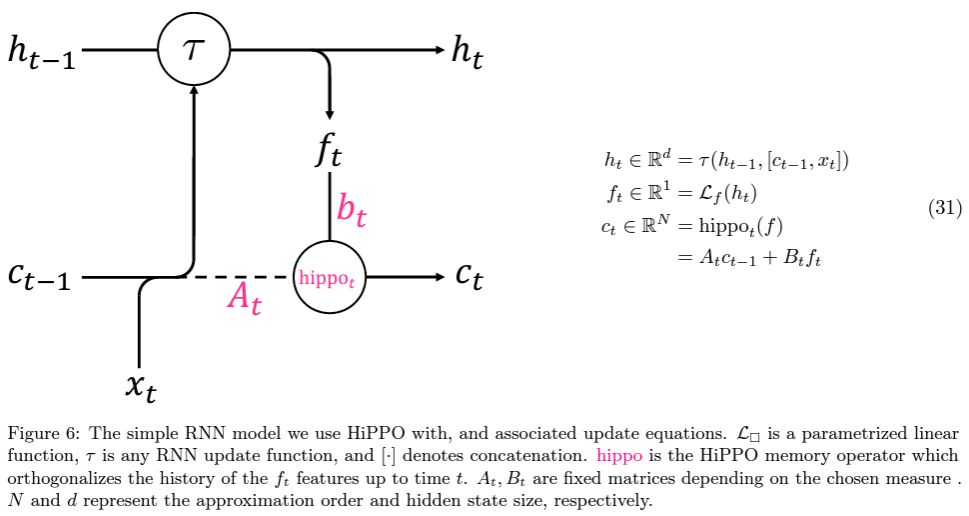

</section>

見ての通り簡単に組み込めます．
これを用いて，2つのベンチマークテストを行っています．

1つ目は，p-MNISTです．
このデータセットでは，とある順序に従ってMNISTのピクセルをシャッフルしたデータセットのようです．
空間的特徴が失われていますので，2次元の畳み込みが通用しません．  
結果は以下の通り，HiPPO-LegSが最も精度が高いです．
その他の手法もなかなかいい精度してますね．

<section style="text-align: center;">

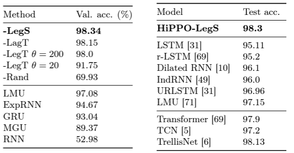

</section>

2つ目は，Character Trajectory classificationです．
これは，文字を書くときの2次元座標情報から文字を分類するタスクになります．（多分）
このタスクでは，あえてサンプリングレートを変えることで，時間スケールへの頑健さをアピールしています．

<section style="text-align: center;">

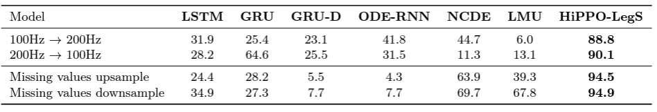

</section>

おまけです．

処理が早いぞ～正確に入力信号を近似できるぞ～という話．

<section style="text-align: center;">

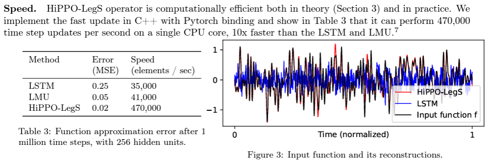

</section>

# LSSL (Linear State-Space Layers)
HiPPOは記憶に関する手法でした．
HiPPOを用いることで長期的な記憶が可能になり，RNNの記憶セル部分にHiPPOを導入するだけで精度が改善しました．

LSSLはHiPPOを状態空間モデルの形に拡張し，記憶と出力の関係性をモデリングしたものになります．
状態空間モデルの形に拡張することで，RNN・畳み込み・常微分方程式の良いところ取りをしたモデルになるというのがアピールポイントになります．
<section style="text-align: center;">

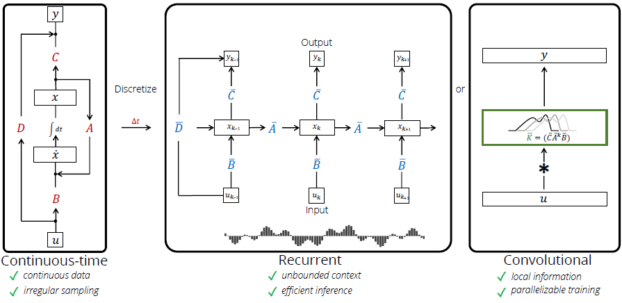

</section>

## 定式化
LSSLは次の式で表されます．

$$
\begin{align*}
\frac{d}{dt}x(t)&=Ax(t)+Bu(t) \\
y(t)&=Cx(t)+Du(t)
\end{align*}
$$

この式は状態空間モデルと呼ばれています．
第1式が隠れ状態の更新を行い，第2式が出力を行います．
そして変数が若干違いますが，第1式はHiPPOと同じ式の形をしています．

HiPPOと同様に離散化を行います．
$\alpha=\frac{1}{2}$のGBT（=Bilinear）を用いれば，
$$
\begin{align*}
x_{t} &= \bar{A}x_{t-1} + \bar{B}u_{t} \\
y_t &= Cx_t + Du_t
\end{align*}
$$

と離散化できます．ただし，
$$
\bar{A} = (I-\frac{1}{2} \Delta t A)^{-1}(I+\frac{1}{2} \Delta t A) \\
\bar{B} = (I-\frac{1}{2} \Delta t A)^{-1}\Delta tB
$$

## LSSL ⇔ RNN
ここでは，LSSLがRNNと同等の表現力を持つことを見ていきます．

### LSSL ⇒ RNN
これは非常にシンプルです．
LSSLにおける式を図示すると以下のようになり，再帰構造を持つことは明らかです．
LSSLは行列演算で成り立っているので，非線形層を持たない線形RNNと捉えることができます．

<section style="text-align: center;">

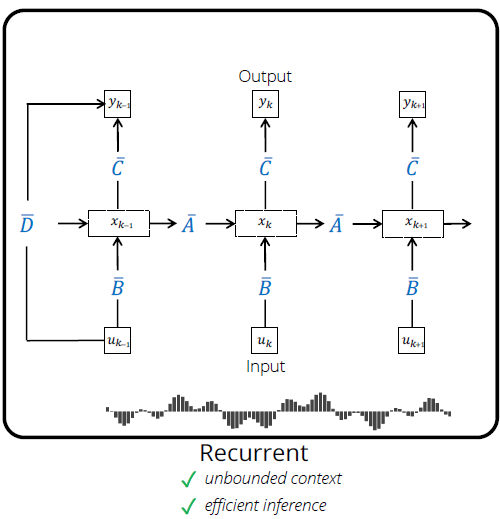

</section>

### RNN ⇒ LSSL
こちらが問題ですね．
RNNがLSSLであることを証明していきます．

---
**補題 C.1: 離散化によるゲートの導入**

ゲート機構を持つ RNN を考える．
$$
x_k = (1 - \sigma(z_k)) x_{k-1} + \sigma(z_k) f(k, x_{k-1}),
$$

ここで，$f(k, x)$ は第2引数に対してリプシッツ連続な任意の関数である（例えば，入力$u_k$ に依存する形を取る）．
このRNNの式は，以下の連続時間の常微分方程式の離散化に対応する：
$$
\dot{x}(t) = -x(t) + f(t, x(t)).
$$

**証明**

Backwards Euler 離散化を適用すると，
$$
x_k - x_{k-1} = \Delta t_k \left[ -x_k + f(t_k, x_k) \right].
$$

この式を変形すると，
$$
x_k = \frac{1}{1 + \Delta t_k} x_{k-1} + \frac{\Delta t_k}{1 + \Delta t_k} f(t_k, x_k).
$$

ここで，$\Delta t_k = \exp(z_k)$ とすると，次のように整理できる．
$$
\frac{\exp(z_k)}{1 + \exp(z_k)} = \sigma(z_k), \quad \frac{1}{1 + \exp(z_k)} = 1 - \sigma(z_k).
$$

以上より，元のRNNの形式に対応することが確認できる．
$$
x_k = (1 - \sigma(z_k)) x_{k-1} + \sigma(z_k) f(k, x_{k-1}).
$$

---

**補題 C.2: ピカール反復による非線形性の近似**

関数 $f(t, x)$ が Picard-Lindelöf の定理の条件を満たすとする．
このとき，次の反復で構築される関数列 $x^{(\ell)}(t)$ は，連続時間の初期値問題（IVP）の解に収束する：
$$
\begin{align*}
x^{(0)}(t) &= x_0, \\
u^{(\ell)}(t) &= f(t, x^{(\ell-1)}(t)), \\
\dot{x}^{(\ell)}(t) &= A x^{(\ell)}(t) + u^{(\ell)}(t).
\end{align*}
$$

**証明**

以下のように変数変換を行う：
$$
z(t) = e^{-At} x(t),
$$

このとき，
$$
\dot{z}(t) = e^{-At} \left[ \dot{x}(t) - A x(t) \right] = e^{-At} f(t, x(t)) = e^{-At} f(t, e^{At} z(t)).
$$
Picard-Lindelöf の定理の条件から，この形式の反復が解に収束することが保証される．

---

**定理 4: LSSL による非線形ダイナミクスの近似**

LSSL の特定のパラメータ設定（$A = -1$, $B = 1$, $C = 1$, $D = 0$）により，LSSLを重ねる操作はピカール反復と同等になり，以下の ODE の解に収束する：
$$
\dot{y}(t) = -y(t) + f(t, y(t)).
$$

**証明**

LSSL での計算は次のように進む：
$$
\begin{align*}
    u^{(\ell)}(t) &= f(t, y^{(\ell-1)}(t)), \\
    \dot{y}^{(\ell)}(t) &= -y^{(\ell)}(t) + u^{(\ell)}(t).
\end{align*}
$$
この構造は，補題 C.2 におけるピカール反復の形式と完全に一致する．
したがって，LSSLを深さ方向に積み重ねることで，このODEの解を近似することができる．

---

**命題 C.3: 深い線形 RNN の対応**

次の形式の深い線形 RNN は，ピカール反復に基づき，非線形ダイナミクスを近似する：
$$
\begin{align*}
    x^{(\ell)}_k &= (1 - \sigma(z_k)) x^{(\ell)}_{k-1} + \sigma(z_k) u^{(\ell)}_k, \\
    u^{(\ell)}_k &= f(k, x^{(\ell-1)}_k).
\end{align*}
$$
この形式は，補題 C.1 および 補題 C.2 の結果を組み合わせたものである．

**証明**

補題 C.1 により，この RNN の形式は連続時間の ODE の離散化に対応する．
また，補題 C.2 により，深さ方向への積層はピカール反復と同等であるため，この RNN は非線形ダイナミクスを近似することができる．

---

一気に補題等を紹介しました．
補題 C.1 より，ゲート機構を持つRNNは，特定のパラメータのLSSLを離散近似したものであることが分かります．
そして，定理 4 および命題 C.3 より，LSSLを重ねること，ゲート機構を持つRNNを重ねることはピカールの反復近似法と同等の操作であることが分かります．
つまり，ゲート機構を持つRNNとは何層も重ねたLSSLの一種であるということです．

## LSSL ⇔ Convolution
ここでは，LSSLが畳み込みと同等の表現力を持つことを見ていきます．

### LSSL ⇒ Convolution
LSSLの式を変形すると
$$
\begin{align*}
y_t &= C(\bar{A}x_{t-1}+\bar{B}u_t)+Du_t \\
&= C(\bar{A}(\bar{A}x_{t-2}+\bar{B}u_{t-1})+\bar{B}u_t)+Du_t \\
&\dots \\
&= C(\bar{A})^t\bar{B}u_0 + C(\bar{A})^{t-1}\bar{B}u_1 + \dots + C\bar{B}u_t + Du_t
\end{align*}
$$
となり，この式は $y=\mathcal{K}_L(\bar{A},\bar{B},C)*u+Du$ という畳み込み演算で記述できます．
$$
\mathcal{K}_L := (C\bar{B},C\bar{A}\bar{B},...,C\bar{A}^{L-1}\bar{B})
$$

つまり，LSSLの計算は高速フーリエ変換（FFT）を用いれば高速に計算することできます．

一方で，$\bar{A}^{L-1}$ を計算するには非常に時間がかかるのでここの工夫は必須になります．
この部分は後に説明します．

### Convolution ⇒ LSSL
畳み込みの式は次のようになります．
$$
y(t)=\int h(\tau)u(t-\tau)d\tau
$$
ここで$h$はフィルタです．
詳細は省きますが，畳み込みと状態空間モデルは密接な関係にあり，畳み込みフィルタ $h$ は有理関数として表現でき、その有理関数は状態空間モデルによって表されます。
つまり、どのような畳み込みフィルタでも、状態空間モデルを使って近似が可能です。

HiPPOの部分でも触れましたが，LSSLの行列の設定によってはスライディングウィンドウを表現することができます．

## 表現力
さて，ここまでについてまとめると，
- LSSLはRNNを含み，非線形常微分方程式を解くだけの十分な表現力を持つ
- LSSLは畳み込みとして表現できるため，非常に高速に計算可能

## 学習
ここまでLSSLの表現力について解説してきました．
次にどのようにして学習を行うかを見ていきます．
重要なポイントは次の2つです．
- Aを学習するときに，HiPPOの枠組みから外れないようにしたい
- 畳み込みカーネルを高速に計算したい

しかし残念なことに，LSSLにおける工夫は綺麗ではないらしく，計算は非常に不安定だといいます．
これを解決したのが次に紹介するS4になります．

# S4
前述したとおり，S4はLSSLにおける2つの課題を華麗に解決した手法です．
LSSLでは，HiPPOの一般的なクラスを求めることでHiPPO行列の学習を行っていましたが，S4ではこれを諦め，最低限HiPPO-LagT・HiPPO-LegT・HiPPO-LegSが含まれるクラスを求めることにします．
そして，そうして求めたクラスでは，畳み込みカーネルを高速に計算することができます．

$$
\begin{align*}
x_{t} &= \bar{A}x_{t-1} + \bar{B}u_{t} \\
y_t &= Cx_t + Du_t
\end{align*}
$$

## 対角化のモチベーション
畳み込みカーネルを計算するとき，行列 $A$ が対角化できたらなぁ～なんてことを考えます．
なぜなら，対角行列であればべき乗を楽に計算できるからです．

>[!NOTE]
>### なぜ対角化？
>

>
 詳細 

>
>$n$ 次の正方行列 $A$ が $n$ 本の一次独立な固有ベクトルを持つとき，$n$ 次対角行列 $\Lambda$ と $n$ 次正則行列 $V$ が存在して，以下のように対角化することができます．
>$$
>V^{-1}AV=\Lambda
>$$
>ここで，対角行列 $\Lambda$ は次のように表されるとします．
>$$
>\Lambda=
>\begin{pmatrix} 
>  \lambda_1 & 0 & \dots  & 0 \\
>  0 & \lambda_2 & \dots  & 0 \\
>  \vdots & \vdots & \ddots & \vdots \\
>  0 & 0 & \dots  & \lambda_n
>\end{pmatrix} 
>$$
>対角行列のべき乗は楽に計算することができ，
>$$
>\Lambda^k=
>\begin{pmatrix} 
>  \lambda_1^k & 0 & \dots  & 0 \\
>  0 & \lambda_2^k & \dots  & 0 \\
>  \vdots & \vdots & \ddots & \vdots \\
>  0 & 0 & \dots  & \lambda_n^k
>\end{pmatrix} 
>$$
>となります．
>すると，元の行列 $A$ のべき乗について以下が成り立ちます．
>$$
>\begin{align*}
>A^k &= (V\Lambda V^{-1})^k \\
>&=(V\Lambda V^{-1})(V\Lambda V^{-1})\cdots(V\Lambda V^{-1}) \\
>&=V\Lambda (V^{-1}V)\Lambda (V^{-1}V) \cdots \Lambda V^{-1} \\
>&=V\Lambda^kV^{-1}
>\end{align*}
>$$
>$\Lambda^k$ は楽に計算できるので，$A^k$ も効率的に計算することができます．
>
>

しかしここで2つの疑問が浮かびます．

1. $A$ を対角化してしまっても良いのか？
2. そもそも $A$ は対角化可能なのか？

これらについて次の2つの補題が成り立ちます．

---

**補題 1**

状態空間モデルの式に共役な作用を施しても同じ変換 $u \rightarrow y$ を維持する．
$(A,B,C,D)\sim(V^{-1}AV,V^{-1}B,CV,D)$

**証明**

共役な作用を施す前後の式を比較する．

【前】
$$
\begin{align*}
x_{t} &= \bar{A}x_{t-1} + \bar{B}u_{t} \\
y_t &= Cx_t + Du_t
\end{align*}
$$

【後】
$$
\begin{align*}
x_{t} &= V^{-1}\bar{A}Vx_{t-1} + V^{-1}\bar{B}u_{t} \\
y_t &= CVx_t + Du_t
\end{align*}
$$

【後】の式において，左から $V$ をかけた上で， $x=Vx$ と定義しなおせば全く同じ式となる．

---

**補題 2**

HiPPO-LegSによって導かれるHiPPO行列 $A$ は，行列 $V_{i,j}=\begin{pmatrix}i+j \\ i-j\end{pmatrix}$ によって対角化される．
特に，$V_{3i,i}=\begin{pmatrix}3i \\ i\end{pmatrix} \approx 2^{4i}$ であり，$V$ は最大で $2^{4N/3}$ の大きさの要素を持つ．

**証明**

略

---

補題1では，$A$ を対角化しても，$B,C$ を適切に変更することで出力に影響を与えないことを保証しています．
補題2では，HiPPO行列が対角化可能であることを主張している一方で，正則行列 $V$ の要素が二項係数に従うため，潜在次元数 $N$ に応じて指数的に増えてしまい，数値的に安定しないことを示しています．

つまり，対角化するモチベーションはあるものの現実的に難しいということです．
LSSLでも同様の議論を行い，対角化とは別のアプローチを取ったのですが，そちらも $N$ が大きくなると数値的に安定しないことがこの論文内で示されています．

## Normal Plus Low-Rank (NPLR)とDiagonal Plus Low-Rank (DPLR)
さて，対角化は難しそうだということが分かったので，ここでは対角化チックな別の方法を取ることにします．

そこでNormal Plus Low-Rank (NPLR)という形式を考えます．

---

**定義** : Normal Plus Low-Rank (NPLR)

行列 $A\in\mathbb{R}^{N\times N}$ が正規行列 $F$ と低ランク行列 $P,Q$ を用いて以下のように書けるとき，$A$ はNPLR表現を持つという．
$$
A = F - PQ^\top
$$

---

（なんでplusなのに引き算しているんだというツッコミはやめましょう．）

そして実は全てのHiPPO行列（-LagT, -LegT, -LegS）は，NPLR表現を持ちます．

---

**定理 1**

すべてのHiPPO行列は，ユリタリ行列 $V\in\mathbb{C}^{N\times N}$，対角行列 $\Lambda$，低ランク行列 $P,Q\in\mathbb{R}^{N\times r}$で表されるNPLR表現を持つ．
すべてのHiPPO行列において，$r=1$ か $r=2$ であり，特にHiPPO-LegSでは $r=1$ である．
$$
A = V\Lambda V^* - PQ^\top = V(\Lambda-(V^*P)(V^*Q)^*)V^*
$$

>[!NOTE]
>正規行列はユリタリ行列により対角化可能（$V^*FV=\Lambda$）なので，$F=V\Lambda V^*$

**証明**

 HiPPO-LagT 

HiPPO-LagTは次の式で表せました．
$$
\begin{align*}
A_{n,k} &= -\begin{bmatrix}
\frac{1 + \beta}{2} & 0 & \cdots & 0 \\
1 & \frac{1 + \beta}{2} & \cdots & 0 \\
\vdots & \ddots & \ddots & \vdots \\
1 & 1 & \cdots & \frac{1 + \beta}{2}
\end{bmatrix}
\end{align*}
$$
ここに行列 $M_{n,k}=\frac{1}{2}$ を加えると，
$$
\begin{align*}
M_{n,k}+A_{n,k} &= -\begin{bmatrix}
\frac{\beta}{2} & -\frac{1}{2} & \cdots & -\frac{1}{2} \\
\frac{1}{2} & \frac{\beta}{2} & \cdots & -\frac{1}{2} \\
\vdots & \ddots & \ddots & \vdots \\
\frac{1}{2} & \frac{1}{2} & \cdots & \frac{\beta}{2}
\end{bmatrix}
\end{align*}
$$
ここで交代行列 $S$ を以下のように定義します．
$$
\begin{align*}
S = -\begin{bmatrix}
0 & -\frac{1}{2} & \cdots & -\frac{1}{2} \\
\frac{1}{2} & 0 & \cdots & -\frac{1}{2} \\
\vdots & \ddots & \ddots & \vdots \\
\frac{1}{2} & \frac{1}{2} & \cdots & 0
\end{bmatrix}
\end{align*}
$$
すると，
$$
M_{n,k}+A_{n,k} = -\frac{\beta}{2}I + S
$$
と表せます．
そして交代行列はユリタリ行列によって対角化可能であることが知られており，$-\frac{\beta}{2}I + S$ も同じ行列で対角化することができます．
さらに，例えば $P_n,Q_k=\frac{1}{\sqrt{2}}$ とおけば，$M_{n,k}=PQ^\top$ とすることができるので，
$$
\begin{align*}
A&=(-\frac{\beta}{2}I + S) - M \\
&=V\Lambda V^*-PQ^\top
\end{align*}
$$
となり，NPLR表現を持ちます．

 HiPPO-LegT 

HiPPO-LegTは次の式で表せました．
$$
\begin{align*}
A_{nk} &= -(2n + 1)
\begin{cases}
1 & \text{if}\quad k\leq n \\
(-1)^{n-k} & \text{if}\quad k\geq n
\end{cases} \\
\end{align*}
$$
ここではスケーリング $(2n + 1)$ は無視して考えます．
次のような行列 $M_{nk}$ を定義します．
$$
\begin{align*}
M_{nk}= 
\begin{cases}
1 & \text{if } n + k = even \\
0 & \text{if } n + k = odd
\end{cases}
\end{align*}
$$
すると，
$$
\begin{align*}
M_{nk} + A_{nk} = -
\begin{cases}
-1 & \text{if } (n > k) \land (n + k = odd)\\
0 & \text{if } n + k = even \\
1 & \text{if } (n < k) \land (n + k = odd)
\end{cases}
\end{align*}
$$
これは交代行列です．
この交代行列を $S$ とします．

>[!NOTE]
>$N=4$の例
>$$
>\begin{align*}
>M_{nk}+A_{nk} &= 
>\begin{bmatrix}
>1 & 0 & 1 & 0 \\
>0 & 1 & 0 & 1 \\
>1 & 0 & 1 & 0 \\
>0 & 1 & 0 & 1
>\end{bmatrix}
>+
>\begin{bmatrix}
>-1 & 1 & -1 & 1 \\
>-1 & -1 & 1 & -1 \\
>-1 & -1 & 1 & 1 \\
>-1 & -1 & -1 & -1
>\end{bmatrix} \\
>&=
>\begin{bmatrix}
>0 & 1 & 0 & 1 \\
>-1 & 0 & 1 & 0 \\
>0 & -1 & 0 & 1 \\
>-1 & 0 & -1 & 0
>\end{bmatrix}
>\end{align*}
>$$

交代行列はユリタリ行列によって対角化可能であることが知られています．
さらに，例えば
$$
\begin{align*}
P,Q=\begin{bmatrix}
1 & 0  \\
0 & 1  \\
1 & 0  \\
0 & 1  \\
\vdots & \vdots
\end{bmatrix}
\end{align*}
$$
とおけば，$M_{n,k}=PQ^\top$ とすることができるので，
$$
\begin{align*}
A&=S - M \\
&=V\Lambda V^*-PQ^\top
\end{align*}
$$
となり，NPLR表現を持ちます．

 HiPPO-LegS 

HiPPO-LegSは次の式で表せました．
$$
\begin{align*}
A_{nk} &= -
\begin{cases}
(2n + 1)^{\frac{1}{2}}(2k + 1)^{\frac{1}{2}} & \text{if}\quad n>k \\
n+1 & \text{if}\quad n=k \\
0 & \text{if}\quad n<k
\end{cases}
\end{align*}
$$
ここに行列 $M_{nk} = \frac{1}{2} (2n + 1)^{1/2} (2k + 1)^{1/2}$ を加えると，
$$
\begin{align*}
M_{nk} + A_{nk} = -
\begin{cases}
\frac{1}{2} (2n + 1)^{1/2} (2k + 1)^{1/2} & \text{if } n > k \\
\frac{1}{2} & \text{if } n = k \\
-\frac{1}{2} (2n + 1)^{1/2} (2k + 1)^{1/2} & \text{if } n < k
\end{cases}
\end{align*}
$$
ここで交代行列 $S$ を以下のように定義します．
$$
\begin{align*}
S_{nk} = -
\begin{cases}
\frac{1}{2} (2n + 1)^{1/2} (2k + 1)^{1/2} & \text{if } n > k \\
0 & \text{if } n = k \\
-\frac{1}{2} (2n + 1)^{1/2} (2k + 1)^{1/2} & \text{if } n < k
\end{cases}
\end{align*}
$$
すると，
$$
M_{n,k}+A_{n,k} = -\frac{1}{2}I + S
$$
と表せます．
そして交代行列はユリタリ行列によって対角化可能であることが知られており，$-\frac{1}{2}I + S$ も同じ行列で対角化することができます．
さらに，例えば $P_n=\frac{1}{2} (2n + 1)^{1/2}, Q_k=(2k + 1)^{1/2}$ とおけば，$M_{n,k}=PQ^\top$ とすることができるので，
$$
\begin{align*}
A&=(-\frac{1}{2}I + S) - M \\
&=V\Lambda V^*-PQ^\top
\end{align*}
$$
となり，NPLR表現を持ちます．

---

さらに，NPLR表現はDPLR表現と共役になります．

---

**定義** : Diagonal Plus Low-Rank (DPLR)

行列 $A\in\mathbb{R}^{N\times N}$ が対角行列 $\Lambda$ と低ランク行列 $P,Q$ を用いて以下のように書けるとき，$A$ はDPLR表現を持つという．
$$
A = \Lambda - PQ^\top
$$

---

NPLRとDPLRが共役であることは式変形により簡単に得られます．
$$
\begin{align*}
A &= V(\Lambda-(V^*P)(V^*Q)^*)V^* \\
V^*AV &= \Lambda-(V^*P)(V^*Q)^*
\end{align*}
$$

そしてここに，補題1が効いてきます．
状態空間モデルにおいては，共役な作用を施しても出力は変わりません．
そのため，NPLR表現を持つHiPPO行列は，DPLR表現を持つと考えてよく，DPLRを満たすように行列 $A$ を学習させます．
つまり，$A=\Lambda - PQ^\top$ として，$\Lambda,P,Q$ を学習させます．

大切なのは，対角行列を含んだ式が得られたということです．
対角化は諦めることになりましたが，それに近しい形を得たことでこの後の計算が楽になります．

## 計算アルゴリズム
さて，いよいよS4の最もすごい部分を見ていきます．
一度思い出してもらうと，S4は以下の2つの課題に対処するための手法でした．

- Aを学習するときに，HiPPOの枠組みから外れないようにしたい
- 畳み込みカーネルを高速に計算したい

このうち1つ目は，DPLRを満たすように学習すれば解決できることを求めました．
ここからは2つ目の，畳み込みカーネル $\mathcal{K}_L := (C\bar{B},C\bar{A}\bar{B},...,C\bar{A}^{L-1}\bar{B})$ を高速に計算する方法についてです．
S4では，愚直に計算すると $O(N^3L)$ かかる計算を $\tilde{O}(N+L)$ まで落とします．

### 定式化
改めて定式化を確認します．
状態空間モデルにおける定式化は次のような常微分方程式を含んでいました．

$$
\begin{align*}
\frac{d}{dt}x(t)&=Ax(t)+Bu(t) \\
y(t)&=Cx(t)+Du(t)
\end{align*}
$$
ここで，$u(t)$ は時間 $t$ に依存する入力系列，$y(t)$ は出力系列，$x(t)\in\mathbb{R}^{N\times 1}$ は隠れ状態，$A\in\mathbb{R}^{N\times N},B\in\mathbb{R}^{N\times 1},C\in\mathbb{R}^{1\times N},D\in\mathbb{R}$ はパラメータです．

そして上記を離散化すると以下のようになります．

---

$$
\begin{align*}
x_{t} &= \bar{A}x_{t-1} + \bar{B}u_{t} \\
y_t &= Cx_t + Du_t
\end{align*}\\

\bar{A} = (I-\frac{1}{2} \Delta t A)^{-1}(I+\frac{1}{2} \Delta t A) \\
\bar{B} = (I-\frac{1}{2} \Delta t A)^{-1}\Delta tB
$$

---

この式は畳み込みとして捉えることができ，畳み込みカーネルは次のようになります．
$$
\mathcal{K}_L \in \mathbb{R}^L := (C\bar{B},C\bar{A}\bar{B},...,C\bar{A}^{L-1}\bar{B})
$$
ここで，$L$ は層の数です．

また，$A$ はDPLR形式を持つため，次が成り立ちます．
$$
A=\Lambda - PQ^\top
$$
ここで，$\Lambda\in\mathbb{R}^{N\times N}$ は対角行列で，$P,Q\in\mathbb{R}^{N\times r}$です．

### アルゴリズムの詳細
簡単のため $r=1$ とし（実際にHiPPO-LagT，HiPPO-LegSは $r=1$），統一性のため $C\in\mathbb{R}^{N\times 1}$ として以下のように整えます．

---

$$
\begin{align*}
x_{t} &= \bar{A}x_{t-1} + \bar{B}u_{t} \\
y_t &= C^*x_t + Du_t \\

\bar{A} &= (I-\frac{1}{2} \Delta t A)^{-1}(I+\frac{1}{2} \Delta t A) \\
\bar{B} &= (I-\frac{1}{2} \Delta t A)^{-1}\Delta tB \\

\mathcal{K}_L(\bar{A},\bar{B},C) \in \mathbb{R}^L &:= (C^*\bar{B},C^*\bar{A}\bar{B},...,C^*\bar{A}^{L-1}\bar{B})
\end{align*}
$$

---

$\mathcal{K}_L$ を直接計算する代わりに次のような生成関数を考えます．
$$
\hat{K}(z; \bar{A}, \bar{B}, C) \in \mathbb{C} := \sum_{k=0}^{\infty} C^* \bar{A}^k \bar{B} z^k = C^* (I - \bar{A}z)^{-1} \bar{B}
$$
式変形には無限等比級数の和の公式を使っています．
また，長さ $L$ までの生成関数を以下のように定義します．
$$
\hat{K}_L(z; \bar{A}, \bar{B}, C) \in \mathbb{C} := \sum_{k=0}^{L-1} C^* \bar{A}^k \bar{B} z^k = C^* (I - \bar{A}^L z^L)(I - \bar{A}z)^{-1} \bar{B} \\
\hat{K}_L(\Omega; \bar{A}, \bar{B}, C) \in \mathbb{C}^L := \left( \hat{K}_L(z_j; \bar{A}, \bar{B}, C) \right)_{j \in [L]}
$$

なぜこのような関数を考えるかというと，次の補題が成り立つからです．

---
**補題 C.2**

カーネル $\mathcal{K}_L(\bar{A},\bar{B},C)$ は，1のべき乗根 $\Omega=\exp(-2\pi i\frac{j}{L}):j\in[L]$ における生成関数 $\hat{K}_L(\Omega; \bar{A}, \bar{B}, C)$ から $O(L\log L)$ で安定的に求めることができる．

**証明**

カーネルの $k$ 番目の要素を $K_k$ とすると
$$
K_k = C^* \bar{A}^k \bar{B}
$$
このとき，以下の関係が成り立つ．
$$
\begin{align*}
\hat{K}_L(z_j; \bar{A}, \bar{B}, C) &= \sum_{k=0}^{L-1} C^* \bar{A}^k \bar{B} z_j^k \\
&= \sum_{k=0}^{L-1} K_k \exp(-2\pi i\frac{jk}{L})
\end{align*}
$$
これは離散フーリエ変換の式と一致しており，$\hat{K}_L$ が $K_k$ を離散フーリエ変換したものだと分かる．
したがって，$\hat{K}_L$ が求まれば，逆離散フーリエ変換によって $K_k$ を求めることができ，高速フーリエ変換アルゴリズムを用いれば，$O(L\log L)$ で計算可能である．

---

この補題から，$\hat{K}_L(z; \bar{A}, \bar{B}, C)$ に1の $L$ 乗根を入れて逆離散フーリエ変換をすればカーネルが求まることが分かりました．
では，$\hat{K}_L(z; \bar{A}, \bar{B}, C)$ はどうやって求めるのでしょうか？
その答えが次の補題です．

---
**補題 C.3**

行列 $A$ が $A=\Lambda - PQ^*$ というDPLR形式を持つとすると，任意の1のべき乗根 $z \in \Omega$ に対して，$\hat{K}_L(z; \bar{A}, \bar{B}, C)$ は次を満たす．
$$
\begin{align*}
\hat{K}_L(z; \bar{A}, \bar{B}, C) &= \frac{2}{1 + z} \left[ \tilde{C}^* R(z) B - \tilde{C}^* R(z) P (1 + Q^* R(z) P)^{-1} Q^* R(z) B \right] \\
\tilde{C} &= (I - \bar{A}^L)^* C \\
R(z; \Lambda) &= \left( \frac{2}{\Delta} \frac{1 - z}{1 + z} I - \Lambda \right)^{-1}
\end{align*}
$$

**証明**
$$
\begin{align*}
\hat{K}_L(z; \bar{A}, \bar{B}, C) &= \sum_{k=0}^{L-1} C^* \bar{A}^k \bar{B} z^k \\
&= C^* (I - \bar{A}^L z^L)(I - \bar{A}z)^{-1} \bar{B} \\
&= \tilde{C}^*(I - \bar{A}z)^{-1} \bar{B}
\end{align*}
$$
ここで
$$
\tilde{C} = (I - \bar{A}^L)^* C
$$

離散化について $\Delta t$ を $\Delta$ と表記すると
$$
\begin{align*}
\bar{A} &= (I-\frac{\Delta}{2} A)^{-1}(I+\frac{\Delta}{2} A) \\
\bar{B} &= (I-\frac{\Delta}{2} A)^{-1}\Delta B \\
\end{align*}
$$

$I=( I - \frac{\Delta}{2} A )^{-1} ( I - \frac{\Delta}{2} A )$ として，さらに $\bar{A}$ を代入すると，
$$
\begin{align*}
\hat{K}_L(z; \bar{A}, \bar{B}, C) &= C^* \left( I - \bar{A} z \right)^{-1} \bar{B} \\
 &= \tilde{C}^* \left[ \left( I - \frac{\Delta}{2} A \right)^{-1} \left( I - \frac{\Delta}{2} A \right) - \left( I - \frac{\Delta}{2} A \right)^{-1} \left( I + \frac{\Delta}{2} A \right) z \right]^{-1} \bar{B} \\
&= \tilde{C}^* \left[ \left( I - \frac{\Delta}{2} A \right) - \left( I + \frac{\Delta}{2} A \right) z \right]^{-1} \left( I - \frac{\Delta}{2} A \right) \bar{B} \\
&= \tilde{C}^* \left[ I (1 - z) - \frac{\Delta}{2} A (1 + z) \right]^{-1} \Delta B \\
&= \tilde{C}^* \left[ \frac{1+z}{2} \left(2I \frac{1 - z}{1 + z} - \Delta A \right) \right]^{-1} \Delta B \\
&= \frac{2\Delta}{1 + z} \tilde{C}^* \left[ 2I \frac{1 - z}{1 + z} - \Delta A \right]^{-1} B \\
&= \frac{2}{1 + z} \tilde{C}^* \left[ \frac{2}{\Delta} \frac{1 - z}{1 + z}I - A \right]^{-1} B
\end{align*}
$$
$A$ はDPLR形式を持つので，
$$
\begin{align*}
\hat{K}_L(z; \bar{A}, \bar{B}, C) &= \frac{2}{1 + z} \tilde{C}^* \left[ \frac{2}{\Delta} \frac{1 - z}{1 + z}I - \Lambda +PQ^* \right]^{-1} B \\
&= \frac{2}{1 + z} \tilde{C}^* \left[ R(z;\Lambda)^{-1} + PQ^* \right]^{-1} B
\end{align*}
$$
ここで
$$
R(z; \Lambda) = \left( \frac{2}{\Delta} \frac{1 - z}{1 + z} I - \Lambda \right)^{-1}
$$

さらにここにWoodburyの行列恒等式を適用すると，
$$
\begin{align*}
\hat{K}_L(z; \bar{A}, \bar{B}, C) &= \frac{2}{1 + z} \tilde{C}^* \left[ R(z)^{-1} + PQ^* \right]^{-1} B \\
&= \frac{2}{1 + z} \tilde{C}^* \left[ R(z) - R(z) P \left( I + Q^* R(z) P \right)^{-1} Q^* R(z) \right] B \\
&= \frac{2}{1 + z} \left[ \tilde{C}^* R(z) B - \tilde{C}^* R(z) P (1 + Q^* R(z) P)^{-1} Q^* R(z) B \right]
\end{align*}
$$

>[!NOTE]
>woodburyの行列恒等式
>
>$$
>\left( A + U C V \right)^{-1} = A^{-1} - A^{-1} U \left( C^{-1} + V A^{-1} U \right)^{-1} V A^{-1}
>$$

---

一見すると複雑な計算に見えますが，実はよく見ると中に出てくる行列積 $\tilde{C}^* R(z) B$，$\tilde{C}^* R(z) P$，$Q^* R(z) P$，$Q^* R(z) B$ は全てスカラーになります．
しかも $R(z)$ は対角行列なので，登場する行列さえ分かれば $O(N)$ で計算することが可能です．
登場する行列（ベクトル）についてですが，$B,P,Q$ はもともと学習パラメータです．
また，$\tilde{C} = (I - \bar{A}^L)^* C$ については，はじめから $\tilde{C}$ を学習すると考えれば問題ありません．

そして最後に $R(z)$ ですが，対角行列の逆行列なので $O(N)$ で計算可能であり，問題なく見えます．
しかし，$z$ は1の $L$ 乗根全てなので，$O(NL)$ の計算量がかかってしまいます．

そこで全ての行列積 $\tilde{C}^* R(z) B$，$\tilde{C}^* R(z) P$，$Q^* R(z) P$，$Q^* R(z) B$ を一括で計算することを考えてみると，次のような行列を計算すれば良いです．
$$
\begin{align*}
K &= \begin{bmatrix} \tilde{C} & Q \end {bmatrix}^* R(z) \begin{bmatrix} B & P \end{bmatrix} \\
&= \begin{bmatrix} \tilde{C}^* \\ Q^* \end{bmatrix} R(z) \begin{bmatrix} B & P \end{bmatrix} \\
&= \begin{bmatrix} \tilde{C}^* R(z) \\ Q^* R(z) \end{bmatrix} \begin{bmatrix} B & P \end{bmatrix} \\
&= \begin{bmatrix} \tilde{C}^* R(z) B & \tilde{C}^* R(z) P \\ Q^* R(z) B & Q^* R(z) P \end{bmatrix}
\end{align*}
$$

ここでとても嬉しいことがあります．
$R(z)$ という行列は実はコーシー行列と呼ばれるものであり，その行列積は高速多重極法というアルゴリズムによって命題5のような計算量で導くことができます．

---

**定義：コーシー行列**

ノード $\Omega = (\omega_i) \in \mathbb{C}^M$ および $\Lambda = (\lambda_j) \in \mathbb{C}^N$ 上のコーシー行列またはカーネルは以下で表される。
$$
M \in \mathbb{C}^{M \times N} = M(\Omega, \Lambda) = (M_{ij})_{i \in [M], j \in [N]} \quad M_{ij} = \frac{1}{\omega_i - \lambda_j}
$$

---

**命題 5**

コーシー行列は，$O(M+N)$ の空間を必要とし，以下の計算量を必要とする．
$$
\mathcal{C}(M, N) = 
\begin{cases}
O(M N) & \text{naively} \\
O((M + N) \log^2(M + N)) & \text{in exact arithmetic} \\
O((M + N) \log(M + N) \log \frac{1}{\varepsilon}) & \text{numerically to precision } \varepsilon.
\end{cases}
$$

---

したがって，$\hat{K}_L(z; \bar{A}, \bar{B}, C)$ は，$\tilde{O}(L+N)$（ソフトオー記法）で求めることができ，逆離散フーリエ変換によって $O(L\log L)$ の計算量でカーネルを計算することができます．

<section style="text-align: center;">

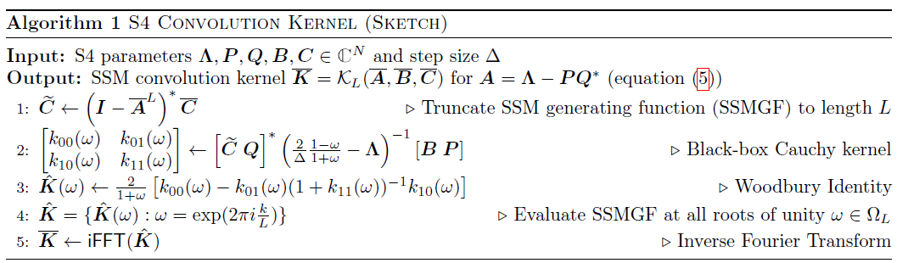

</section>

## アーキテクチャ
モデルアーキテクチャについて軽く補足します．
S4レイヤーは，$\mathbb{R}^L\rightarrow\mathbb{R}^L$ というように1次元の入力に対し，入力と等しい長さの出力を行います．
もし入力特徴量が $H$ 個ある場合は，その分だけ層を並列します．
そして，得られた出力 $\mathbb{R}^{H\times L}$ を位置に合わせて線形層でミックスするという操作を行います．
そのため，層としての働きはAttention層とほぼ同じと考えていいと思います．

>[!NOTE]
>後続研究により，$A=\Lambda-PP^*$ とした方が安定性があるとされています．

## 実験結果
### Long Range Arena
以下の結果は，Long Range Arenaという長期依存性に関するタスクの結果になります．
一目で分かるように，圧倒的な性能を誇っています．
特に，PATH-Xというタスクは，これまで乱択と同程度の精度しか出せていなかったにもかかわらず，S4では96%という精度をたたき出しました．

<section style="text-align: center;">

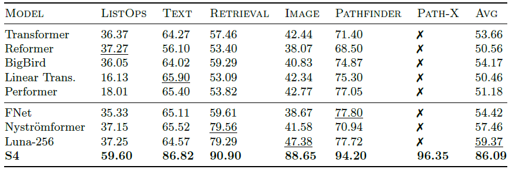

</section>

PATH-Xというのは，左の図のように2つの点が点線で繋がれているかを当てるベンチマークです．
2d-convは使用不可であり，1次元のベクトルにして入力されます．
右の図は学習されたカーネルになります．

<section style="text-align: center;">

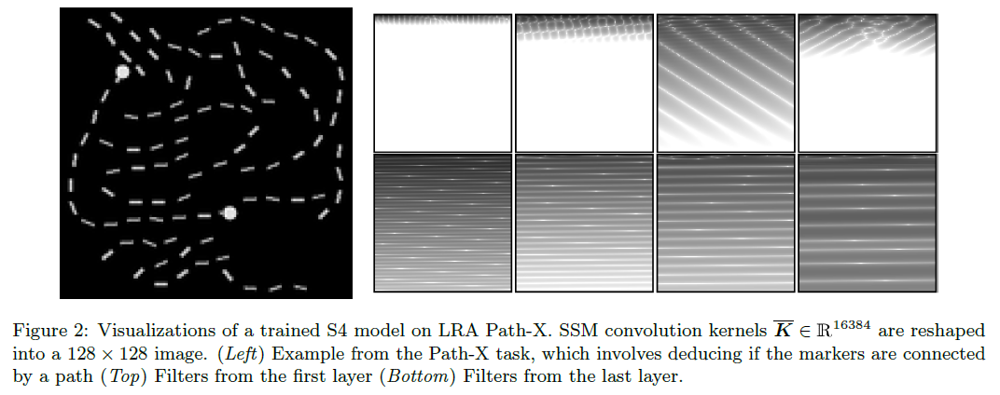

</section>

### 時系列予測
一般的な時系列モデルとしての性能比較もされています．
Transformer系のモデルと比較しても優秀な成績をおさめています．

<section style="text-align: center;">

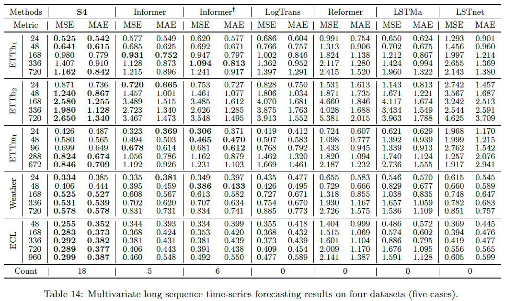

</section>

### 画像・テキスト
画像とテキストについても紹介します．
精度に関してはTransformerの方が良かったりはしますが，特筆すべきは処理の速さになります．
言語の場合，Transformerの60倍の処理速度です．
S4層+S4層+MLPを16ブロック重ねてモデルを作成しています．
S4層は，Self-Attention層に比べてパラメータ数が1/4なので，1つのブロックに複数のS4層を入れられます．

<section style="text-align: center;">

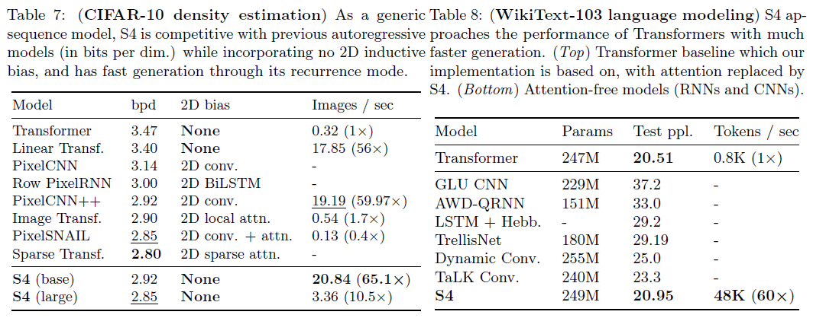

</section>

## 考察
ここまで読むと，S4はとても素晴らしいモデルに感じます．
しかし，時系列モデルのベンチマーク比較に登場しているところを見たことがありません．
時系列予測で示した結果は，TimesNetなどの手法でも使われているベンチマークですが，比較対象にはなりませんでした．
もしかしたら，どこか使い勝手が悪いのでしょうか？

以下のような記事を見つけました．

https://ai-scholar.tech/articles/time-series/FiLM

どうやら直交多項式で近似するという性質上，隠れ次元数が増えるほどオーバーフィッティングしやすく，ノイズに弱くなってしまうようです．
（逆に言えば，入力の保存は精度がかなり高い）
記事の手法では，ノイズを低減することで飛躍的に向上させています．
しかしこの手法もまた，別の論文で出てきたところを見たことがありません...

誰か検証して...

# Mamba vs Transformer
あくまで個人の見解ですが，mambaがTransformerの代替になることはないと思います．
mambaはRNNであり（？），どんなに長い系列も固定長のベクトルに押し込んでしまいます．
しかしTransformerは，Attention機構によってどんな系列についても1トークンずつベクトルとして扱います．
そのため，当然Transformerの方が精度が出ると思います．

しかしmambaにも良いところがあり，それは長期的な依存関係を捉えられるという点です．
系列が長くなってくると，Transformerで処理するのはかなり厳しくなりますが，mambaであれば苦ではありません．
そのため，ものすごく長い系列についてはmambaが優位に立つ可能性もなくはないと思います．

個人的には，両者のハイブリッドが良いのだろうと思います．
実際にハイブリッド手法（Jamba，Zamba）が提案されていますので，何かしら嬉しいことがあるのでしょう．

例えば，100万トークンの入力があったとします．
Transformerではさすがに厳しいです．
そこで，1万トークンごとに分け，それらをmambaに入力します．
そうすれば，1万トークンを固定長のベクトルに押し込んでくれるわけですから，100個のベクトルができることになります．
この100個のベクトルをTransformer（Attention）に入力してあげれば，精度を保ったまま長い入力に対応できるのではないでしょうか？
いわば，トークン単位の埋め込みをした後に，段落単位の埋め込みをするようなものです．
そして，Transformerに続きの段落について計算してもらいます．
そしたら，段落単位の逆埋め込み，トークン単位の逆埋め込みを経て，出力文ができあがります．
完全に想像の話ですが，もしこれができるとなると，一度の計算で1つの段落を出力できることになります．
そうすればかなりの計算量削減になるのではないでしょうか？
S4の考察より，入力の保存についてはかなりのものなので，入力の保存をmamba，予測をTransformerが...なんて．