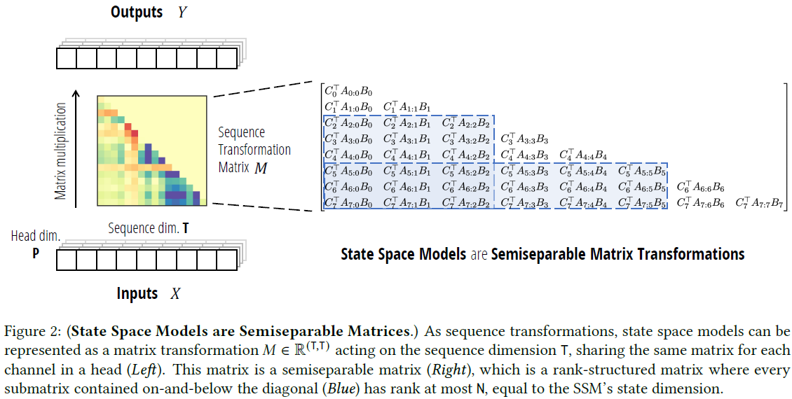

<link href="github.css" rel="stylesheet"></link>

 Mambaを知ろう 

あらゆる最新AIはアーキテクチャとしてTransformerを採用しており，まさにTransformerの時代といえると思います．  
そんな中，Mambaという新しい手法が登場し，「**Transformerを凌駕しうる**」と期待されているようです．  
そんな注目の最新手法Mambaについて解説していこうと思います．

 目次 

- [1. 注意](#1-注意)
- [2. はじめに](#2-はじめに)
- [3. 事前知識](#3-事前知識)
  - [3.1. RNN](#31-rnn)
  - [3.2. LSTM](#32-lstm)
  - [3.3. Transformer](#33-transformer)
- [4. LMU (Legendre Memory Unit)](#4-lmu-legendre-memory-unit)
  - [4.1. ルジャンドル多項式による近似](#41-ルジャンドル多項式による近似)
    - [4.1.1. ルジャンドル多項式とは？](#411-ルジャンドル多項式とは)
    - [4.1.2. ルジャンドル多項式による関数近似](#412-ルジャンドル多項式による関数近似)
    - [4.1.3. なぜ入力を近似するのか？](#413-なぜ入力を近似するのか)
  - [4.2. LMUの工夫](#42-lmuの工夫)
- [5. HiPPO (Higher-order Polynomial Projection Operations)](#5-hippo-higher-order-polynomial-projection-operations)
  - [5.1. 問題設定](#51-問題設定)
  - [5.2. HiPPOフレームワーク](#52-hippoフレームワーク)
  - [5.3. HiPPOの具体化](#53-hippoの具体化)
    - [5.3.1. HiPPO-LegT (Translated Legendre)](#531-hippo-legt-translated-legendre)
    - [5.3.2. HiPPO-LagT (Translated Laguerre)](#532-hippo-lagt-translated-laguerre)
    - [5.3.3. HiPPO-LegS (Scaled Legendre)](#533-hippo-legs-scaled-legendre)
  - [5.4. 離散化](#54-離散化)
  - [5.5. HiPPO-LegSの性質](#55-hippo-legsの性質)
  - [5.6. 実験](#56-実験)
- [6. LSSL (Linear State-Space Layers)](#6-lssl-linear-state-space-layers)
  - [6.1. 定式化](#61-定式化)
  - [6.2. LSSLの表現力](#62-lsslの表現力)
    - [6.2.1. LSSL ⇔ RNN](#621-lssl--rnn)
      - [6.2.1.1. LSSL ⇒ RNN](#6211-lssl--rnn)
    - [6.2.2. RNN ⇒ LSSL](#622-rnn--lssl)
    - [6.2.3. LSSL ⇔ Convolution](#623-lssl--convolution)
      - [6.2.3.1. LSSL ⇒ Convolution](#6231-lssl--convolution)
      - [6.2.3.2. Convolution ⇒ LSSL](#6232-convolution--lssl)
    - [6.2.4. 表現力のまとめ](#624-表現力のまとめ)
  - [6.3. 学習](#63-学習)
- [7. S4 (Structured State Space Sequence model)](#7-s4-structured-state-space-sequence-model)
  - [7.1. 対角化のモチベーション](#71-対角化のモチベーション)
  - [7.2. Normal Plus Low-Rank (NPLR)とDiagonal Plus Low-Rank (DPLR)](#72-normal-plus-low-rank-nplrとdiagonal-plus-low-rank-dplr)
  - [7.3. 計算アルゴリズム](#73-計算アルゴリズム)
    - [7.3.1. 定式化](#731-定式化)
    - [7.3.2. アルゴリズムの詳細](#732-アルゴリズムの詳細)
  - [7.4. アーキテクチャ](#74-アーキテクチャ)
  - [7.5. 実験結果](#75-実験結果)
    - [7.5.1. Long Range Arena](#751-long-range-arena)
    - [7.5.2. 時系列予測](#752-時系列予測)
    - [7.5.3. 画像・テキスト](#753-画像テキスト)
    - [7.5.4. S4D](#754-s4d)
  - [7.6. 考察](#76-考察)
- [8. H3 (Hungry Hungry HiPPOs)](#8-h3-hungry-hungry-hippos)
  - [8.1. S4の弱点](#81-s4の弱点)
  - [8.2. Attention-Likeな構造](#82-attention-likeな構造)
  - [8.3. アルゴリズム](#83-アルゴリズム)
  - [8.4. 実験結果](#84-実験結果)
- [9. Mamba](#9-mamba)
  - [9.1. S4の問題点](#91-s4の問題点)
  - [9.2. 選択的メカニズム](#92-選択的メカニズム)
  - [9.3. 効率的な計算アルゴリズム](#93-効率的な計算アルゴリズム)
    - [9.3.1. parallel scan](#931-parallel-scan)
    - [9.3.2. kernel fusion・activationの再計算](#932-kernel-fusionactivationの再計算)
  - [9.4. アーキテクチャ](#94-アーキテクチャ)
  - [9.5. 実験結果](#95-実験結果)
- [10. Mamba 2](#10-mamba-2)
  - [10.1. SSMと構造化行列](#101-ssmと構造化行列)
  - [10.2. Linear Attentionと構造化行列](#102-linear-attentionと構造化行列)
  - [10.3. State Space Duality](#103-state-space-duality)
  - [10.4. 効率的な計算アルゴリズム](#104-効率的な計算アルゴリズム)
    - [10.4.1. 対角ブロック](#1041-対角ブロック)
    - [10.4.2. 非対角ブロック](#1042-非対角ブロック)
  - [10.5. アルゴリズムの解釈](#105-アルゴリズムの解釈)
  - [10.6. モデルアーキテクチャ](#106-モデルアーキテクチャ)
  - [10.7. 実験結果](#107-実験結果)
- [11. 全体のまとめ](#11-全体のまとめ)
- [12. Mamba vs Transformer](#12-mamba-vs-transformer)

# 1. 注意
解説中たくさんの数式が出てきます．  
知識不足により，完全に理解できていなかったり，不正確な表現をしてしまうかもしれません．

また，note機能を使ってちょっとした解説などを挟みます．  
読みにくくなるかもしれません．

>[!NOTE]
>解説など

# 2. はじめに
Mambaは理論によって支えられている手法です．  
そのため，Mambaの論文だけを解説するのではなく，Mambaにいたる軌跡をたどることで理解を深めていきます．  
ここでは以下の流れに沿って解説します．

1. LMU (Legendre Memory Unit)  *NeurIPS 2019
2. HiPPO (Higher-order polynomial projection operations)  *NeurIPS 2020
3. LSSL (Linear State Space Layer)  *NeurIPS 2021
4. S4 (Structured State Space Sequence model)  *ICLR 2022
5. H3 (Hungry Hungry HiPPOs)  *ICLR 2023
6. Mamba  *ICLR 2024 Rejected
7. Mamba 2  *ICML 2024

錚々たる顔ぶれですが頑張りましょう．

# 3. 事前知識
本題に入る前に事前知識について確認します．  
ほとんど事前知識は要らないですが，RNNとLSTMについては軽く触れておきます．  
RNNとLSTMについてある程度の理解がある人はこのセクションを飛ばしてください．

## 3.1. RNN
RNN（Recurrent Neural Network）とは，時系列データや言語などの時系列データを扱うために再帰構造を取り入れたニューラルネットワークです．  
通常のニューラルネットワークは，入力情報を中間層でごちゃ混ぜにしてしまうので，時系列を考慮することができません．  
再帰構造によって，前の情報を次へと渡すことができるようになります．

---

## 3.2. LSTM
LSTM（Long Short-Term Memory）とは，RNNに記憶セル $c$ を付けることで長期記憶できるように改良した手法です．  
忘却ゲート，入力ゲート，出力ゲートの3つのゲートを持ち，入力情報をどの程度記憶セルに反映させるかを動的に決定することができます．  
3つのシグモイド関数 $\sigma$ がこの決定を司っています．

---

## 3.3. Transformer
おまけですが，Transformerについてもほんの少し触れます．  
Transformerは，Attentionという機構を持ったニューラルネットワークです．  
かなり正確性に欠けますが，図にすると次のような感じです．  
RNNとの大きな違いは，RNNが1つ前の状態を見るのに対して，Transformerでは過去全ての状態を見ます．  
そのため，Transformerは情報を圧縮することなく扱うことができ，高い性能を発揮しています．（しかも早い）

---

# 4. LMU (Legendre Memory Unit)
LMUは連続的な信号を扱うために提案されたRNNの一種です．  
通常扱われるデータは，あるサンプリング周波数の計測機器によって計測された離散的なデータですが，私たちの脳は世界からの連続的な信号を扱っています．（もしかしたらサンプリングしているのかもしれないが...）  
そこで，連続的な信号についても扱えるようにしてみようというものです．

連続信号は絶え間なく入力されるため，信号を保存するには無限の容量が必要になってしまいます．  
そのため，いかに入力情報を圧縮するかが連続信号を扱う上で重要になります．  
LMUは，**入力信号をルジャンドル多項式によって近似**することで情報を圧縮します．  
これにより効率的にデータを記憶することができ，長期的な依存関係を学習することができます．

---

## 4.1. ルジャンドル多項式による近似
### 4.1.1. ルジャンドル多項式とは？
ルジャンドル多項式とは，「ルジャンドルの微分方程式」を満たすルジャンドル関数のうち次数が非負整数のものをいいます．

$$\tag{1}
P_n(x) = \frac{1}{2^n n!} \frac{d^n}{dx^n} \left( (x^2 - 1)^n \right)
$$

この数式はロドリゲスの公式による表現で，帰納的定義にしたがった形は次の通りです．

$$\tag{2}
P_n(x) = 2^{n} \cdot \sum_{k=0}^{n} x^{k} \binom{n}{k} \binom{\frac{n+k-1}{2}}{2}
$$

帰納的定義の方が分かりやすいですね．

$n$に具体的な数字を入れてみると次のような多項式が得られます．

$$
\begin{align*}
P_0(x) &= 1, \\
P_1(x) &= x, \\
P_2(x) &= \frac{1}{2} (3x^2 - 1), \\
P_3(x) &= \frac{1}{2} (5x^3 - 3x), \\
P_4(x) &= \frac{1}{8} (35x^4 - 30x^2 + 3), \\
P_5(x) &= \frac{1}{8} (63x^5 - 70x^3 + 15x).
\end{align*}\tag{3}
$$

図示するとこんな感じです．
ルジャンドル多項式は区間 $[-1,1]$ に対して定義されています．

---

---

重要なポイントは，ルジャンドル多項式は**直交多項式系**の1つということです．  
直交多項式系については後ほど詳しく触れますが，「直交」とは2つの多項式 $P_n,P_m(n\neq m)$ について以下が成り立つことをいいます．

$$\tag{4}
\langle P_n, P_m \rangle = \int P_n(x)P_m(x) \omega (x)dx = 0
$$

ここで $\omega(x)$ は重み関数です．

### 4.1.2. ルジャンドル多項式による関数近似
ルジャンドル多項式によって関数 $f(x)$ を近似するとき，次の式が成り立ちます．

$$
\begin{align*}
f(x) &\approx \sum_{n=0}^{N-1} c_n P_n(x) \\
c_n &= \frac{2n + 1}{2} \int_{-1}^{1} f(x)P_n(x)dx
\end{align*}\tag{5}
$$

$f(x)$ をルジャンドル多項式の線形和によって表現し，その係数が $c_n$ になっています．

こんなのでちゃんと近似できるのかと思いましたが，しっかり近似できるようです．  
以下は，$f(x)=\sin(\pi x) + \sin(2\pi x) + \sin(3\pi x)$ を近似した様子です．  
$N$ （ルジャンドル多項式の数）が大きくなるほど，近似の精度が高いことが分かります．

---

### 4.1.3. なぜ入力を近似するのか？
さて，ルジャンドル多項式による関数近似が分かったところで，なぜ入力信号を近似するのか説明します．

ポイントは「情報の圧縮」と「情報の分離」です．

- 「情報の圧縮」  
LMUでは入力信号が連続的だった場合を考えています．  
連続的ということは，$\varDelta t = 0$ でデータが入力されるということであり，無限のデータポイントを扱うことになります．  
しかしメモリは有限なので，連続的な信号を保存しておくことはできません．   
そこでルジャンドル多項式で近似すると，入力信号の特性が係数ベクトルという形で表現することができます．  
信号を保存しなくても，係数から信号を再現することができるようになるのです．

- 「情報の分離」  
ルジャンドル多項式は直交多項式であるという話をしました．  
多項式が直交するということは，他の多項式と独立した情報を持つということです．  
そのため，抽出した係数は互いに独立した情報を保持しており，効率的に情報を得ることができます．

## 4.2. LMUの工夫
ルジャンドル多項式で近似すれば連続的な信号を扱えるということがお分かりいただけたと思います．  
しかし，実は大きな落とし穴があります．

それは，係数 $c_n$ を計算することが難しいということです．  
理由は入力信号を近似するためには，やはり過去の信号を保存しておかなければならないからです．

そこでLMUでは，信号をオンラインで受け取り，即座に近似係数 $c_n$ を更新する式を導きました．

$$\tag{6}
\theta \dot{\mathbf{m}}(t) = \mathbf{A} \mathbf{m}(t) + \mathbf{B} u(t)
$$

$$
\begin{align*}
\mathbf{A} &= \begin{bmatrix} a \end{bmatrix}_{ij} \in \mathbb{R}^{d\times d}, \quad a_{ij} = (2i+1)\begin{cases} -1 & \text{ if } i < j \\ (-1)^{i-j+1} & \text{ if } i \geq j \end{cases} \\
\mathbf{B} &= \begin{bmatrix} b \end{bmatrix}_{ij} \in \mathbb{R}^{d\times 1}, \quad b_i = (2i+1)(-1)^i
\end{align*} \\
\quad i,j\in [0,d-1]
$$

- $\mathbf{m}=[c_n]_{n=0,...,N-1}$

この式は，$c_n$ に関する線形常微分方程式であり，$c_n$ の更新について記述しています．

・・・と言われてもなんのこっちゃ分からないと思います．
ですが今はこの式が分からなくて問題ありません．

ここで理解していただきたいのは，連続信号を扱うために直交多項式で近似したいというモチベーションです．  
そこさえ理解していただければ，次のHiPPOに進むことができます．

# 5. HiPPO (Higher-order Polynomial Projection Operations)
HiPPOはLMUを一般化したものです．  
近似に用いる多項式をルジャンドル多項式に限らずに，係数 $c_n$ の更新式を導きます．

HiPPOの流れは大まかに以下のようになります．
1. 入力信号 $f(x)$ を近似する
2. 近似式から係数 $c_n$ を抽出する
3. 係数 $c_n$ を用いて記憶をアップデートする

HiPPOの本質は入力を圧縮した表現を獲得することなので，近似多項式がもはや直交である必要もありません．  
ですが，直交多項式の方が効率的に圧縮できますし，十分に研究されてきているので使わない手はない気がします．

>[!NOTE]
>実は基底が多項式である必要もないそうです．しかしこの論文では基底を直交多項式として進めています．

## 5.1. 問題設定
時刻 $t\geq 0$ における入力信号を $f(t) \in \mathbb{R}$，時刻 $t$ までに得られた入力信号の履歴を $f_{\leq t}:=f(x)|_{x\leq t}$ と表記します．  
測度は時間とともに変化するものとし，各時刻 $t$ に対して，$\mu^{(t)}$ を $(-\infty, t]$ 上で定義される測度とします．

>[!NOTE]
>任意の確率測度 $\mu$ が $\mathbb{R}$ 上で定義されているとき，二乗可積分関数の空間に内積
>$$\tag{7}
>\langle f, g \rangle _\mu = \int_{-\infty}^{\infty} f(x)g(x) \, d\mu(x)
>$$
>が与えられ，これによりヒルベルト空間 $H_\mu$ と対応するノルム
>$$\tag{8}
>\|f\|_{L^2(\mu)} = \langle f, f \rangle _\mu^{1/2}
>$$
>が定義されます．

このとき，$f_t$ を近似する $g^{(t)} \in \mathcal{G}$ は，$\|f_t - g^{(t)}\|_{L^2(\mu^{(t)})}$ を最小化します．  
課題は，与えられた $\mu^{(t)}$ に対して最適化問題をどのように解くか，そしてこれらの係数をオンラインでどのように更新するかです．

>[!NOTE]
>### 測度ってどんなものだろうか？
>

>
 詳細 

>
>「測度とは」と検索をかけてみると，「集合の大きさを測るもの」という説明とともに定義やら性質やらが出てきます．
>
>ただ，数式では分かりにくいので直感的なイメージを考えてみることにします．  
>目の前に大きさが全く同じ鉄球と木球があるとします．
>この2つの球の大きさを比べてみます．
>
>

>
>大きさを比べるとなると，直径や表面積，体積など色々ありますが，今回は全く同じ大きさの球なのでいずれも同じになりますね．  
>しかし質量で比較した場合はどうでしょう？  
>当然鉄球の方が重いですよね．
>なぜなら鉄球の方が**密度**が高いからです．
>
>これを2次元空間で考えてみます．（3次元でもいいです．）
>
>

>
>この空間で質量を求めるにはどうしたらいいでしょうか？
>**密度**をどのようにして取り入れたらいいでしょうか？
>
>その答えが測度です．
>
>測度は，空間内の「濃さ」の分布を決めています．  
>もし空間内の「濃さ」が下図のようになっていたら．鉄球の方が重いということのイメージも付きやすいですよね．
>
>

>
>実際この先，測度 $\mu$ に対して
>$$\tag{9}
>d\mu=\omega(x)dx
>$$
>という関係式が出てきますが，これはまさに $x$ に対して $\omega(x)$ で重み付けしたものを測度 $\mu$ としているのです．  
>直交多項式の「直交」についての説明（式 (4)）で重み関数が出てきましたが，その正体がこれになります．  
>ちなみに，空間内の濃さが一様である場合はルベーグ測度といいます．
>
>さて，長くなりましたが以上を踏まえると，今回の問題設定における測度とは，過去データの重要度にあたります．  
>下図を考えた場合，最近のデータほど重要視する（＝大きな重みを付ける）という意味になります．  
>このことさえ理解できていれば，この先に出てくる測度には困りません．
>
>

>

## 5.2. HiPPOフレームワーク
HiPPOのフレームワークを定義します．

---
**定義：HiPPO**

$(-\infty, t]$ でサポートされる時間変化する測度族 $\mu^{(t)}$，$N$ 次元の多項式が張る部分空間 $\mathcal{G}$，そして連続入力信号 $f: \mathbb{R}_{\geq 0} \to \mathbb{R}$ が与えられたとき，$f$ を最適化された投影係数 $c:\mathbb{R}_{\geq 0} \to \mathbb{R}^N$ に移す演算 HiPPO を定義する．
この演算は，以下の性質を持つ投影演算子 $\text{proj}_t$ と，係数抽出演算子 $\text{coef}_t$ をすべての時間ステップ $t$ で求め，それらの合成 $\text{coef}_t \circ \text{proj}_t$ である．  
（つまり，$(\text{hippo}(f))(t) = \text{coef}_t(\text{proj}_t(f))$ である．）

1. $\text{proj}_t$ は，時刻 $t$ までの信号 $f$，つまり $f_{\leq t} := f(x)|_{x \leq t}$ を，推論誤差 $|f_{\leq t} - g^{(t)}|_{L_2(\mu^{(t)})}$ を最小にする多項式 $g^{(t)} \in \mathcal{G}$ に射影する．
2. $\text{coef}_t : \mathcal{G} \to \mathbb{R}^N$ は，多項式 $g^{(t)}$ を，測度 $\mu^{(t)}$ に関して定義された直交多項式の基底関数の係数ベクトル $c(t) \in \mathbb{R}^N$ に射影する．
---

さて，LMUでもあったようにこれらの演算子を使って係数 $c_n$ を計算することは簡単ではありません．  
なのでHiPPOでもLMUと同様に $c_n$ が常微分方程式 $\frac{d}{dt}\bm{c}(t)=\bm{A}(t)\bm{c}(t)+\bm{B}(t)f(t)$ の形を取ることを導いていきます．  
結論は以下のようになります．

---
$$\tag{10}
\frac{d}{dt}c_n(t)=\zeta (t)^{-\frac{1}{2}}\lambda_n \left\{ \int f(x)\left( \frac{\partial}{\partial t}p_n(t,x) \right) \frac{\omega}{\chi}dx + \int f(x) p_n(t,x)  \left( \frac{\partial}{\partial t}\frac{\omega}{\chi}(t,x)\right) dx \right\}
$$
- $f(x)$ : 入力信号
- $\omega$ : 時間変化する測度 $\mu^{(t)}$ のルベーグ測度 $d\lambda(x):=dx$ に対する密度
- $p_n(t,x)$ : 正規直交多項式
- $\chi$ : 正規直交多項式のスケーリング変数
- $\zeta(t)$ : スケーリングして得た直交多項式 $p_n(t,x)\chi(x)$ における測度に対する密度
- $\lambda_n$ : スケーリング変数
---

$\frac{d}{dt} p^{(t)}_n$ は $x$ の $n$ 次の多項式であるため，$p_0, \ldots, p_n$ の線形結合として書けます．

そのため第1項は
$$
\begin{align*}
\zeta (t)^{-\frac{1}{2}}\lambda_n \int f(x)\left( \frac{\partial}{\partial t}p_n(t,x) \right) \frac{\omega}{\chi}dx
&= \zeta (t)^{-\frac{1}{2}}\lambda_n \int f(x)\left( \sum_{i=0}^n d_i(t) p_i(t,x) \right) \frac{\omega}{\chi}dx \\
&= \sum_{i=0}^n d_i(t) \zeta (t)^{-\frac{1}{2}}\lambda_n \int f(x) p_i(t,x) \frac{\omega}{\chi}dx \\
&= \sum_{i=0}^n d_i(t) c_i(t)
\end{align*}\tag{11}
$$

となり，$c_0, \ldots, c_n$ の線形結合になります．

また，多くの重み関数 $\omega$ に対して，$\frac{\partial}{\partial t} \frac{\omega}{\chi}$ を $\frac{\omega}{\chi}$ 自身の式で表現できるようなスケーリング関数を見つけることができます． 
（ディラック測度 $\delta$ を使って，$a \frac{\omega}{\chi} + b\delta$ みたいな感じになるらしい）  
この場合，式 (10) の第2項では，$a \frac{\omega}{\chi}$ を用いた積分の部分は $c_0, \ldots, c_n$ の線形結合となり，$b\delta$ を用いた積分の部分は $f$ の線形結合になります．

したがって，測度を上手く選べば $c(t)$ に対する閉じた形の線形 ODE $\frac{d}{dt}c_n(t) = -A(t)c(t) + B(t)f(t)$ が得られます．

次に式の導出について証明していきます．
証明はいいやという人は飛ばしてください．

---

 証明 

任意の時刻 $t$ で $(-\infty, t]$ 上でサポートされる測度 $\mu^{(t)}$ が定義されます．  
そして次数が最大で $N-1$ の多項式 $g(t)$ を求め，その誤差 $\|f|_{x \leq t} - g(t)\|_{L^2(\mu^{(t)})}$ を最小化します．  
簡単のために，測度 $\mu^{(t)}$ は確率測度で，その定義域および時間にわたって十分に滑らかであると仮定します．  
特に，これらの測度はルベーグ測度 $d\lambda(x) := dx$ に関して密度 $\omega(t, x) := \frac{d\mu^{(t)}}{d\lambda}(x)$ を持ち，$\omega$ はほぼ至る所で $C^1$ （1回微分可能で，1次導関数が連続）であるとします．  
したがって，$d\mu^{(t)}(x)$ に対する積分は，$\omega(t, x) dx$ に対する積分として書き直すことができます．  

>[!NOTE]
>### 密度って何？
>

>
 詳細 

>
>密度とは，測度の比のことです．  
>2つの測度 $\mu$ ， $\nu$ があるとき，その密度 $\frac{d\nu}{d\mu}(x)$ は， $\nu$ が $\mu$ に対してどのように分布しているかを表します．
>
>密度を使えば，新たな測度を定義することができます．
>測度 $\mu$ と密度 $f(x)=\frac{d\nu}{d\mu}(x)$ が与えられているとき，
>$$\tag{12}
>\nu(A)=\int_A f(x)d\mu(x)
>$$
>となります．

$\{P_n^{(t)}\}_{n \in \mathbb{N}}$ を時間変化する測度 $\mu^{(t)}$ に関しての直交多項式の列と定義します．  
そして，$P_n^{(t)}$ を正規化したもの（ノルムが1のもの）を $p_n^{(t)}$ とし，次のように定義します．

$$\tag{13}
p_n(t, x) = p_n^{(t)}(x)
$$

ここで，関数の圧縮表現を獲得するという目標のもとでは，必ずしも正規直交多項式使う必要はありません．  
そのため，任意のスケーリング関数 $\chi(t, x)$ を導入します．

$$\tag{14}
\chi(t, x) = \chi^{(t)}(x)
$$

関数 $p_n(x) \chi^{(t)}(x)$ は，$\chi^{(t)}(x)$ が $x$ に依存するため，元の密度 $\omega$ での直交性が失われます．  
しかし，新たな密度 $\omega / \chi^2$ を定義すれば，関数 $p_n(x) \chi^{(t)}(x)$ はこの密度に関して直交します．

>[!NOTE]
>### $p_n(x) \chi(x)$ が密度 $\omega / \chi^2$ に関して直交する理由
>

>
 詳細 

>
>ここではなぜ「$p_n(x) \chi(x)$ は密度 $\omega / \chi^2$ に関して直交」するのかを解説します．
>
>直交する多項式 $\{P_n(x)\}$ が測度 $\mu(x)$ に対して直交しているとします．
すなわち，
>$$
>\int P_n(x) P_m(x) d\mu = \int P_n(x) P_m(x) \omega(x) dx = 0 \quad \text{for} \quad n \neq m.
>$$
>ここで，この多項式をスケーリング関数 $\chi(x)$ でスケーリングした多項式 $\chi(x) P_n(x)$ を考えます．
>
>スケーリング後の多項式 $\{\chi(x) P_n(x)\}$ が直交する測度を求めるためには，これらの多項式の直交性条件を再度書き直す必要があります．
>新しい測度 $\nu(x)$ に対して直交するためには，
>
>$$
>\int \left( \chi(x) P_n(x) \right) \left( \chi(x) P_m(x) \right) \nu(x) \, dx = 0 \quad \text{for} \quad n \neq m
>$$
>
>が成立する必要があります．
>
>元の直交性と比較すると
>$$
>\nu(x) = \frac{\omega(x)}{\chi(x)^2}.
>$$
>
>を得ることができます．
>

>[!NOTE]
>### 「測度に関して直交性を持つ」と「密度に関して直交性を持つ」にはどんな違いがあるんだろう？
>

>
 詳細 

>
>**「測度に関して直交性を持つ」**
>
>これは，特定の測度に基づいて定義された**内積**に関する直交性を表しています．  
>具体的には，関数 $f(x)$ と $g(x)$ が測度 $\mu$ に関して直交であるとは，次の条件を満たすことを意味します：
>$$
>\int f(x) g(x) \, d\mu(x) = 0.
>$$
>
>**「密度に関して直交性を持つ」**
>
>これは，「密度関数を用いて定義された新しい測度」に関しての直交性を指します．
>仮に密度関数 $w(x)$ が測度 $\mu$ に対して定義されている場合，**密度 $w(x)$ に関して直交性を持つ**という表現は，次の条件を満たすことを意味します：
>$$
>\int f(x) g(x) \, w(x) \, d\mu(x) = 0.
>$$
>ここで，$w(x) \, d\mu(x)$ は密度 $w(x)$ に基づく新しい測度 $d\nu(x) = w(x) \, d\mu(x)$ です．  
>このような場合，関数 $f(x)$ と $g(x)$ は「新しい測度 $\nu$ に関して直交」であるとも言います．
>

新たに得た密度 $\omega / \chi^2$ を用いて，新たな正規化された測度（＝確率測度） $\nu^{(t)}$ を定義します．  
正規化定数として

$$\tag{15}
\zeta(t) = \int \frac{\omega}{\chi^2} = \int \frac{\omega^{(t)}(x)}{(\chi^{(t)}(x))^2} \, dx
$$

とすると $\nu^{(t)}$ は密度 $\frac{\omega^{(t)}(x)}{\zeta(t)(\chi^{(t)}(x))^2}$ を持ちます．  
もし $\chi(t, x) = 1$ （傾斜なし）であれば，この定数は $\zeta(t) = 1$ です．（ $\mu^{(t)}$ を確率測度としているため）  
一般に， $\zeta$ はすべての $t$ に対して定数であると仮定します．

このとき以下が成り立ちます（積分内の $x$ への依存性を省略しています）．
$$
\begin{align*}
\left\| (\zeta(t)^{\frac{1}{2}} p_n^{(t)} \chi^{(t)}) \right\|_{\nu^{(t)}}^2 &= \int \left( (\zeta(t)^{\frac{1}{2}} p_n^{(t)} \chi^{(t)}) \right)^2 d\nu^{(t)} \\
&= \int \left( (\zeta(t)^{\frac{1}{2}} p_n^{(t)} \chi^{(t)}) \right)^2 \frac{\omega^{(t)}}{\zeta(t) (\chi^{(t)})^2} \\
&= \int (p_n^{(t)})^2 \omega^{(t)} \\
&= \int (p_n^{(t)})^2 d\mu^{(t)} \\
&= \| p_n^{(t)} \|_{\mu^{(t)}}^2 \\
&= 1
\end{align*}\tag{16}
$$

したがって， $\nu^{(t)}$ に対する直交基底を以下のように定義します．

$$\tag{17}
g_n^{(t)} = \lambda_n \zeta(t)^{\frac{1}{2}} p_n^{(t)} \chi^{(t)}, \quad n \in \mathbb{N}.
$$

$\lambda_n=\pm 1$ のとき，$g_n^{(t)}$ 正規直交基底となります．
また， $g_n^{(t)}$ は直交基底なので次が成り立ちます．

$$
\langle g_n^{(t)}, g_m^{(t)} \rangle_{\nu^{(t)}}=\lambda_n^2 \delta_{n,m}
$$

入力信号 $f:[0,\infty)\rightarrow \mathbb{R}$ を $C^1$ であるとし，各時刻 $t$ までの信号 ${f(x)}_{\leq t}={f(x)}_{x\leq t}$ の圧縮表現を得ることを考えます．  
基底 $g_n^{(t)}$ を用いると，展開係数は次のように計算できます．

$$
\begin{align*}
c_n(t) &= \langle {f(x)}_{\leq t},g_n^{(t)} \rangle_{\nu^{(t)}} \\
&= \int fg_n^{(t)}d\nu^{(t)} \\
&= \int fg_n^{(t)} \frac{\omega^{(t)}}{\zeta(t) (\chi^{(t)})^2} \\
&= \int f \lambda_n \zeta(t)^{\frac{1}{2}} p_n^{(t)} \chi^{(t)} \frac{\omega^{(t)}}{\zeta(t) (\chi^{(t)})^2} \\
&= \zeta(t)^{-\frac{1}{2}} \lambda_n \int f p_n^{(t)} \frac{\omega^{(t)}}{\chi^{(t)}}
\end{align*}\tag{18}
$$

また， ${f(x)}_{\leq t}$ の近似式は以下のように計算できます．

$$
\begin{align*}
f_{\leq t} \approx g^{(t)} :=& \sum_{n=0}^{N-1} \langle f_{\leq t},g_n^{(t)} \rangle_{\nu^{(t)}} \frac{g_n^{(t)}}{\|g_n^{(t)}\|_{\nu^{(t)}}^2} \\
=& \sum_{n=0}^{N-1} c_n(t)\lambda_n^{-2}g_n^{(t)} \\
=& \sum_{n=0}^{N-1} \lambda_n^{-1} \zeta(t)^{\frac{1}{2}} c_n(t)p_n^{(t)} \chi^{(t)}
\end{align*}\tag{19}
$$

この式 (19) こそが $\text{proj}_t$ です．
また， $\text{coef}_t$ は，係数ベクトル $c(t)=(c_n(t))_{n\in[N]}$ を抽出する操作で式 (18)です．

さらに係数 $c_n^{(t)}$ をオンラインで計算するため，式 (18) を時間微分します．
$$
\begin{align*}
\frac{d}{dt}c_n(t) &= \frac{d}{dt}\zeta(t)^{-\frac{1}{2}} \lambda_n \int f p_n^{(t)} \frac{\omega^{(t)}}{\chi^{(t)}} \\
&= \zeta (t)^{-\frac{1}{2}}\lambda_n \left\{ \int f(x)\left( \frac{\partial}{\partial t}p_n(t,x) \right) \frac{\omega}{\chi}dx + \int f(x) p_n(t,x)  \left( \frac{\partial}{\partial t}\frac{\omega}{\chi}(t,x)\right) dx \right\}
\end{align*}
$$
ここで， $\zeta$ は時間に対して定数であると仮定してます．
これで式 (10) を導出できました．

---

あとは，この式の各変数に具体的な数値を入れることで，いくつかの手法を定義することができます．  
特に重要なのは $p_n(t,x)$ で，ここにルジャンドル多項式などの直交多項式を入れていきます．

## 5.3. HiPPOの具体化
さて，いよいよ具体的な基底・直交多項式を使って，いろいろな手法を求めていきます．

### 5.3.1. HiPPO-LegT (Translated Legendre)
この手法では，基底としてルジャンドル多項式を用います．  
ルジャンドル多項式は，ルベーグ測度に対して直交性を持つため，測度はルベーグ測度となります．
また， $\chi=1,\zeta=1$ とします．  
なお，ルジャンドル多項式は区間 $[-1,1]$ を定義域としているため，区間 $[t-\theta, t]$ を定義域とするように変形します．  
これは，ウィンドウサイズ $\theta$ のスライディングウィンドウを考えることに相当します．

$$
\begin{align*}
\omega(t, x) &= \frac{1}{\theta} \mathbb{I}_{[t-\theta, t]} \\
p_n(t, x) &= (2n + 1)^{\frac{1}{2}} P_n\left( \frac{2(x - t)}{\theta} + 1 \right) \\
g_n(t, x) &= \lambda_n p_n(t, x)
\end{align*}\tag{20}
$$

$P_n\left( \frac{2(x - t)}{\theta} + 1 \right)$ は区間 $[t-\theta, t]$ を定義域とするルジャンドル多項式， $p_n(t, x)$ はそれを正規化したものです．  
なお，区間の端では以下が成り立ちます．

$$
\begin{align*}
g_n(t,t) &= \lambda_n(2n+1)^{\frac{1}{2}} \\
g_n(t,t-\theta) &= \lambda_n(-1)^n(2n+1)^{\frac{1}{2}}
\end{align*}\tag{21}
$$

また，時間微分について以下が成り立ちます．
詳細はルジャンドル多項式の微分の性質を調べてみてください．

$$
\begin{align*}
\frac{\partial}{\partial t}\omega(t,x) &= \frac{1}{\theta}\delta_t - \frac{1}{\theta}\delta_{t-\theta} \\
\frac{\partial}{\partial t} g_n(t, x) &= \lambda_n (2n + 1)^{\frac{1}{2}} \cdot \frac{-2}{\theta} P_n'\left( \frac{2(x - t)}{\theta} + 1 \right) \\
&= \lambda_n (2n + 1)^{\frac{1}{2}} \frac{-2}{\theta} \left[ (2n - 1) P_{n-1}\left( \frac{2(x - t)}{\theta} + 1 \right) + (2n - 5) P_{n-3}\left( \frac{2(x - t)}{\theta} + 1 \right) + \ldots \right] \\
&= -\lambda_n (2n + 1)^{\frac{1}{2}} \frac{2}{\theta} \left[ \lambda_{n-1}^{-1} (2n - 1)^{\frac{1}{2}} g_{n-1}(t, x) + \lambda_{n-3}^{-1} (2n - 5)^{\frac{1}{2}} g_{n-3}(t, x) + \ldots \right]
\end{align*}\tag{22}
$$

さらに $c_n$ の更新式を計算する過程で $f(t-\theta)$ が必要になりますが，オンライン問題であるため $f(t-\theta)$ は保持していません．  
そこで， $f(t-\theta)$ を近似した式を用います．
式 (19) で表される $\text{proj}_t$ および $p_n(t,x)$ より

$$
\begin{align*}
f_{\leq t}(x) &\approx \sum_{k=0}^{N-1} \lambda_k^{-1}c_k(t)(2k+1)^{\frac{1}{2}}P_k\left( \frac{2(x - t)}{\theta} + 1 \right) \\
f(t-\theta) &\approx \sum_{k=0}^{N-1} \lambda_k^{-1}c_k(t)(2k+1)^{\frac{1}{2}}(-1)^k
\end{align*}\tag{23}
$$

これを $c_n$ の更新式 (10) に代入すると以下の式を得ます．

$$\tag{24}
\frac{d}{dt}c_n(t) = - \frac{\lambda_n}{\theta}(2n+1)^{\frac{1}{2}} \sum_{k=0}^{N-1} M_{nk}(2k+1)^{\frac{1}{2}}\frac{c_k(t)}{\lambda_k} + \frac{\lambda_n}{\theta}(2n+1)^{\frac{1}{2}}f(t)
$$
where
$$
M_{nk}=
\begin{cases}
1 & \text{if}\quad k\leq n \\
(-1)^{n-k} & \text{if}\quad k\geq n
\end{cases}
$$

---

 式変形の詳細 

$$
\begin{align*}
\frac{d}{dt}c_n(t) &= \zeta (t)^{-\frac{1}{2}}\lambda_n \left\{ \int f(x)\left( \frac{\partial}{\partial t}p_n(t,x) \right) \frac{\omega}{\chi}dx + \int f(x) p_n(t,x)  \left( \frac{\partial}{\partial t}\frac{\omega}{\chi}(t,x)\right) dx \right\} \\
&= \int f(x)\left( \frac{\partial}{\partial t}g_n(t,x) \right) \omega (t,x)dx + \int f(x) g_n(t,x)  \left( \frac{\partial}{\partial t}\omega(t,x)\right) dx \\
&= \int -f(x)\lambda_n (2n + 1)^{\frac{1}{2}} \frac{2}{\theta} \left[ \lambda_{n-1}^{-1} (2n - 1)^{\frac{1}{2}} g_{n-1}(t, x) + \lambda_{n-3}^{-1} (2n - 5)^{\frac{1}{2}} g_{n-3}(t, x) + \ldots \right] \omega (t,x)dx \\
&\quad + \int f(x) g_n(t,x)  \left( \frac{1}{\theta}\delta_t - \frac{1}{\theta}\delta_{t-\theta}\right) dx \\
&= -\lambda_n (2n + 1)^{\frac{1}{2}} \frac{2}{\theta} \left[ \lambda_{n-1}^{-1} (2n - 1)^{\frac{1}{2}} \int f(x)g_{n-1}(t, x)\omega (t,x)dx + \lambda_{n-3}^{-1} (2n - 5)^{\frac{1}{2}} \int f(x)g_{n-3}(t, x)\omega (t,x)dx + \ldots \right] \\
&\quad + \frac{1}{\theta}f(t) g_n(t,t) - \frac{1}{\theta}f(t-\theta) g_n(t,t-\theta) \\
&= -\lambda_n (2n + 1)^{\frac{1}{2}} \frac{2}{\theta} \left[ \lambda_{n-1}^{-1} (2n - 1)^{\frac{1}{2}} c_{n-1}(t) + \lambda_{n-3}^{-1} (2n - 5)^{\frac{1}{2}} c_{n-3}(t) + \ldots \right] \\
&\quad + \frac{1}{\theta}f(t) g_n(t,t) - \frac{1}{\theta}f(t-\theta) g_n(t,t-\theta) \\
&= -\lambda_n (2n + 1)^{\frac{1}{2}} \frac{2}{\theta} \left[ \lambda_{n-1}^{-1} (2n - 1)^{\frac{1}{2}} c_{n-1}(t) + \lambda_{n-3}^{-1} (2n - 5)^{\frac{1}{2}} c_{n-3}(t) + \ldots \right] \\
&\quad + \frac{1}{\theta}f(t) \lambda_n(2n+1)^{\frac{1}{2}} - \frac{1}{\theta}f(t-\theta) \lambda_n(-1)^n(2n+1)^{\frac{1}{2}} \\
&\approx -\lambda_n (2n + 1)^{\frac{1}{2}} \frac{2}{\theta} \left[ \lambda_{n-1}^{-1} (2n - 1)^{\frac{1}{2}} c_{n-1}(t) + \lambda_{n-3}^{-1} (2n - 5)^{\frac{1}{2}} c_{n-3}(t) + \ldots \right] \\
&\quad + (2n+1)^{\frac{1}{2}}\frac{\lambda_n}{\theta}f(t) - (2n+1)^{\frac{1}{2}}\frac{\lambda_n}{\theta}(-1)^n \sum_{k=0}^{N-1} \lambda_k^{-1}c_k(t)(2k+1)^{\frac{1}{2}}(-1)^k \\
&= -\frac{\lambda_n}{\theta} (2n + 1)^{\frac{1}{2}} \cdot 2 \left[ (2n - 1)^{\frac{1}{2}} \frac{c_{n-1}(t)}{\lambda_{n-1}} + (2n - 5)^{\frac{1}{2}} \frac{c_{n-3}(t)}{\lambda_{n-3}} + \ldots \right] \\
&\quad - \frac{\lambda_n}{\theta}(2n+1)^{\frac{1}{2}} \sum_{k=0}^{N-1} (-1)^{n-k}(2k+1)^{\frac{1}{2}}\frac{c_k(t)}{\lambda_k} + \frac{\lambda_n}{\theta}(2n+1)^{\frac{1}{2}}f(t) \\
&= - \frac{\lambda_n}{\theta}(2n+1)^{\frac{1}{2}} \sum_{k=0}^{N-1} M_{nk}(2k+1)^{\frac{1}{2}}\frac{c_k(t)}{\lambda_k} + \frac{\lambda_n}{\theta}(2n+1)^{\frac{1}{2}}f(t)
\end{align*}
$$
where
$$
M_{nk}=
\begin{cases}
1 & \text{if}\quad k\leq n \\
(-1)^{n-k} & \text{if}\quad k\geq n
\end{cases}
$$

>[!NOTE]
>### 最後に何が起きた？
>

>
 詳細 

>
>最後の式変形で何が起きたのかを解説します．  
>最後の項は変わっていないため，1項目と2項目で計算しています．  
>さらに $-\frac{\lambda_n}{\theta} (2n + 1)^{\frac{1}{2}}$ の部分は一致しているため，
>$$
>2 \left[ (2n - 1)^{\frac{1}{2}} \frac{c_{n-1}(t)}{\lambda_{n-1}} + (2n - 5)^{\frac{1}{2}} \frac{c_{n-3}(t)}{\lambda_{n-3}} + \ldots \right] + \sum_{k=0}^{N-1} (-1)^{n-k}(2k+1)^{\frac{1}{2}}\frac{c_k(t)}{\lambda_k}
>= \sum_{k=0}^{N-1} M_{nk}(2k+1)^{\frac{1}{2}}\frac{c_k(t)}{\lambda_k}
>$$
>となっています．
>この部分を表にしてみます．
>
>||||||||||||
>|---|---|---|---|---|---|---|---|---|---|---
>|$k$       |...|$n-3$|$n-2$|$n-1$|$n$|$n+1$|$n+2$|$n+3$|...|$N-1$
>|1項目の係数|   | $2$| $0$ | $2$ | $0$ | $0$ | $0$ | $0$ |  | $0$
>|2項目の係数|   | $-1$| $1$ |$-1$| $1$|$-1$| $1$|$-1$|  | $(-1)^{n-(N-1)}$
>
>表を見ると一目瞭然かもしれません．  
>1項目は $k=n-1$ まで1つ飛ばしで係数2を持っていて，2項目は$1,-1$を交互に繰り返します．  
>この和をとると， $k=n-1$ までは係数が全て1になり， $k=n$ 以降は $(-1)^{n-k}$が係数になります．  
>これを表現しているのが $M_{nk}$ ということです．
>

---

ここで， $\lambda_n$ の値について考えます．

もし， $\lambda_n=1$ とした（基底を正規直交基底と考える）場合，式 (24) は次のような線形常微分方程式に変形できます．

$$
\begin{align*}
\frac{d}{dt}c(t) &= -\frac{1}{\theta}Ac(t)+\frac{1}{\theta}Bf(t) \\
A_{nk} &= (2n + 1)^{\frac{1}{2}}(2k + 1)^{\frac{1}{2}}
\begin{cases}
1 & \text{if}\quad k\leq n \\
(-1)^{n-k} & \text{if}\quad k\geq n
\end{cases} \\
B_n &= (2n + 1)^{\frac{1}{2}}
\end{align*}\tag{25}
$$

もし， $\lambda_n=(2n + 1)^{\frac{1}{2}}(-1)^n$ とした場合，次のような線形常微分方程式に変形できます．

$$
\begin{align*}
\frac{d}{dt}c(t) &= -\frac{1}{\theta}Ac(t)+\frac{1}{\theta}Bf(t) \\
A_{nk} &= (2n + 1)
\begin{cases}
1 & \text{if}\quad k\leq n \\
(-1)^{n-k} & \text{if}\quad k\geq n
\end{cases} \\
B_n &= (2n + 1)(-1)^n
\end{align*}\tag{26}
$$

さて，気付きましたでしょうか？

実は式 (26) は，LMUの式 (6) になっています．
このことから，LMUがHiPPO-LegTの特殊化であることが導けました．

### 5.3.2. HiPPO-LagT (Translated Laguerre)
ここでは基底として，直交多項式の1つであるラゲール多項式を選んでみます．

ラゲール多項式について軽く紹介します．

---

- 定義
$$
L_n(x) = e^x \frac{d^n}{dx^n} \left( x^n e^{-x} \right)
$$
- 直交性
$$
\int_{0}^{\infty} L_m(x) L_n(x) e^{-x} \, dx = \delta_{mn} \frac{(n!)^2}{(2n+1)!}
$$

また，一般化ラゲール多項式というものも存在します．
- 定義
$$
L_n^{(\alpha)}(x) = \frac{x^{-\alpha} e^x}{n!} \frac{d^n}{dx^n} \left( e^{-x} x^{n + \alpha} \right)
$$
- 直交性
$$
\int_{0}^{\infty} L_m^{(\alpha)}(x) L_n^{(\alpha)}(x) x^{\alpha} e^{-x} \, dx = \frac{(\alpha + n)!}{n!} \delta_{mn}
$$

一般化ラゲール多項式において $\alpha=0$ がラゲール多項式です．

---

ここでは一般化ラゲール多項式を基底として採用します．  
一般化ラゲール多項式は，区間 $[0,\infty)$ を定義域としているため，区間 $(-\infty,t]$ を定義域とするように変形します．  
まとめると以下の通りです．

$$
\begin{align*}
\omega(t, x) &= 
\begin{cases} 
(t - x)^{\alpha} e^{x - t} & \text{if } x \leq t \\
0 & \text{if } x > t 
\end{cases} \\
&= (t - x)^{\alpha} e^{-(t - x)} \mathbb{I}_{(-\infty, t]} \\
p_n(t, x) &= \frac{\Gamma(n + 1)^{\frac{1}{2}}}{\Gamma(n + \alpha + 1)^{\frac{1}{2}}} L_n^{(\alpha)}(t - x)
\end{align*}\tag{27}
$$

スケーリング $\chi$ は以下のように定義します．
$\beta \in \mathbb{R}$ は定数です．

$$\tag{28}
\chi(t, x) = (t - x)^{\alpha} \exp \left( -\frac{1 - \beta}{2}(t - x) \right) \mathbb{I}_{(-\infty, t]}
$$

このとき，正規化項は

$$
\begin{align*}
\zeta &= \int \frac{\omega}{\chi^2} = \int (t - x)^{-\alpha} e^{-\beta(t - x)} \mathbb{I}_{(-\infty, t]} dx \\
&= \Gamma(1 - \alpha) \beta^{\alpha - 1}
\end{align*}\tag{29}
$$

となり，スケーリングされた測度は次の密度を持ちます．

$$\tag{30}
\zeta(t)^{-1} \frac{\omega^{(t)}}{(\chi^{(t)})^2} = \Gamma(1 - \alpha)^{-1} \beta^{1 - \alpha} (t - x)^{-\alpha} \exp(-\beta(t - x)) \mathbf{1}_{(-\infty, t]}.
$$

また， $\lambda_n$ を一般化ラゲール多項式のノルムに設定することで， $\lambda_n p_n^{(t)} = L_n^{(\alpha)}(t - x)$ という関係が成り立ちます．

$$\tag{31}
\lambda_n = \frac{\Gamma(n + \alpha + 1)^{\frac{1}{2}}}{\Gamma(n + 1)^{\frac{1}{2}}}
$$

このとき，
$$\tag{32}
g_n^{(t)} = \lambda_n \zeta^{\frac{1}{2}} \chi^{(t)} p_n^{(t)} = \zeta^{\frac{1}{2}} \chi^{(t)} L_n^{(\alpha)}(t - x)
$$

最後に $c_n$ の更新式に必要な2つの微分項を計算していきます．

$$\tag{33}
\frac{\omega}{\chi}(t, x) = \exp \left( \frac{1 + \beta}{2} (t - x) \right) \mathbf{1}_{(-\infty, t]}.
$$

より，

$$\tag{34}
\frac{\partial}{\partial t} \frac{\omega}{\chi}(t, x) = - \left( \frac{1 + \beta}{2} \right) \frac{\omega}{\chi}(t, x) +\exp \left( - \left( \frac{1 + \beta}{2} \right) (t - x) \right) \delta_t
$$

一般化ラゲール多項式の微分は次のようになります．

$$
\begin{align*}
\frac{\partial}{\partial t} \lambda_n p_n(t, x) &= \frac{\partial}{\partial t} L_n^{(\alpha)}(t - x) \\
&= -L_0^{(\alpha)}(t - x) - \cdots - L_{n-1}^{(\alpha)}(t - x) \\
&= -\lambda_0 p_0(t, x) - \cdots - \lambda_{n-1} p_{n-1}(t, x) \\
&= -\sum_{k=0}^{n-1} \lambda_kp_k(t,x)
\end{align*}\tag{35}
$$

さて，ようやく準備が整いました．
あとは $c_n$ の更新式に代入していくだけです．
代入すると次の式が得られます．
$$
\begin{align*}
\frac{d}{dt} c(t) &= -Ac(t) + Bf(t) \\
A &= \begin{bmatrix}
\frac{1 + \beta}{2} & 0 & \cdots & 0 \\
1 & \frac{1 + \beta}{2} & \cdots & 0 \\
\vdots & \ddots & \ddots & \vdots \\
1 & 1 & \cdots & \frac{1 + \beta}{2}
\end{bmatrix} \\
B &= \zeta^{-\frac{1}{2}} \cdot 
\begin{bmatrix}
\binom{\alpha}{0} \\
\vdots \\
\binom{N-1+\alpha}{N-1}
\end{bmatrix}
\end{align*}\tag{36}
$$

---

 式変形の詳細 

$$
\begin{align*}
\frac{d}{dt}c_n(t) &= \zeta^{-\frac{1}{2}} \int f \cdot \left( \frac{\partial}{\partial t} \lambda_n p_n^{(t)} \right) \frac{\omega^{(t)}}{\chi^{(t)}} \\
&\quad + \int f \cdot \left( \zeta^{-\frac{1}{2}} \lambda_n p_n^{(t)} \right) \left( \frac{\partial}{\partial t} \frac{\omega^{(t)}}{\chi^{(t)}} \right) \\
&= \zeta^{-\frac{1}{2}} \int f \cdot \left( -\sum_{k=0}^{n-1} \lambda_kp_k(t,x)\right) \frac{\omega^{(t)}}{\chi^{(t)}} \\
&\quad + \int f \cdot \left( \zeta^{-\frac{1}{2}} \lambda_n p_n^{(t)} \right) \left\{ - \left( \frac{1 + \beta}{2} \right) \frac{\omega}{\chi}(t, x) +\exp \left( - \left( \frac{1 + \beta}{2} \right) (t - x) \right) \delta_t \right\} \\
&= \zeta^{-\frac{1}{2}} \int f \cdot \left( -\sum_{k=0}^{n-1} \lambda_kp_k(t,x)\right) \frac{\omega^{(t)}}{\chi^{(t)}} \\
&\quad - \left( \frac{1 + \beta}{2} \right) \int f \cdot \left( \zeta^{-\frac{1}{2}} \lambda_n p_n^{(t)} \right) \frac{\omega^{(t)}}{\chi^{(t)}} + \int f \cdot \left( \zeta^{-\frac{1}{2}} \lambda_n p_n^{(t)} \right) \exp \left( - \left( \frac{1 + \beta}{2} \right) (t - x) \right) \delta_t \\
&= \zeta^{-\frac{1}{2}} \int f \cdot \left( -\sum_{k=0}^{n-1} \lambda_kp_k(t,x)\right) \frac{\omega^{(t)}}{\chi^{(t)}} \\
&\quad - \left( \frac{1 + \beta}{2} \right) \int f \cdot \left( \zeta^{-\frac{1}{2}} \lambda_n p_n^{(t)} \right) \frac{\omega^{(t)}}{\chi^{(t)}} + f(t) \cdot \left( \zeta^{-\frac{1}{2}} \lambda_n p_n(t,t) \right) \\
&= -\sum_{k=0}^{n-1} \int f \cdot \left( \zeta^{-\frac{1}{2}} \lambda_k p_k^{(t)} \chi^{(t)} \right) \frac{\omega^{(t)}}{(\chi^{(t)})^2} \\
&\quad - \left( \frac{1 + \beta}{2} \right) \int f \cdot \left( \zeta^{-\frac{1}{2}} \lambda_n p_n^{(t)}\chi^{(t)} \right) \frac{\omega^{(t)}}{(\chi^{(t)})^2} + f(t) \cdot \zeta^{-\frac{1}{2}} L_n^{(\alpha)}(0) \\
&= -\sum_{k=0}^{n-1} \int f \cdot g_n^{(t)} \frac{\omega^{(t)}}{(\chi^{(t)})^2} \\
&\quad - \left( \frac{1 + \beta}{2} \right) \int f \cdot g_n^{(t)} \frac{\omega^{(t)}}{(\chi^{(t)})^2} + f(t) \cdot \zeta^{-\frac{1}{2}} L_n^{(\alpha)}(0) \\
&= -\sum_{k=0}^{n-1} c_k(t) - \left( \frac{1 + \beta}{2} \right) c_n(t) + \Gamma(1 - \alpha)^{-\frac{1}{2}} \beta^{\frac{1 - \alpha}{2}} \binom{n + \alpha}{n} f(t) \\
\frac{d}{dt} c(t) &= -Ac(t) + Bf(t) \\
A &= \begin{bmatrix}
\frac{1 + \beta}{2} & 0 & \cdots & 0 \\
1 & \frac{1 + \beta}{2} & \cdots & 0 \\
\vdots & \ddots & \ddots & \vdots \\
1 & 1 & \cdots & \frac{1 + \beta}{2}
\end{bmatrix} \\
B &= \zeta^{-\frac{1}{2}} \cdot 
\begin{bmatrix}
\binom{\alpha}{0} \\
\vdots \\
\binom{N-1+\alpha}{N-1}
\end{bmatrix}
\end{align*}
$$

---

HiPPO-LegTと同様に線形常微分方程式が得られました．
論文中では， $\alpha=0, \beta=1$ として
$$\tag{37}
A_{nk}=
\begin{cases}
1 & \text{if} \quad n\geq k \\
0 & \text{if} \quad n\leq k
\end{cases},
\quad
B_n=1
$$
という行列をHiPPO-LagTとして提案しています．

### 5.3.3. HiPPO-LegS (Scaled Legendre)
さて，最後にもう一つだけ紹介します．
もったいぶってしまいましたが，この手法がメインとなります．

名前の通り，この手法でもルジャンドル多項式を基底として採用しますが，HiPPO-LegTとは考え方に違いがあります．  
HiPPO-LegTでは，区間 $[t-\theta,t]$ を定義域としていました．  
これは $\theta$ をウィンドウサイズとして，スライディングさせていると考えることができます．  

一方で，HiPPO-LegS では，区間 $[0,t]$ を定義域とします．  
これは $t=0$ から現在までの情報をすべて見るということになります．
ウィンドウサイズが可変であると解釈しても良いかもしれません．

これまでの手法と比較すると次の図のようになります．

HiPPO-LegTはウィンドウの外の信号は忘れてしまいますが，HiPPO-LegSでは忘れることはありません．  
単純ですが，そのように考えるとこちらの方が上手くいきそうな予感があります．  
ちなみに，ラゲール多項式は直近のデータを重要視するものになります．
これもなんだか良さそうに感じます．

それではこれまでと同様にして，サクッと導出していきます．

$$
\begin{align*}
\omega(t, x) &= \frac{1}{t} \mathbb{I}_{[0, t]} \\
g_n(t, x) &= p_n(t, x) = (2n + 1)^{\frac{1}{2}} P_n\left( \frac{2x}{t} + 1 \right)
\end{align*}\tag{38}
$$

ここで， $\chi(t,x)=1, \zeta(t)=1, \lambda_n=1$ としています．
また，

$$
\begin{align*}
\frac{\partial}{\partial t} \omega(t, \cdot) &= -t^{-2} \mathbb{I}_{[0,t]} + t^{-1}\delta_t = t^{-1}(-\omega(t) + \delta_t) \\
\frac{\partial}{\partial t} g_n(t, x) &= - (2n+1)^{\frac{1}{2}} 2xt^{-2} P'_n \left( \frac{2x}{t} - 1 \right) \\
&= - (2n+1)^{\frac{1}{2}} t^{-1} \left( \frac{2x}{t} - 1 + 1 \right) P'_n \left( \frac{2x}{t} - 1 \right)
\end{align*}\tag{39}
$$

ここで， $z = \frac{2x}{t} - 1$ と置くと，

$$
\begin{align*}
\frac{\partial}{\partial t} g_n(t, x) &= - (2n+1)^{\frac{1}{2}} t^{-1} (z+1) P'_n(z) \\
&= - (2n+1)^{\frac{1}{2}} t^{-1} \left[ nP_n(z) + (2n-1) P_{n-1}(z) + (2n-3) P_{n-2}(z) + \ldots \right] \\
&= - t^{-1} (2n+1)^{\frac{1}{2}} \left[ n (2n+1)^{-\frac{1}{2}} g_n(t, x) + (2n-1)^{\frac{1}{2}} g_{n-1}(t, x) + (2n-3)^{\frac{1}{2}} g_{n-2}(t, x) + \ldots \right]
\end{align*}\tag{40}
$$

これを $c_n$ の更新式に代入すれば次を得ます．
$$
\begin{align*}
\frac{d}{dt}c(t) &= -\frac{1}{t}Ac(t)+\frac{1}{t}Bf(t) \\
A_{nk} &= 
\begin{cases}
(2n + 1)^{\frac{1}{2}}(2k + 1)^{\frac{1}{2}} & \text{if}\quad n>k \\
n+1 & \text{if}\quad n=k \\
0 & \text{if}\quad n<k
\end{cases} \\
B_n &= (2n + 1)^{\frac{1}{2}}
\end{align*}\tag{41}
$$

---

 式変形の詳細 

$$
\begin{align*}
\frac{d}{dt}c_n(t) &= \zeta (t)^{-\frac{1}{2}}\lambda_n \left\{ \int f(x)\left( \frac{\partial}{\partial t}p_n(t,x) \right) \frac{\omega}{\chi}dx + \int f(x) p_n(t,x)  \left( \frac{\partial}{\partial t}\frac{\omega}{\chi}(t,x)\right) dx \right\} \\
&=  \int f(x)\left( \frac{\partial}{\partial t}g_n(t,x) \right) \omega(t,x) dx + \int f(x) g_n(t,x)  \left( \frac{\partial}{\partial t}\omega(t,x)\right) dx \\
&=  \int f(x)\left( - t^{-1} (2n+1)^{\frac{1}{2}} \left[ n (2n+1)^{-\frac{1}{2}} g_n(t, x) + (2n-1)^{\frac{1}{2}} g_{n-1}(t, x) + (2n-3)^{\frac{1}{2}} g_{n-2}(t, x) + \ldots \right] \right) \omega(t,x) dx \\
&\quad + \int f(x) g_n(t,x) t^{-1}(-\omega(t) + \delta_t) dx \\
&=  - t^{-1} (2n+1)^{\frac{1}{2}} \left[ n (2n+1)^{-\frac{1}{2}} c_n(t) + (2n-1)^{\frac{1}{2}} c_{n-1}(t) + (2n-3)^{\frac{1}{2}} c_{n-2}(t) + \ldots \right] \\
&\quad -t^{-1}c_n(t,x) + t^{-1}f(t)g_n(t,t) \\
&=  - t^{-1} (2n+1)^{\frac{1}{2}} \left[ (n+1) (2n+1)^{-\frac{1}{2}} c_n(t) + (2n-1)^{\frac{1}{2}} c_{n-1}(t) + (2n-3)^{\frac{1}{2}} c_{n-2}(t) + \ldots \right] \\
&\quad + t^{-1}f(t)g_n(t,t) \\
&=  - t^{-1} (2n+1)^{\frac{1}{2}} \left[ (n+1) (2n+1)^{-\frac{1}{2}} c_n(t) + (2n-1)^{\frac{1}{2}} c_{n-1}(t) + (2n-3)^{\frac{1}{2}} c_{n-2}(t) + \ldots \right] \\
&\quad + t^{-1}(2n+1)^{-\frac{1}{2}}f(t) \\
&= -\frac{1}{t}Ac(t)+\frac{1}{t}Bf(t) \\
A_{nk} &= 
\begin{cases}
(2n + 1)^{\frac{1}{2}}(2k + 1)^{\frac{1}{2}} & \text{if}\quad n>k \\
n+1 & \text{if}\quad n=k \\
0 & \text{if}\quad n<k
\end{cases} \\
B_n &= (2n + 1)^{\frac{1}{2}}
\end{align*}
$$

---

このあと確かめますが，実はこの手法が最も良い精度を示します．  
そのため，これ以降の論文ではこの $A_{nk}$ をHiPPO Matrixと呼んでいます．

## 5.4. 離散化
これまで線形常微分方程式を導いてきましたが，実用上，離散化する必要があります．  
そのため，いくつか離散化の手法を紹介します．
ここでは，以下の式を離散化します．

$$
\frac{d}{dt}c(t)=Ac(t)+Bf(t)
$$

このとき，ステップサイズを $\Delta t$ とすると

$$
c(t+\Delta t) - c(t) = \int_{t}^{t+\Delta t} (Ac(s)+Bf(s))ds
$$
となります．

この右辺の積分をどのように近似するかで手法が分かれます．  
近似手法については難しく考える必要はなく，幅 $\Delta t$ の長方形の面積を求めると考えてくれれば問題ないです．

forward Euler 

この手法は，長方形の高さを $s=t$ のときに合わせる方法です．
$$
\int_{t}^{t+\Delta t} (Ac(s)+Bf(s))ds \approx \Delta t (Ac(t)+Bf(t))
$$

backward Euler 

この手法は，長方形の高さを $s=t+\Delta t$ のときに合わせる方法です．
$$
\begin{align*}
\int_{t}^{t+\Delta t} (Ac(s)+Bf(s))ds \approx \Delta t (Ac(t+\Delta t)+Bf(t+\Delta t))
\end{align*}
$$

Bilinear 

この手法は，長方形の高さを $s=t$ のときと $s=t+\Delta t$ のときの平均にする方法です．
$$
\begin{align*}
\int_{t}^{t+\Delta t} (Ac(s)+Bf(s))ds \approx \frac{\Delta t}{2} (Ac(t)+Bf(t)) + \frac{\Delta t}{2} (Ac(t+\Delta t)+Bf(t+\Delta t))
\end{align*}
$$

Generalized Bilinear Transformation (GBT) 

この手法は，長方形の高さを $s=t$ のときと $s=t+\Delta t$ のときを $\alpha : 1-\alpha$ で内分したものにする手法です．  
この手法は前の3つを含んだ一般化になり，$\alpha =0$ がforward Euler， $\alpha =1$ がbackward Euler， $\alpha =\frac{1}{2}$ がBilinearに対応します．
$$
\begin{align*}
\int_{t}^{t+\Delta t} (Ac(s)+Bf(s))ds \approx (1-\alpha)\Delta t (Ac(t)+Bf(t)) + \alpha \Delta t (Ac(t+\Delta t)+Bf(t+\Delta t))
\end{align*}
$$

実際に$\alpha=\frac{1}{2}$のGBT（=Bilinear）を用いて離散化してみます．  
ここではゼロ次ホールド $f(t+\Delta t)=f(t)$ を仮定します．

$$
\begin{align*}
c(t+\Delta t) - c(t) &= \frac{1}{2}\Delta t (Ac(t)+Bf(t)) + \frac{1}{2} \Delta t (Ac(t+\Delta t)+Bf(t+\Delta t)) \\
(I-\frac{1}{2} \Delta t A)c(t+\Delta t) &= (I+\frac{1}{2} \Delta t A)c(t) + \Delta tBf(t+\Delta t) \\
c(t+\Delta t) &= (I-\frac{1}{2} \Delta t A)^{-1}(I+\frac{1}{2} \Delta t A)c(t) + (I-\frac{1}{2} \Delta t A)^{-1}\Delta tBf(t+\Delta t) \\
c_{t} &= \bar{A}c_{t-1} + \bar{B}f_{t}
\end{align*}\tag{42}
$$

ただし，

$$
\begin{align*}
\bar{A} &= (I-\frac{1}{2} \Delta t A)^{-1}(I+\frac{1}{2} \Delta t A) \\
\bar{B} &= (I-\frac{1}{2} \Delta t A)^{-1}\Delta tB
\end{align*}\tag{43}
$$

## 5.5. HiPPO-LegSの性質
さて，なぜHiPPO-LegSが最も良い精度を示すのでしょうか？  
もちろんすべての履歴を考慮するからというのもありますが，実はHiPPO-LegSにはいくつかの好ましい性質があります．  
それは次の通りです．

1. 時間ステップに非依存
2. 計算が $O(N)$
3. 勾配消失しない （勾配の大きさが時間ステップに反比例する）
4. 入力信号が滑らかなほど，近似誤差が減少する

ここでは，「1. 時間ステップに非依存」のみ解説していきます．

HiPPO-LegSを離散化してみます．
離散化にはGBT ($\alpha=\frac{1}{2}$)，つまりbilinearを適用します．

$$
\begin{align*}
\frac{d}{dt}c(t) &= -\frac{1}{t}Ac(t)+\frac{1}{t}Bf(t) \\
c(t+\Delta t) - c(t) &= \int_{t}^{t+\Delta t} \left(-\frac{1}{s}Ac(s)+\frac{1}{s}Bf(s)\right) ds \\
&\approx \frac{\Delta t}{2} \left(-\frac{1}{t}Ac(t)+\frac{1}{t}Bf(t)\right) + \frac{\Delta t}{2} \left(-\frac{1}{t+\Delta t}Ac(t+\Delta t)+\frac{1}{t+\Delta t}Bf(t+\Delta t)\right)
\end{align*}
$$

ここでゼロ次ホールド $f(t+\Delta t)=f(t)$ を仮定すると，

$$
\begin{align*}
c(t+\Delta t) - c(t) &= \frac{\Delta t}{2} \left(-\frac{1}{t}Ac(t)+\frac{1}{t}Bf(t)\right) + \frac{\Delta t}{2} \left(-\frac{1}{t+\Delta t}Ac(t+\Delta t)+\frac{1}{t+\Delta t}Bf(t)\right) \\
c(t+\Delta t) + \frac{\Delta t}{2(t+\Delta t)}Ac(t+\Delta t) &= \left( I-\frac{\Delta t}{2t}A \right)c(t) + \frac{\Delta t}{2} \left( \frac{1}{t}+\frac{1}{t+\Delta t} \right)Bf(t) \\
\left(I + \frac{\Delta t}{2(t+\Delta t)}A\right)c(t+\Delta t) &= \left( I-\frac{\Delta t}{2t}A \right)c(t) + \left( \frac{\Delta t}{2t}+\frac{\Delta t}{2(t+\Delta t)} \right)Bf(t) \\
\end{align*}
$$

ここで時間を離散化し， $t=k\Delta t$ とおいて， $c_k:=c(k\Delta t)$ ， $f_k:=f(k\Delta t)$ としてみると

$$
\begin{align*}
\left(I + \frac{\Delta t}{2(k\Delta t+\Delta t)}A\right)c(k\Delta t+\Delta t) &= \left( I-\frac{\Delta t}{2k\Delta t}A \right)c(k\Delta t) + \left( \frac{\Delta t}{2k\Delta t}+\frac{\Delta t}{2(k\Delta t+\Delta t)} \right)Bf(k\Delta t) \\
\left(I + \frac{1}{2(k+1)}A\right)c_{k+1} &= \left( I-\frac{1}{2k}A \right)c_k + \left( \frac{1}{2k}+\frac{1}{2(k+1)} \right)Bf_k \\
\end{align*}
$$

$\Delta t$ がすべて消えました．
このことから，HiPPO-LegSは時間ステップに非依存となります．  
この性質はHiPPO-LegS特有のもののようで，他の手法には見られないそうです．

## 5.6. 実験
最後に実験結果を示して，HiPPOの解説を終わりにしようと思います．
実験では，HiPPOを次のようにしてRNNに組み込みました．

HiPPOは記憶の更新に関する手法なので，RNNの記憶セルの更新部に組み込めます．  
これを用いて，2つのベンチマークテストを行っています．

1つ目は，p-MNISTです．  
このデータセットでは，とある順序に従ってMNISTのピクセルをシャッフルしたデータセットです．  
空間的特徴が失われていますので，2次元の畳み込みが通用しません．  
結果は以下の通り，HiPPO-LegSが最も精度が高いです．
その他の手法もなかなかいい精度してますね．

2つ目は，Character Trajectory classificationです．  
これは，文字を書くときの2次元座標情報から文字を分類するタスクになります．  
このタスクでは，あえてサンプリングレートを変えることで，時間スケールへの頑健さをアピールしています．

最後に処理速度と入力信号の近似精度の話です．  
HiPPO-LegSは処理速度が速く，LSTMに比べて入力信号の近似精度がダントツです．

# 6. LSSL (Linear State-Space Layers)
HiPPOは記憶に関する手法でした．  
HiPPOを用いることで長期的な記憶が可能になり，RNNの記憶セル部分にHiPPOを導入するだけで精度が改善しました．

LSSLはHiPPOを状態空間モデルの形に拡張し，記憶と出力の関係性も含めてモデリングしたものです．  
状態空間モデルの形に拡張することで，RNN・畳み込み・常微分方程式の良いところ取りをしたモデルになるというのがアピールポイントになります．

## 6.1. 定式化
LSSLは次の式で表されます．

$$
\begin{align*}
\frac{d}{dt}x(t)&=Ax(t)+Bu(t) \\
y(t)&=Cx(t)+Du(t)
\end{align*}\tag{44}
$$

この式は状態空間モデルと呼ばれていて，第1式が隠れ状態の更新を行い，第2式が出力を行います．  
変数が若干違いますが，第1式はHiPPOと同じ式の形をしています．

HiPPOと同様に離散化を行います．
$\alpha=\frac{1}{2}$のGBT（=Bilinear）を用いれば，
$$
\begin{align*}
x_{t} &= \bar{A}x_{t-1} + \bar{B}u_{t} \\
y_t &= Cx_t + Du_t
\end{align*}\tag{45}
$$

と離散化できます．ただし，
$$
\bar{A} = (I-\frac{1}{2} \Delta t A)^{-1}(I+\frac{1}{2} \Delta t A) \\
\bar{B} = (I-\frac{1}{2} \Delta t A)^{-1}\Delta tB
$$

## 6.2. LSSLの表現力
実は，LSSLは非常に強力な表現力を持ちます．
これを確認していきます．

### 6.2.1. LSSL ⇔ RNN
ここでは，LSSLがRNNと同等の表現力を持つことを見ていきます．

#### 6.2.1.1. LSSL ⇒ RNN
これは非常にシンプルです．

LSSLにおける式を図示すると以下のようになり，再帰構造を持つことは明らかです．  
LSSLは行列演算で成り立っているので，非線形層を持たない線形RNNと捉えることができます．

### 6.2.2. RNN ⇒ LSSL
こちらが問題ですね．
RNNがLSSLであることを証明していきます．

---
**補題 C.1: 離散化によるゲートの導入**

ゲート機構を持つ RNN を考える．
$$
x_k = (1 - \sigma(z_k)) x_{k-1} + \sigma(z_k) f(k, x_{k-1}),
$$

ここで，$f(k, x)$ は第2引数に対してリプシッツ連続な任意の関数である（例えば，入力$u_k$ に依存する形を取る）．  
このRNNの式は，以下の連続時間の常微分方程式の離散化に対応する：
$$
\dot{x}(t) = -x(t) + f(t, x(t)).
$$

**証明**

Backwards Euler 離散化を適用すると，
$$
x_k - x_{k-1} = \Delta t_k \left[ -x_k + f(t_k, x_k) \right].
$$

この式を変形すると，
$$
x_k = \frac{1}{1 + \Delta t_k} x_{k-1} + \frac{\Delta t_k}{1 + \Delta t_k} f(t_k, x_k).
$$

ここで，$\Delta t_k = \exp(z_k)$ とすると，次のように整理できる．
$$
\frac{\exp(z_k)}{1 + \exp(z_k)} = \sigma(z_k), \quad \frac{1}{1 + \exp(z_k)} = 1 - \sigma(z_k).
$$

以上より，元のRNNの形式に対応することが確認できる．
$$
x_k = (1 - \sigma(z_k)) x_{k-1} + \sigma(z_k) f(k, x_{k-1}).
$$

---

**補題 C.2: ピカール反復による非線形性の近似**

関数 $f(t, x)$ が Picard-Lindelöf の定理の条件を満たすとする．  
このとき，次の反復で構築される関数列 $x^{(\ell)}(t)$ は，連続時間の初期値問題（IVP）の解に収束する：
$$
\begin{align*}
x^{(0)}(t) &= x_0, \\
u^{(\ell)}(t) &= f(t, x^{(\ell-1)}(t)), \\
\dot{x}^{(\ell)}(t) &= A x^{(\ell)}(t) + u^{(\ell)}(t).
\end{align*}
$$

**証明**

以下のように変数変換を行う：
$$
z(t) = e^{-At} x(t),
$$

このとき，
$$
\dot{z}(t) = e^{-At} \left[ \dot{x}(t) - A x(t) \right] = e^{-At} f(t, x(t)) = e^{-At} f(t, e^{At} z(t)).
$$
Picard-Lindelöf の定理の条件から，この形式の反復が解に収束することが保証される．

---

**定理 4: LSSL による非線形ダイナミクスの近似**

LSSL の特定のパラメータ設定（$A = -1$, $B = 1$, $C = 1$, $D = 0$）により，LSSLを重ねる操作はピカール反復と同等になり，以下の ODE の解に収束する：
$$
\dot{y}(t) = -y(t) + f(t, y(t)).
$$

**証明**

LSSL での計算は次のように進む：
$$
\begin{align*}
    u^{(\ell)}(t) &= f(t, y^{(\ell-1)}(t)), \\
    \dot{y}^{(\ell)}(t) &= -y^{(\ell)}(t) + u^{(\ell)}(t).
\end{align*}
$$
この構造は，補題 C.2 におけるピカール反復の形式と完全に一致する．  
したがって，LSSLを深さ方向に積み重ねることで，このODEの解を近似することができる．

---

**命題 C.3: 深い線形 RNN の対応**

次の形式のDeep線形 RNN は，ピカール反復に基づき，非線形ダイナミクスを近似する：
$$
\begin{align*}
    x^{(\ell)}_k &= (1 - \sigma(z_k)) x^{(\ell)}_{k-1} + \sigma(z_k) u^{(\ell)}_k, \\
    u^{(\ell)}_k &= f(k, x^{(\ell-1)}_k).
\end{align*}
$$
この形式は，補題 C.1 および 補題 C.2 の結果を組み合わせたものである．

**証明**

補題 C.1 により，この RNN の形式は連続時間の ODE の離散化に対応する．  
また，補題 C.2 により，深さ方向への積層はピカール反復と同等であるため，この RNN は非線形ダイナミクスを近似することができる．

---

一気に補題等を紹介しました．

補題 C.1 より，ゲート機構を持つRNNは，特定のパラメータのLSSLを離散近似したものであることが分かります．  
そして，定理 4 および命題 C.3 より，LSSLを重ねること，ゲート機構を持つRNNを重ねることはピカールの反復近似法と同等の操作であることが分かります．  
つまり，ゲート機構を持つRNNとは何層も重ねたLSSLの一種であるということです．

### 6.2.3. LSSL ⇔ Convolution
ここでは，LSSLが畳み込みと同等の表現力を持つことを見ていきます．

#### 6.2.3.1. LSSL ⇒ Convolution
LSSLの式を変形すると
$$
\begin{align*}
y_t &= C(\bar{A}x_{t-1}+\bar{B}u_t)+Du_t \\
&= C(\bar{A}(\bar{A}x_{t-2}+\bar{B}u_{t-1})+\bar{B}u_t)+Du_t \\
&\dots \\
&= C(\bar{A})^t\bar{B}u_0 + C(\bar{A})^{t-1}\bar{B}u_1 + \dots + C\bar{B}u_t + Du_t
\end{align*}
$$
となり，この式は $y=\mathcal{K}_L(\bar{A},\bar{B},C)*u+Du$ という畳み込み演算で記述できます．
$$\tag{46}
\mathcal{K}_L := (C\bar{B},C\bar{A}\bar{B},...,C\bar{A}^{L-1}\bar{B})
$$

つまり，LSSLの計算は高速フーリエ変換（FFT）を用いれば高速に計算することできます．

一方で，$\bar{A}^{L-1}$ を計算するには非常に時間がかかるのでここの工夫は必須になります．
この部分は後に説明します．

#### 6.2.3.2. Convolution ⇒ LSSL
畳み込みの式は次のようになります．
$$
y(t)=\int h(\tau)u(t-\tau)d\tau
$$
ここで$h$はフィルタです．  
詳細は省きますが，畳み込みと状態空間モデルは密接な関係にあり，畳み込みフィルタ $h$ は有理関数として表現でき，その有理関数は状態空間モデルによって表されます．  
つまり，どのような畳み込みフィルタでも，状態空間モデルを使って近似が可能です．

HiPPOでも触れましたが，LSSLの行列の設定によってはスライディングウィンドウを表現することができます．

### 6.2.4. 表現力のまとめ
LSSLの表現力についてまとめます．
- LSSLはRNNを含み，非線形常微分方程式を解くだけの十分な表現力を持つ
- LSSLは畳み込みとして表現できるため，非常に高速に計算可能

## 6.3. 学習
ここまでLSSLの表現力について解説してきました．  
次にどのようにして学習を行うかを見ていきます．
重要なポイントは次の2つです．

- Aを学習するときに，HiPPOの枠組みから外れないようにしたい  
HiPPOでは，行列を固定して扱っていました．
しかし，実用上学習によって獲得できた方が柔軟な予測ができます．  
そこで，HiPPOの枠組みの中だけで学習したいというモチベーションが生まれます．

- 畳み込みカーネルを高速に計算したい  
式 (46) で表される畳み込みカーネルは，行列のべき乗を含むため計算に時間がかかってしまいます．  
そのため，高速な計算方法を考えたいです．

しかし残念なことに，LSSLにおける工夫は綺麗ではないらしく，計算は非常に不安定だといいます．  
これを解決したのが次に紹介するS4になります．

# 7. S4 (Structured State Space Sequence model)
前述したとおり，S4はLSSLにおける2つの課題を華麗に解決した手法です．

LSSLでは，HiPPOの一般的なクラスを求めることでHiPPO行列の学習を行っていました．  
しかし，すべてのHiPPO行列を含むようなクラスを導出することはかなり難しいです．  
そこでS4ではこれを諦め，最低限HiPPO-LagT・HiPPO-LegT・HiPPO-LegSが含まれるクラスを求めることにします．  
さらに，こうして求めたクラスでは，畳み込みカーネルを高速に計算できることも示します．

$$
\begin{align*}
x_{t} &= \bar{A}x_{t-1} + \bar{B}u_{t} \\
y_t &= Cx_t + Du_t
\end{align*}\tag{45}
$$

## 7.1. 対角化のモチベーション
畳み込みカーネルを計算するとき，行列 $A$ が対角化できたらなぁ～なんてことを考えます．  
なぜなら，対角行列であればべき乗を楽に計算できるからです．

>[!NOTE]
>### 対角化と対角行列のべき乗
>

>
 詳細 

>
>$n$ 次の正方行列 $A$ が $n$ 本の一次独立な固有ベクトルを持つとき，$n$ 次対角行列 $\Lambda$ と $n$ 次正則行列 $V$ が存在して，以下のように対角化することができます．
>$$
>V^{-1}AV=\Lambda
>$$
>ここで，対角行列 $\Lambda$ は次のように表されるとします．
>$$
>\Lambda=
>\begin{bmatrix} 
>  \lambda_1 & 0 & \dots  & 0 \\
>  0 & \lambda_2 & \dots  & 0 \\
>  \vdots & \vdots & \ddots & \vdots \\
>  0 & 0 & \dots  & \lambda_n
>\end{bmatrix} 
>$$
>対角行列のべき乗は楽に計算することができ，
>$$
>\Lambda^k=
>\begin{bmatrix} 
>  \lambda_1^k & 0 & \dots  & 0 \\
>  0 & \lambda_2^k & \dots  & 0 \\
>  \vdots & \vdots & \ddots & \vdots \\
>  0 & 0 & \dots  & \lambda_n^k
>\end{bmatrix} 
>$$
>となります．
>すると，元の行列 $A$ のべき乗について以下が成り立ちます．
>$$
>\begin{align*}
>A^k &= (V\Lambda V^{-1})^k \\
>&=(V\Lambda V^{-1})(V\Lambda V^{-1})\cdots(V\Lambda V^{-1}) \\
>&=V\Lambda (V^{-1}V)\Lambda (V^{-1}V) \cdots \Lambda V^{-1} \\
>&=V\Lambda^kV^{-1}
>\end{align*}
>$$
>$\Lambda^k$ は楽に計算できるので，$A^k$ も効率的に計算することができます．
>
>

しかしここで2つの疑問が浮かびます．

1. $A$ を対角化してしまっても良いのか？
2. そもそも $A$ は対角化可能なのか？

これらについて次の2つの補題が成り立ちます．

---

**補題 1**

状態空間モデルの式に共役な作用を施しても同じ変換 $u \rightarrow y$ を維持する．
$(A,B,C,D)\sim(V^{-1}AV,V^{-1}B,CV,D)$

**証明**

共役な作用を施す前後の式を比較する．

【前】
$$
\begin{align*}
x_{t} &= \bar{A}x_{t-1} + \bar{B}u_{t} \\
y_t &= Cx_t + Du_t
\end{align*}
$$

【後】
$$
\begin{align*}
x_{t} &= V^{-1}\bar{A}Vx_{t-1} + V^{-1}\bar{B}u_{t} \\
y_t &= CVx_t + Du_t
\end{align*}
$$

【後】の式において，左から $V$ をかけた上で， $x=Vx$ と定義しなおせば全く同じ式となる．

---

**補題 2**

HiPPO-LegSによって導かれるHiPPO行列 $A$ は，行列 $V_{i,j}=\begin{pmatrix}i+j \\ i-j\end{pmatrix}$ によって対角化される．
特に，$V_{3i,i}=\begin{pmatrix}3i \\ i\end{pmatrix} \approx 2^{4i}$ であり，$V$ は最大で $2^{4N/3}$ の大きさの要素を持つ．

**証明**

略

---

補題1では，$A$ を対角化しても，$B,C$ を適切に変更することで出力に影響を与えないことを保証しています．  
補題2では，HiPPO行列が対角化可能であることを主張している一方で，正則行列 $V$ の要素が二項係数に従うため，潜在次元数 $N$ に応じて指数的に増えてしまい，数値的に安定しないことを示しています．

つまり，対角化するモチベーションはあるものの現実的に難しいということです．

LSSLでも同様の議論を行い，対角化とは別のアプローチを取ったのですが，そちらも $N$ が大きくなると数値的に安定しないことがこの論文内で示されています．

## 7.2. Normal Plus Low-Rank (NPLR)とDiagonal Plus Low-Rank (DPLR)
さて，対角化は難しそうだということが分かったので，ここでは対角化チックな別の方法を取ることにします．

そこでNormal Plus Low-Rank (NPLR)という形式を考えます．

---

**定義** : Normal Plus Low-Rank (NPLR)

行列 $A\in\mathbb{R}^{N\times N}$ が正規行列 $F$ と低ランク行列 $P,Q$ を用いて以下のように書けるとき，$A$ はNPLR表現を持つという．
$$\tag{47}
A = F - PQ^\top
$$

---

（なんでplusなのに引き算しているんだというツッコミはやめましょう．）

そして実は全てのHiPPO行列（-LagT, -LegT, -LegS）は，NPLR表現を持ちます．

---

**定理 1**

すべてのHiPPO行列は，ユリタリ行列 $V\in\mathbb{C}^{N\times N}$，対角行列 $\Lambda$，低ランク行列 $P,Q\in\mathbb{R}^{N\times r}$で表されるNPLR表現を持つ．  
すべてのHiPPO行列において，$r=1$ か $r=2$ であり，特にHiPPO-LegSでは $r=1$ である．
$$\tag{48}
A = V\Lambda V^* - PQ^\top = V(\Lambda-(V^*P)(V^*Q)^*)V^*
$$

>[!NOTE]
>正規行列はユリタリ行列により対角化可能（$V^*FV=\Lambda$）なので，$F=V\Lambda V^*$

**証明**

 HiPPO-LagT 

HiPPO-LagTは次の式で表せました．

$$
\begin{align*}
A_{n,k} &= -\begin{bmatrix}
\frac{1 + \beta}{2} & 0 & \cdots & 0 \\
1 & \frac{1 + \beta}{2} & \cdots & 0 \\
\vdots & \ddots & \ddots & \vdots \\
1 & 1 & \cdots & \frac{1 + \beta}{2}
\end{bmatrix}
\end{align*}
$$

ここに行列 $M_{n,k}=\frac{1}{2}$ を加えると，

$$
\begin{align*}
M_{n,k}+A_{n,k} &= -\begin{bmatrix}
\frac{\beta}{2} & -\frac{1}{2} & \cdots & -\frac{1}{2} \\
\frac{1}{2} & \frac{\beta}{2} & \cdots & -\frac{1}{2} \\
\vdots & \ddots & \ddots & \vdots \\
\frac{1}{2} & \frac{1}{2} & \cdots & \frac{\beta}{2}
\end{bmatrix}
\end{align*}
$$

ここで交代行列 $S$ を以下のように定義します．

$$
\begin{align*}
S = -\begin{bmatrix}
0 & -\frac{1}{2} & \cdots & -\frac{1}{2} \\
\frac{1}{2} & 0 & \cdots & -\frac{1}{2} \\
\vdots & \ddots & \ddots & \vdots \\
\frac{1}{2} & \frac{1}{2} & \cdots & 0
\end{bmatrix}
\end{align*}
$$

すると，

$$
M_{n,k}+A_{n,k} = -\frac{\beta}{2}I + S
$$

そして交代行列はユリタリ行列によって対角化可能であることが知られており，$-\frac{\beta}{2}I + S$ も同じ行列で対角化することができます．  
さらに，例えば $P_n,Q_k=\frac{1}{\sqrt{2}}$ とおけば，$M_{n,k}=PQ^\top$ とすることができるので，

$$
\begin{align*}
A&=(-\frac{\beta}{2}I + S) - M \\
&=V\Lambda V^*-PQ^\top
\end{align*}
$$

となり，NPLR表現を持ちます．

 HiPPO-LegT 

HiPPO-LegTは次の式で表せました．

$$
\begin{align*}
A_{nk} &= -(2n + 1)
\begin{cases}
1 & \text{if}\quad k\leq n \\
(-1)^{n-k} & \text{if}\quad k\geq n
\end{cases} \\
\end{align*}
$$

ここではスケーリング $(2n + 1)$ は無視して考えます．
次のような行列 $M_{nk}$ を定義します．

$$
\begin{align*}
M_{nk}= 
\begin{cases}
1 & \text{if } n + k = even \\
0 & \text{if } n + k = odd
\end{cases}
\end{align*}
$$

すると，

$$
\begin{align*}
M_{nk} + A_{nk} = -
\begin{cases}
-1 & \text{if } (n > k) \land (n + k = odd)\\
0 & \text{if } n + k = even \\
1 & \text{if } (n < k) \land (n + k = odd)
\end{cases}
\end{align*}
$$

これは交代行列です．
この交代行列を $S$ とします．

>[!NOTE]
>$N=4$の例
>$$
>\begin{align*}
>M_{nk}+A_{nk} &= 
>\begin{bmatrix}
>1 & 0 & 1 & 0 \\
>0 & 1 & 0 & 1 \\
>1 & 0 & 1 & 0 \\
>0 & 1 & 0 & 1
>\end{bmatrix}
>+
>\begin{bmatrix}
>-1 & 1 & -1 & 1 \\
>-1 & -1 & 1 & -1 \\
>-1 & -1 & 1 & 1 \\
>-1 & -1 & -1 & -1
>\end{bmatrix} \\
>&=
>\begin{bmatrix}
>0 & 1 & 0 & 1 \\
>-1 & 0 & 1 & 0 \\
>0 & -1 & 0 & 1 \\
>-1 & 0 & -1 & 0
>\end{bmatrix}
>\end{align*}
>$$

交代行列はユリタリ行列によって対角化可能であることが知られています．
さらに，例えば

$$
\begin{align*}
P,Q=\begin{bmatrix}
1 & 0  \\
0 & 1  \\
1 & 0  \\
0 & 1  \\
\vdots & \vdots
\end{bmatrix}
\end{align*}
$$

とおけば，$M_{n,k}=PQ^\top$ とすることができるので，

$$
\begin{align*}
A&=S - M \\
&=V\Lambda V^*-PQ^\top
\end{align*}
$$

となり，NPLR表現を持ちます．

 HiPPO-LegS 

HiPPO-LegSは次の式で表せました．

$$
\begin{align*}
A_{nk} &= -
\begin{cases}
(2n + 1)^{\frac{1}{2}}(2k + 1)^{\frac{1}{2}} & \text{if}\quad n>k \\
n+1 & \text{if}\quad n=k \\
0 & \text{if}\quad n<k
\end{cases}
\end{align*}
$$

ここに行列 $M_{nk} = \frac{1}{2} (2n + 1)^{1/2} (2k + 1)^{1/2}$ を加えると，

$$
\begin{align*}
M_{nk} + A_{nk} = -
\begin{cases}
\frac{1}{2} (2n + 1)^{1/2} (2k + 1)^{1/2} & \text{if } n > k \\
\frac{1}{2} & \text{if } n = k \\
-\frac{1}{2} (2n + 1)^{1/2} (2k + 1)^{1/2} & \text{if } n < k
\end{cases}
\end{align*}
$$

ここで交代行列 $S$ を以下のように定義します．

$$
\begin{align*}
S_{nk} = -
\begin{cases}
\frac{1}{2} (2n + 1)^{1/2} (2k + 1)^{1/2} & \text{if } n > k \\
0 & \text{if } n = k \\
-\frac{1}{2} (2n + 1)^{1/2} (2k + 1)^{1/2} & \text{if } n < k
\end{cases}
\end{align*}
$$

すると，

$$
M_{n,k}+A_{n,k} = -\frac{1}{2}I + S
$$

そして交代行列はユリタリ行列によって対角化可能であることが知られており，$-\frac{1}{2}I + S$ も同じ行列で対角化することができます．  
さらに，例えば $P_n=\frac{1}{2} (2n + 1)^{1/2}, Q_k=(2k + 1)^{1/2}$ とおけば，$M_{n,k}=PQ^\top$ とすることができるので，

$$
\begin{align*}
A&=(-\frac{1}{2}I + S) - M \\
&=V\Lambda V^*-PQ^\top
\end{align*}
$$

となり，NPLR表現を持ちます．

---

さらに，NPLR表現はDPLR表現と共役になります．

---

**定義** : Diagonal Plus Low-Rank (DPLR)

行列 $A\in\mathbb{R}^{N\times N}$ が対角行列 $\Lambda$ と低ランク行列 $P,Q$ を用いて以下のように書けるとき，$A$ はDPLR表現を持つという．
$$\tag{49}
A = \Lambda - PQ^\top
$$

---

NPLRとDPLRが共役であることは式変形により簡単に得られます．
$$
\begin{align*}
A &= V(\Lambda-(V^*P)(V^*Q)^*)V^* \\
V^*AV &= \Lambda-(V^*P)(V^*Q)^*
\end{align*}
$$

そしてここに，補題1が効いてきます．
状態空間モデルにおいては，共役な作用を施しても出力は変わりません．  
そのため，NPLR表現を持つHiPPO行列は，DPLR表現を持つと考えてよく，DPLRを満たすように行列 $A$ を学習させます．  
つまり，$A=\Lambda - PQ^\top$ として，$\Lambda,P,Q$ を学習させます．

大切なのは，対角行列を含んだ式が得られたということです．  
対角化は諦めることになりましたが，それに近しい形を得たことでこの後の計算が楽になります．

## 7.3. 計算アルゴリズム
さて，いよいよS4の最もすごい部分を見ていきます．  
一度思い出してもらうと，S4は以下の2つの課題に対処するための手法でした．

- Aを学習するときに，HiPPOの枠組みから外れないようにしたい
- 畳み込みカーネルを高速に計算したい

このうち1つ目は，DPLRを満たすように学習すれば解決できることを求めました．  
ここからは2つ目の，畳み込みカーネル $\mathcal{K}_L := (C\bar{B},C\bar{A}\bar{B},...,C\bar{A}^{L-1}\bar{B})$ を高速に計算する方法についてです．  
S4では，愚直に計算すると $O(N^3L)$ かかる計算を $\tilde{O}(N+L)$ まで落とします．

### 7.3.1. 定式化
改めて定式化を確認します．
状態空間モデルにおける定式化は次のような常微分方程式を含んでいました．

$$
\begin{align*}
\frac{d}{dt}x(t)&=Ax(t)+Bu(t) \\
y(t)&=Cx(t)+Du(t)
\end{align*}\tag{44}
$$
ここで，$u(t)$ は時間 $t$ に依存する入力系列，$y(t)$ は出力系列，$x(t)\in\mathbb{R}^{N\times 1}$ は隠れ状態，$A\in\mathbb{R}^{N\times N},B\in\mathbb{R}^{N\times 1},C\in\mathbb{R}^{1\times N},D\in\mathbb{R}$ はパラメータです．

そして上記を離散化すると以下のようになります．

---

$$
\begin{align*}
x_{t} &= \bar{A}x_{t-1} + \bar{B}u_{t} \\
y_t &= Cx_t + Du_t \\
\bar{A} &= (I-\frac{1}{2} \Delta t A)^{-1}(I+\frac{1}{2} \Delta t A) \\
\bar{B} &= (I-\frac{1}{2} \Delta t A)^{-1}\Delta tB
\end{align*}\tag{45}
$$

---

この式は畳み込みとして捉えることができ，畳み込みカーネルは次のようになります．
$$\tag{46}
\mathcal{K}_L \in \mathbb{R}^L := (C\bar{B},C\bar{A}\bar{B},...,C\bar{A}^{L-1}\bar{B})
$$
ここで，$L$ は層の数です．

また，$A$ はDPLR形式を持つため，次が成り立ちます．
$$\tag{49}
A=\Lambda - PQ^\top
$$
ここで，$\Lambda\in\mathbb{R}^{N\times N}$ は対角行列で，$P,Q\in\mathbb{R}^{N\times r}$です．

### 7.3.2. アルゴリズムの詳細
簡単のため $r=1$ とし（実際にHiPPO-LagT，HiPPO-LegSは $r=1$），統一性のため $C\in\mathbb{R}^{N\times 1}$ として以下のように整えます．

---

$$
\begin{align*}
x_{t} &= \bar{A}x_{t-1} + \bar{B}u_{t} \\
y_t &= C^*x_t + Du_t \\

\bar{A} &= (I-\frac{1}{2} \Delta t A)^{-1}(I+\frac{1}{2} \Delta t A) \\
\bar{B} &= (I-\frac{1}{2} \Delta t A)^{-1}\Delta tB \\

\mathcal{K}_L(\bar{A},\bar{B},C) \in \mathbb{R}^L &:= (C^*\bar{B},C^*\bar{A}\bar{B},...,C^*\bar{A}^{L-1}\bar{B})
\end{align*}\tag{50}
$$

---

$\mathcal{K}_L$ を直接計算する代わりに次のような生成関数（母関数）を考えます．

$$\tag{51}
\hat{K}(z; \bar{A}, \bar{B}, C) \in \mathbb{C} := \sum_{k=0}^{\infty} C^* \bar{A}^k \bar{B} z^k = C^* (I - \bar{A}z)^{-1} \bar{B}
$$

式変形には無限等比級数の和の公式を使っています．
また，$k=L-1$ までの生成関数を以下のように定義します．

$$
\begin{align*}
\hat{K}_L(z; \bar{A}, \bar{B}, C) \in \mathbb{C} &:= \sum_{k=0}^{L-1} C^* \bar{A}^k \bar{B} z^k = C^* (I - \bar{A}^L z^L)(I - \bar{A}z)^{-1} \bar{B} \\
\hat{K}_L(\Omega; \bar{A}, \bar{B}, C) \in \mathbb{C}^L &:= \left( \hat{K}_L(z_j; \bar{A}, \bar{B}, C) \right)_{j \in [L]}
\end{align*}\tag{52}
$$

なぜこのような関数を考えるかというと，次の補題が成り立つからです．

---
**補題 C.2**

カーネル $\mathcal{K}_L(\bar{A},\bar{B},C)$ は，1のべき乗根 $\Omega=\exp(-2\pi i\frac{j}{L}):j\in[L]$ における生成関数 $\hat{K}_L(\Omega; \bar{A}, \bar{B}, C)$ から $O(L\log L)$ で安定的に求めることができる．

**証明**

カーネル $\mathcal{K}_L(\bar{A},\bar{B},C)$ の $k$ 番目の要素を $K_k$ とすると
$$
K_k = C^* \bar{A}^k \bar{B}
$$
このとき，以下の関係が成り立つ．
$$
\begin{align*}
\hat{K}_L(z_j; \bar{A}, \bar{B}, C) &= \sum_{k=0}^{L-1} C^* \bar{A}^k \bar{B} z_j^k \\
&= \sum_{k=0}^{L-1} K_k \exp(-2\pi i\frac{jk}{L})
\end{align*}
$$
これは離散フーリエ変換の式と一致しており，$\hat{K}_L$ が $K_k$ を離散フーリエ変換したものだと分かる．  
したがって，$\hat{K}_L$ が求まれば，逆離散フーリエ変換によって $K_k$ を求めることができ，高速フーリエ変換アルゴリズムを用いれば，$O(L\log L)$ で計算可能である．

---

この補題から，$\hat{K}_L(z; \bar{A}, \bar{B}, C)$ に1の $L$ 乗根を入れて逆離散フーリエ変換をすればカーネルが求まることが分かりました．  
では，$\hat{K}_L(z; \bar{A}, \bar{B}, C)$ はどうやって求めるのでしょうか？
その答えが次の補題です．

---
**補題 C.3**

行列 $A$ が $A=\Lambda - PQ^*$ というDPLR形式を持つとすると，任意の1のべき乗根 $z \in \Omega$ に対して，$\hat{K}_L(z; \bar{A}, \bar{B}, C)$ は次を満たす．
$$
\begin{align*}
\hat{K}_L(z; \bar{A}, \bar{B}, C) &= \frac{2}{1 + z} \left[ \tilde{C}^* R(z) B - \tilde{C}^* R(z) P (1 + Q^* R(z) P)^{-1} Q^* R(z) B \right] \\
\tilde{C} &= (I - \bar{A}^L)^* C \\
R(z; \Lambda) &= \left( \frac{2}{\Delta} \frac{1 - z}{1 + z} I - \Lambda \right)^{-1}
\end{align*}\tag{53}
$$

**証明**
$$
\begin{align*}
\hat{K}_L(z; \bar{A}, \bar{B}, C) &= \sum_{k=0}^{L-1} C^* \bar{A}^k \bar{B} z^k \\
&= C^* (I - \bar{A}^L z^L)(I - \bar{A}z)^{-1} \bar{B} \\
&= \tilde{C}^*(I - \bar{A}z)^{-1} \bar{B}
\end{align*}
$$
ここで
$$
\tilde{C} = (I - \bar{A}^L)^* C
$$

離散化について $\Delta t$ を $\Delta$ と表記すると
$$
\begin{align*}
\bar{A} &= (I-\frac{\Delta}{2} A)^{-1}(I+\frac{\Delta}{2} A) \\
\bar{B} &= (I-\frac{\Delta}{2} A)^{-1}\Delta B \\
\end{align*}
$$

$I=( I - \frac{\Delta}{2} A )^{-1} ( I - \frac{\Delta}{2} A )$ として，さらに $\bar{A}$ を代入すると，
$$
\begin{align*}
\hat{K}_L(z; \bar{A}, \bar{B}, C) &= C^* \left( I - \bar{A} z \right)^{-1} \bar{B} \\
 &= \tilde{C}^* \left[ \left( I - \frac{\Delta}{2} A \right)^{-1} \left( I - \frac{\Delta}{2} A \right) - \left( I - \frac{\Delta}{2} A \right)^{-1} \left( I + \frac{\Delta}{2} A \right) z \right]^{-1} \bar{B} \\
&= \tilde{C}^* \left[ \left( I - \frac{\Delta}{2} A \right) - \left( I + \frac{\Delta}{2} A \right) z \right]^{-1} \left( I - \frac{\Delta}{2} A \right) \bar{B} \\
&= \tilde{C}^* \left[ I (1 - z) - \frac{\Delta}{2} A (1 + z) \right]^{-1} \Delta B \\
&= \tilde{C}^* \left[ \frac{1+z}{2} \left(2I \frac{1 - z}{1 + z} - \Delta A \right) \right]^{-1} \Delta B \\
&= \frac{2\Delta}{1 + z} \tilde{C}^* \left[ 2I \frac{1 - z}{1 + z} - \Delta A \right]^{-1} B \\
&= \frac{2}{1 + z} \tilde{C}^* \left[ \frac{2}{\Delta} \frac{1 - z}{1 + z}I - A \right]^{-1} B
\end{align*}
$$
$A$ はDPLR形式を持つので，
$$
\begin{align*}
\hat{K}_L(z; \bar{A}, \bar{B}, C) &= \frac{2}{1 + z} \tilde{C}^* \left[ \frac{2}{\Delta} \frac{1 - z}{1 + z}I - \Lambda +PQ^* \right]^{-1} B \\
&= \frac{2}{1 + z} \tilde{C}^* \left[ R(z;\Lambda)^{-1} + PQ^* \right]^{-1} B
\end{align*}
$$
ここで
$$
R(z; \Lambda) = \left( \frac{2}{\Delta} \frac{1 - z}{1 + z} I - \Lambda \right)^{-1}
$$

さらにここにWoodburyの行列恒等式を適用すると，
$$
\begin{align*}
\hat{K}_L(z; \bar{A}, \bar{B}, C) &= \frac{2}{1 + z} \tilde{C}^* \left[ R(z)^{-1} + PQ^* \right]^{-1} B \\
&= \frac{2}{1 + z} \tilde{C}^* \left[ R(z) - R(z) P \left( I + Q^* R(z) P \right)^{-1} Q^* R(z) \right] B \\
&= \frac{2}{1 + z} \left[ \tilde{C}^* R(z) B - \tilde{C}^* R(z) P (1 + Q^* R(z) P)^{-1} Q^* R(z) B \right]
\end{align*}
$$

>[!NOTE]
>woodburyの行列恒等式
>
>$$
>\left( A + U C V \right)^{-1} = A^{-1} - A^{-1} U \left( C^{-1} + V A^{-1} U \right)^{-1} V A^{-1}
>$$

---

一見すると複雑な計算に見えますが，実はよく見ると中に出てくる行列積 $\tilde{C}^* R(z) B$，$\tilde{C}^* R(z) P$，$Q^* R(z) P$，$Q^* R(z) B$ は全てスカラーになります．  
しかも $R(z)$ は対角行列なので，登場する行列さえ分かれば $O(N)$ で計算することが可能です．  
登場する行列（ベクトル）についてですが，$B,P,Q$ はもともと学習パラメータです．  
また，$\tilde{C} = (I - \bar{A}^L)^* C$ については，はじめから $\tilde{C}$ を学習すると考えれば問題ありません．

そして最後に $R(z)$ ですが，対角行列の逆行列なので $O(N)$ で計算可能であり，問題なく見えます．  
しかし，$z$ は1の $L$ 乗根全てなので，$O(NL)$ の計算量がかかってしまいます．

そこで全ての行列積 $\tilde{C}^* R(z) B$，$\tilde{C}^* R(z) P$，$Q^* R(z) P$，$Q^* R(z) B$ を一括で計算することを考えてみると，次のような行列を計算すれば良いです．
$$
\begin{align*}
K &= \begin{bmatrix} \tilde{C} & Q \end {bmatrix}^* R(z) \begin{bmatrix} B & P \end{bmatrix} \\
&= \begin{bmatrix} \tilde{C}^* \\ Q^* \end{bmatrix} R(z) \begin{bmatrix} B & P \end{bmatrix} \\
&= \begin{bmatrix} \tilde{C}^* R(z) \\ Q^* R(z) \end{bmatrix} \begin{bmatrix} B & P \end{bmatrix} \\
&= \begin{bmatrix} \tilde{C}^* R(z) B & \tilde{C}^* R(z) P \\ Q^* R(z) B & Q^* R(z) P \end{bmatrix}
\end{align*}
$$

ここでとても嬉しいことがあります．  
実は $R(z)$ という行列はコーシー行列と呼ばれるものであり，その行列積は高速多重極法というアルゴリズムによって命題5のような計算量で導くことができます．

---

**定義：コーシー行列**

ノード $\Omega = (\omega_i) \in \mathbb{C}^M$ および $\Lambda = (\lambda_j) \in \mathbb{C}^N$ 上のコーシー行列またはカーネルは以下で表される。
$$
M \in \mathbb{C}^{M \times N} = M(\Omega, \Lambda) = (M_{ij})_{i \in [M], j \in [N]} \quad M_{ij} = \frac{1}{\omega_i - \lambda_j}
$$

---

**命題 5**

コーシー行列は，$O(M+N)$ の空間を必要とし，以下の計算量を必要とする．
$$
\mathcal{C}(M, N) = 
\begin{cases}
O(M N) & \text{naively} \\
O((M + N) \log^2(M + N)) & \text{in exact arithmetic} \\
O((M + N) \log(M + N) \log \frac{1}{\varepsilon}) & \text{numerically to precision } \varepsilon.
\end{cases}
$$

---

したがって，$\hat{K}_L(z; \bar{A}, \bar{B}, C)$ は，$\tilde{O}(L+N)$（ソフトオー記法）で求めることができ，逆離散フーリエ変換によって $O(L\log L)$ の計算量でカーネルを計算することができます．

>[!NOTE]
>忘れてはいけないのは，S4には畳み込みモードと再帰モードがあるということです．  
>ここでは畳み込みについて解説しましたが，再帰的な計算では $O(N)$ で計算できます．  
>実用上，学習時には並列計算可能な畳み込みモードを使用し，推論時には効率的な再帰モードを使用します．

>[!NOTE]
>後続研究により，$A=\Lambda-PP^*$ とした方が安定性があるとされています．
>ここで紹介する結果は，$A=\Lambda-PP^*$ としたときの結果になります．

## 7.4. アーキテクチャ
モデルアーキテクチャについて軽く補足します．

S4レイヤーは，$\mathbb{R}^L\rightarrow\mathbb{R}^L$ というように1次元の入力に対し，入力と等しい長さの出力を行います．  
もし入力特徴量が $H$ 個ある場合は，その分だけ層を並列します．  
そして，得られた出力 $\mathbb{R}^{H\times L}$ を位置に合わせて線形層でミックスするという操作を行います．  
そのため，層としての働きはAttention層とほぼ同じと考えていいと思います．

## 7.5. 実験結果
### 7.5.1. Long Range Arena
以下の結果は，Long Range Arenaという長期依存性に関するタスクの結果になります．  
一目で分かるように，圧倒的な性能を誇っています．  
特に，PATH-Xというタスクは，これまで乱択と同程度の精度しか出せていなかったにもかかわらず，S4では96%という精度をたたき出しました．

PATH-Xというのは，左の図のように2つの点が点線で繋がれているかを当てるベンチマークです．  
2d-convは使用不可であり，1次元のベクトルにして入力されます．
右の図は学習されたカーネルになります．

### 7.5.2. 時系列予測
一般的な時系列モデルとしての性能比較もされています．
Transformer系のモデルと比較しても優秀な成績をおさめています．

### 7.5.3. 画像・テキスト
画像とテキストについても紹介します．  
精度に関してはTransformerの方が良かったりはしますが，特筆すべきは処理の速さになります．  
言語の場合，Transformerの60倍の処理速度です．
S4層+S4層+MLPを16ブロック重ねてモデルを作成しています．  
S4層は，Self-Attention層に比べてパラメータ数が1/4なので，1つのブロックに複数のS4層を入れられます．

### 7.5.4. S4D
S4の後続研究の1つにS4Dという手法があります．

S4Dでは，行列 $A$ を対角行列として学習させます．

これまでの話では，対角化は難しいということでしたが，完全なHiPPOの枠組みを諦め，できる限りHiPPOを近似できるように努力することで，対角行列でもS4に匹敵する結果になることが示されています．

結局のところS4の方が精度は高いのですが，対角行列とした方が計算の楽さや解釈性は高いですよね．  
そのシンプルさが売りといった感じです．

## 7.6. 考察
ここまで読むと，S4はとても素晴らしいモデルに感じます．

しかし，時系列モデルのベンチマーク比較に登場しているところを見たことがありません．  
時系列予測で示した結果は，TimesNetなどの手法でも使われているベンチマークですが，比較対象にはなりませんでした．  
もしかしたら，どこか使い勝手が悪いのでしょうか？

以下のような記事を見つけました．

https://ai-scholar.tech/articles/time-series/FiLM

どうやら直交多項式で近似するという性質上，隠れ次元数が増えるほどオーバーフィッティングしやすく，ノイズに弱くなってしまうようです．
（逆に言えば，入力の保存は精度がかなり高い）  
記事の手法では，ノイズを低減することで飛躍的に向上させています．  
しかしこの手法もまた，別の論文で出てきたところを見たことがありません...

誰か検証して...

# 8. H3 (Hungry Hungry HiPPOs)
## 8.1. S4の弱点
S4というとても素晴らしい手法が提案されたわけですが，そんなS4にも弱点があります．  
まずは，H3の位置づけについてまとめられた以下の図を見てください．

S4の右下部分にTransformerモデルとの比較が簡単に載っています．

この記述から，S4はTransformerに比べて計算時間と自然言語処理分野が劣っていることが分かります．  
なんで計算時間が劣っているんだ？と思うかもしれませんが，実はTransformerの方がGPUフレンドリーに設計されているので，理論上の計算速度とは違う結果になってしまっているのです．  
この問題について，H3やmambaではハードウェアを意識したアルゴリズムを考えることで対処していますので，いったん置いておきましょう．

問題は自然言語処理の分野です．
H3ではこの問題について，2つの簡単なタスクを解かせることで，S4に足りない要素を指摘しています．  
2つの簡単なタスクとは次の通りです．

- Induction Head

  特殊なトークン $"\vdash"$ で囲まれた文字列の最初の文字を出力するタスク

- Associative Recall
  
  セットになっているアルファベットと数字の組に対して，与えられたアルファベットに対応する数字を出力するタスク

これらの簡単にタスクに対して，以下のような結果が得られます．

Attentionは完璧に解くことができますが，S4はなどの状態空間モデルは正確に解くことができません．  
このような自然言語処理に対する弱みを改善したのがH3です．

## 8.2. Attention-Likeな構造
Induction HeadとAssociative Recallの結果から分かったことは，状態空間モデルはトークン同士を比較することができないことです．  
S4の基礎になっているHiPPOは，入力系列を直交多項式で近似しようとしているわけですから，そもそも入力同士を比較するような計算はしないのです．  
一方でAttentionは，QKVを用いて直接的に類似度を計算しているので，トークン同士の比較は大得意です．

そこで，Attentionっぽい構造を取り入れたのがH3です．
H3は以下のような構造をしています．

QKVをそのまま取り入れているのでほぼAttentionですね．
KVを先に計算しているのは，Linear Attentionを参考にしているからです．

>[!NOTE]
>

>
 Linear Attention 

>
>Attentionの計算は次のように表せます．
>$$
>O_i = \frac{\sum_{j=1}^i \text{Sim}(Q_i, K_j) V_j}{\sum_{j=1}^i \text{Sim}(Q_i, K_j)} \in \mathbb{R}^d
>$$
>通常の計算では，$\text{Sim}(q, k)=e^{q^\top k}$ となります．
>しかしLinear Attentionでは，類似度を計算する部分が $\text{Sim}(q, k)=\phi(q)^\top\phi(k)$ で表せると仮定します．
>そうすることで，Attentionの計算は次のように書き直すことができます．
>$$
>O_i = \frac{\phi(Q_i)^\top \sum_{j=1}^i \phi(K_j) V_j^\top}{\phi(Q_i)^\top \sum_{j=1}^i \phi(K_j)}
>$$
>これにより，Attentionの計算時間を大幅に短縮することができます．
>

- Shift SSM

過去の情報との類似度を計算するには，まずは過去の情報を保っておかなければなりません．
そこで，次のような行列を考えます．
$$
x_{t} = \bar{A}x_{t-1} + \bar{B}u_{t} \\
\bar{A}_{ij} = 
\begin{cases}
1 & \text{for } i-1=j \\
0 & \text{otherwise}
\end{cases}
$$
この行列は対角成分の1つ下のみが1で，それ以外が0の行列です．
この行列をかけることによって，情報を1つだけずらすことができます．  
もし $B=e_1$ （第1要素が1でそれ以外が0のベクトル）の場合，$x_i=[u_i,u_{i-1},...,u_{i-m-1}]$ のように入力をそのまま $m$ ステップ分保存することになります．

Shift SSMに $x^{\text{key}}$ を通した場合，直感的には次のようなベクトルを得ることができます．
$$
\left[ 0, x^{\text{key}}_1, ... , \sum_{k=1}^{l-1} x^{\text{key}}_k, ... , \sum_{k=1}^{L-1} x^{\text{key}}_k \right]
$$

- $\text{SSM}_\text{shift}(K)\odot V$

この演算は要素積なので，Attention Weightのような役割を果たします．
以下の式のように，過去の情報との比較を行っています．
$$
\left[ 0, x^{\text{key}}_1, ... , \sum_{k=1}^{l-1} x^{\text{key}}_k, ... , \sum_{k=1}^{L-1} x^{\text{key}}_k \right]
\odot
\left[ x^\text{val}_1, x^\text{val}_2, ... , x^\text{val}_l, ... , x^\text{val}_L \right]
$$

- Diag SSM

この部分はS4Dと同じです．
そのため，過去と比較した情報について上手くまとめている感じでしょう．

- $Q \odot \text{SSM}_\text{diag}(\cdot)$

最後にクエリと計算をしています．

Linear Attentionをベースにしているのでイメージしづらいですが，なんとなく伝わったでしょうか？

## 8.3. アルゴリズム
以上をまとめると次のようになります．

## 8.4. 実験結果
言語モデルに対する結果を以下に示します．  
GPT-2とGPT-Neoとの比較ですが，さまざまなモデルサイズにおいて最良の結果になっています．  
Hybridとなっているのは，H3層とAttention層を混ぜているからです．
どうやらH3層だけでは勝てないらしい...

速度もTransformerに勝っています．  
以下は単位時間あたりに出力可能なトークン数を比較したものです．  
入力が長いほど差は顕著であり，最大2.4倍ほどの速度になります．

# 9. Mamba
非常に長い道のりでしたが，いよいよMambaを紹介します．
ここまでついてきたならば，Mambaの内容は意外とあっさりに感じるかもしれません．

## 9.1. S4の問題点
MambaでもH3と同様にS4の問題点を指摘するところから始まります．
以下の3つのタスクを考えます．

- Copying
  
  系列の一部をそのまま出力するタスク

- Selective Copying
  
  関連するトークン（色付き）を記憶し，出力するタスク（要約タスクなど）

- Induction Head

  特殊なトークンの前の文字を出力するタスク

Copyingについては，時間に関する情報さえ保てればいいのでS4でも対応することができます．  
しかし，Selective CopyingやInduction Headの場合，時間だけでなく文脈というのも判断しなければならず，S4では対応できません．  
以下に示すようにS4だけでなく，H3でも精度が十分でないことが分かります．  

>[!NOTE]
>この表から分かるようにS4というのは層の名前で，H3はアーキテクチャの名前です．  
>この論文では，S6という新たな層を提案した上で，Mambaというアーキテクチャを提案します．

ずばり何が問題なのかというと，状態空間モデルにおける行列（$A,B,C,D$）が時間に対し不変である部分です．  
パラメータが不変であるということは，どの情報についても同じように記憶し，同じように忘却しているということです．  
そのため，何が重要な情報かの選択ができません．  
そこで，Mambaではこれらの行列を時間（入力）に依存させることでこの問題に対処します．

>[!NOTE]
>### 線形時不変性（LTI）としての強み
>S4やH3のように行列が時間に対して不変であるシステムを線形時不変性（LTI）といいます．  
>このようなシステムには前述した問題点がある一方で重要な役割を担ってきました．
>
>それは畳み込みです．
>
>LTIであるからこそ，畳み込みとして扱うことができ，高速な計算が可能だったのです．  
>そのため，パラメータを時間依存させるということは，畳み込みを諦めて，これまで導出した理論を捨てることになります．  
>Mambaの技術的な貢献とは，LTIという制約を取り除いた上で効率的な計算を可能にしたところにあります．

## 9.2. 選択的メカニズム
前述したとおり，Mambaでは行列（$A,B,C,D$）を時間依存（入力依存）にします．

これをSelective Structured State Space Sequence model (S6) といいます．

Sの数が違うので本名が違うかもしれませんが，Selectiveがポイントなのは確かです．  
そしてアルゴリズムは以下の通りです．

- B : バッチサイズ，L : 系列長，D : 入力次元（特徴量数），N : 隠れ次元数
- $s_B(x),s_C(x)=\text{Linear}_N(x)$
- $s_\Delta(x)=\text{Broadcast}_D(\text{Linear}_1(x))$
- $\tau_\Delta=\text{softplus}$ （活性化関数）

S4とは違い，行列が入力に依存していることが分かります．  
$A$ は直接的には入力に依存していないように見えますが，離散化パラメータ $\Delta$ を介して入力に依存しています．  
$B,C$ には，$D\rightarrow N$ の線形変換が施されています．

こんな単純な変換で情報の選択ができるのか？と思ってしまいますが，ちゃんとできるんです．

Mambaでは，状態空間モデルをゼロ次ホールドという方法で離散化します．  
Mambaに合わせて表記が若干変わっている点に注意してください．

$$
\begin{align*}
h_{t} &= \bar{A}_th_{t-1} + \bar{B}_tx_{t} \\
y_t &= C_th_t + D_tx_t \\
\bar{A} &= \exp(\Delta A) \\
\bar{B} &= (\Delta A)^{-1}(\exp(\Delta A) - I)\Delta B
\end{align*}\tag{54}
$$

このとき選択的メカニズムはゲート機構になります．

---
**定理1**

$N=1,A=-1,B=1,s_\Delta=\text{Linear}(x),\tau_\Delta=\text{softplus}$ のとき，選択的SSMは次の形をとる．
$$
\begin{align*}
g_t &= \sigma(\text{Linear}(x_t)) \\
h_t &= (1-g_t)h_{t-1} + g_tx_t
\end{align*}
$$

**証明**
$$
\begin{align*}
\Delta_t &= \tau_\Delta(\text{Parameter}+s_\Delta(x_t)) \\
&= \text{softplus}(\text{Parameter}+\text{Linear}(x_t)) \\
&= \text{softplus}(\text{Linear}(x_t)) \qquad \text{Parameter is viewed as bias}\\
&= \log (1 + \exp (\text{Linear}(x_t))) \\
\bar{A_t} &= \exp (\Delta A) = \frac{1}{1 + \exp (\text{Linear}(x_t))} = \sigma(-\text{Linear}(x_t)) \\
&= 1 - \sigma(\text{Linear}(x_t)) \\
\bar{B_t} &= (\Delta A)^{-1}(\exp(\Delta A) - I)\Delta B = -(\exp (\Delta A) - I) = 1 - \bar{A} \\
&= \sigma(\text{Linear}(x_t))
\end{align*}
$$

---

定理1より，選択的メカニズムはシグモイド関数によるゲート機構を含んだより一般的な機構になります．

これにより，入力の重要度に応じて記憶することができるようになりました．

さらに，文の切れ目で記憶をリセットすることが可能になります．（$g_t=1$）  
これはTransformerでは，特別なトークンを差し込むことでこれを達成していましたが，Mambaでは自動的に行ってくれます．

定理1より，各パラメータの解釈は以下のようになります．
- $\Delta$ : 現在の入力をどれだけ重要視するか・無視するかを制御します．
  - $\Delta$ が大きいほど，高周波で入力をサンプリングするため，入力を重視します．
  - $\Delta$ が小さいほど，低周波で入力をサンプリングするため，入力をスキップします．

- $A$ : 記憶を司ります．
  - $A$ については選択的ではなく，S4のようにHiPPO行列を学習させることで効率的な記憶を可能にします．

- $B,C$ : より細やかな制御を可能にします．
  - $B$ によって，状態に入力をどれだけ含めるかを制御します．
  - $C$ によって，出力に状態をどれだけ含めるかを制御します．

## 9.3. 効率的な計算アルゴリズム
効率的な計算については，実は大きな新規性はありません．
次の3つの手法によって高速化を図ります．
- parallel scan
- kernel fusion
- activationの再計算

### 9.3.1. parallel scan
parallel scanとは，累積和を並列に計算するためのアルゴリズムです．

以下の図のように累積和の計算とSSMの再帰計算にはシナジーがあります．

そのため，parallel scanをそのまま流用すれば，SSMの再帰計算を一部並列計算することができます．（このアイデア自体も新しいものではない）  
parallel scanは，二分木上で総和を計算していきますが，同じ階層のノードは並列計算可能であることを利用しています．

parallel scanの詳細については以下の資料を参照してください．

https://www.cs.princeton.edu/courses/archive/fall20/cos326/lec/21-02-parallel-prefix-scan.pdf

### 9.3.2. kernel fusion・activationの再計算
モデルの学習・推論のボトルネックは，データを大容量・低速なHBMと小容量・高速なSRAM間で移動させる部分にあります．  
そのためMambaでは，この移動を最小限に抑えるためにkernel fusion・activationの再計算という工夫を行っています．

kernel fusionは一般的な技術であり，複数の計算カーネルを1つにまとめることで効率化する手法のようです．  
activationの再計算は，本来勾配の計算に必要なactivationを保持するのではなく，逐一計算しなおすというものです．  
activationを保持するとHBMへ保存する必要が出てきてしまうため，より遅くなってしまうようです．

ここまで読めば，冒頭のMambaの図が理解できるようになったと思います．

## 9.4. アーキテクチャ
Mambaは以下のようなアーキテクチャです．

H3を活かしつつもH3よりもシンプルなアーキテクチャです．

## 9.5. 実験結果
まずは，冒頭で触れたS4の問題点が解消されたかどうかを見てみます．  

どちらのタスクにおいても解消されていることが分かりますが，注目するべきは右図です．  
これは外挿にどれだけ強いかを実験した結果です．  
縦の点線が学習で用いた入力の長さ（=256）を表しており，色のついた実線が推論における入力の長さと精度の関係を表しています．  
多くのモデルが学習した長さを超えると精度が低下する一方で，Mambaは少なくとも100万の長さでも精度が低下していません．

なぜですかね？

<section style="text-align: center;">

</section>

次に言語タスクの性能です．

スケーリング則が見られる上に，同程度のサイズのTransformerモデルより性能が高いことが分かります．

<section style="text-align: center;">

</section>

<section style="text-align: center;">

</section>

最後に速度とメモリについてです．

思ったより速いですね．
特に大きなバッチサイズで顕著な差が出ます．

<section style="text-align: center;">

</section>

>[!NOTE]
>### MambaがRejectされた原因
>MambaはICLR 2024 でRejectされています．
>これは，評価方法に疑問が持たれたからだそうです．
>まず，これまで学術的価値の大部分を占めていたLong Range Arenaにおける評価がありません．
>次に，生成文の精度をPerplexity（文の自然さ）でしか評価しておらず，MT-Benchなどの主要なベンチマークテストを行っていません．
>このあたりが原因のようです．

>[!NOTE]
>### MambaとRNN(LSTM)との違いは何か？
>MambaはLSTMと非常に似ているなと個人的に思いました．
>そもそも再帰構造ですし，ゲートメカニズムもありますし．
>
>もちろん，MambaはRNNを1つのモジュールとして保持していますし，ゲートメカニズムについてもより一般的なメカニズムを持っています．
>しかしこれらはLSTMでも達成可能なような気がしなくもないです．
>
>決定的な違いは何ですかね？
>
>これについて，著者のGu氏はインタビュー（https://www.youtube.com/watch?v=1zjMalKLHiA ）にて，LSTMなどの従来のRNNは非線形性を含めすぎたあまり，学習が上手く進まなかったという発言をしているそうです．
>LSTMはtanhなどを使って記憶の更新を行う一方，MambaなどのSSMでは行列積によって記憶の更新を行います．
>これが大きな違いの一つのようです．
>
>なお，LSTMの著者がxLSTMなるものを開発しました．https://arxiv.org/abs/2405.04517
>
>Mambaをはじめとする研究の流行に刺激されたのでしょうか？

# 10. Mamba 2
前節にて，ついにMambaの全容を捉えたわけですが，正直S4ほどの感動はないですよね．
そこまで意外ではないアイデアを出して，失われた効率性を既存の工夫によってなんとか補っている状態．（言い過ぎ）

しかし，Mambaはここでは終わらず，より理論的な発展をします．
Mamba 2の論文のタイトルは「Transformers are SSMs: Generalized Models and Efficient Algorithms Through Structured State Space Duality」といい，Transformerの変種がSSMと等価であることを示していきます．

なぜTransformerとの等価性を示すのかというと，TransformerとGPUの相性がいいからです．
MambaをはじめとするSSMは，計算量的にはTransformerよりも軽いですが，実践上だとTranformerの方が速かったりします．
そこで，MambaをTransformerの計算と同じと捉えてあげることで，高速な行列演算や並列計算の恩恵を受けられるということです．

それでは，SSMとTransformerの関係性を見ていきましょう．

## 10.1. SSMと構造化行列
改めてMambaの式を書いておきます．
$$
\begin{align*}
h_{t} &= \bar{A}_th_{t-1} + \bar{B}_tx_{t} \\
y_t &= C^\top_th_t + D_tx_t
\end{align*}
$$

このMambaの式を再帰計算をほどいて書いてみます．
$$
\begin{align*}
h_{t} &= \bar{A}_t...\bar{A}_1\bar{B}_0x_0 + \bar{A}_t...\bar{A}_2\bar{B}_1x_1 + \dots + \bar{A}_t\bar{A}_{t-1}\bar{B}_{t-2}x_{t-2} + \bar{A}_t\bar{B}_{t-1}x_{t-1} + \bar{B}_tx_t \\
&= \sum_{s=0}^t \left( \prod_{i=s+1}^t \bar{A}_i \right) \bar{B}_sx_s
\end{align*}
$$

これを $y$ の式に代入します．
通常 $D=0$ なので，それを考慮すると
$$
y_t = \sum_{s=0}^t C_t^\top \left( \prod_{i=s+1}^t \bar{A}_i \right) \bar{B}_sx_s
$$

そしてこの式は，次のような行列式に変形できます．
$$
\begin{align*}
y &= Mx \\
M_{ji} &:= C^\top_j \bar{A}_j ... \bar{A}_{i+1} \bar{B}_i
\end{align*}
$$

行列形式で表すと次のような感じです．
このように眺めると $M$ は下三角行列であることが分かります．
$$
\begin{bmatrix}y_0 \\ y_1 \\ y_2 \\ \vdots \\ y_{T-1} \end{bmatrix} = 
\begin{bmatrix}
C^\top_0 \bar{B}_0 & 0 & 0 & \cdots & 0 \\
C^\top_1 \bar{A}_1 \bar{B}_0 & C^\top_1 \bar{B}_1 & 0 & \cdots & 0 \\
C^\top_2 \bar{A}_2 \bar{A}_1 \bar{B}_0 & C^\top_2 \bar{A}_2 \bar{B}_1 & C^\top_2 \bar{B}_2 & \cdots & 0 \\
\vdots & \vdots & \vdots & \ddots & \vdots \\
C^\top_{T-1} \bar{A}_{T-1} \bar{A}_{T-2} \cdots \bar{A}_1 \bar{B}_0 & C^\top_{T-1} \bar{A}_{T-1} \bar{A}_{T-2} \cdots \bar{A}_2 \bar{B}_1 & C^\top_{T-1} \bar{A}_{T-1} \bar{A}_{T-2} ... \bar{A}_3 \bar{B}_2 & \cdots & C^\top_{T-1} \bar{B}_{T-1} \\
\end{bmatrix}
\begin{bmatrix}x_0 \\ x_1 \\ x_2 \\ \vdots \\ x_{T-1} \end{bmatrix}
$$

実はこの行列 $M$ は半分離可能行列とよばれる構造化行列になっています．

>[!NOTE]
>### 構造化行列とは？
>構造化行列（structured matrix）とは，特定の構造や性質を持つ行列のことをいいます．
>構造や性質を利用することで，計算効率を向上させたり，メモリの使用量を削減したりすることができます．
>構造化行列の例としては，対角行列やトーピッツ行列，コーシー行列などがあります．
>コーシー行列は，S4でも登場しており，計算効率を高めるために一役買っていました．

---
**定義3.1** : 半分離可能（semiseparable, SS）

（下三角）行列 $M$ が $N$-半分離可能 であるとは，行列の下三角部分のすべての部分行列のランクが最大で $N$ であることをいう．
ここで，$N$ を半分離可能行列の次数またはランクと呼ぶ．

---

半分離可能行列には、hierarchical semiseparable (HSS)，sequential semiseparable (SSS)など，さまざまな構造化された表現がありますが，ここではSSSについて扱っていきます．
SSSの定義や性質について紹介します．

---
**定義3.2** : 系列半分離可能（sequential semiseparable，SSS）

下三角行列 $M\in \mathbb{R}^{T\times T}$ が $N$-系列半分離可能であるとは，$B_0,...,B_{T-1},C_0,...,C_{T-1}\in\mathbb{R}^N$，$A_0,...,A_{T-1}\in\mathbb{R}^{N\times N}$ について以下のように書けることをいう．
$$
M_{ji} = C^\top_j A_j ... A_{i+1} B_i
$$

---
**補題3.3**

$N$-SSS行列 $M$ は $N$-SSである．

**証明**

行列 $M$ の下三角部分から任意の部分行列（$j\sim j'$行，$i\sim i'$列）を抜き出すと以下のように分解することができる．
$$
\begin{bmatrix}
C^\top_j \bar{A}_j ... \bar{A}_{i+1} \bar{B}_i & \cdots & C^\top_{j} \bar{A}_{j} ... \bar{A}_{i'+1} \bar{B}_{i'} \\
\vdots &  & \vdots \\
C^\top_{j'} \bar{A}_{j'} ... \bar{A}_{i+1} \bar{B}_i & \cdots & C^\top_{j'} \bar{A}_{j'} ... \bar{A}_{i'+1} \bar{B}_{i'} \\
\end{bmatrix}=
\begin{bmatrix} C^\top_j \\ \vdots \\ C^\top_{j'} \bar{A}_{j'}...\bar{A}_{j+1} \end{bmatrix}
\bar{A}_{j} ... \bar{A}_{i'+1}
\begin{bmatrix} \bar{A}_{i'}...\bar{A}_{i+1} \bar{B}_i & \cdots & \bar{B}_{i'} \end{bmatrix}
$$

$A$ は $N\times N$ の行列であるため，この部分行列のランクは最大でも $N$ である．

---
**命題3.4**

全ての$N$-SS行列は $N$-SSS表現を持つ．

---

定義3.2より，SSMの式はSSS行列と入力の積と見なすことができます．
そして，補題3.3および命題3.4から，SSSとSSは等価であることが示されました．
したがって，SSMの式はSS行列と入力の積と考えることができます．

<section style="text-align: center;">

</section>

SSMの式が構造化行列の積で表されることが分かったことで，SSMの計算に非常に効率的な計算アルゴリズムが適用できるようになりました．

最後に少し強めの仮定ですが，$\bar{A}_t = a_t I$ という関係が成り立つとします．
S4Dより，$A$ が対角行列であることは問題ないのですが，そのすべての要素が同じというのは強めの仮定だと思います．

この仮定の上では $M_{ji}$ は，
$$
M_{ji} = a_j ... a_{i+1} C^\top_j B_i
$$
と変形できるので，
$$
\begin{align*}
M &= L \odot (CB^\top) \\
L &:= 
\begin{bmatrix}
1 & 0 & 0 & \cdots & 0 \\
a_1 & 1 & 0 & \cdots & 0 \\
a_2 a_1& a_2 & 1 & \cdots & 0 \\
\vdots & \vdots & \vdots & \ddots & \vdots \\
a_{T-1} a_{T-2} ... a_1 & a_{T-1} a_{T-2} ... a_2 & a_{T-1} a_{T-2} ... a_3 & \cdots & 1 \\
\end{bmatrix}
\end{align*}
$$

ここで，$L$ は1-SS行列になっています．

以上を踏まえると，SSMの式は以下のようになります．
$$
y = (L \odot (CB^\top)) x
$$

## 10.2. Linear Attentionと構造化行列
Linear Attentionは，H3でも説明しましたが，改めて式を示します．

Attentionの計算は次のように表せます．
$$
O_i = \frac{\sum_{j=1}^i \text{Sim}(Q_i, K_j) V_j}{\sum_{j=1}^i \text{Sim}(Q_i, K_j)} \in \mathbb{R}^d
$$
通常の計算では，$\text{Sim}(q, k)=e^{q^\top k}$ となりますが，Linear Attentionでは，類似度を計算する部分が $\text{Sim}(q, k)=\phi(q)^\top\phi(k)$ で表せると仮定します．
そうすることで，Attentionの計算は次のように書き直すことができます．
$$
O_i = \frac{\phi(Q_i)^\top \sum_{j=1}^i \phi(K_j) V_j^\top}{\phi(Q_i)^\top \sum_{j=1}^i \phi(K_j)}
$$
これにより，Attentionの計算時間を大幅に短縮することができます．

>[!NOTE]
>### Linear Attentionの種類
>

>
>Linear Attentionにおけるカーネル $\phi(\cdot)$ は色々なものが提案されています．
>- Original : $x \mapsto 1 +\text{elu}(x)$
>- Random Feature Attention : $x \mapsto (\cos(x),\sin(x))$
>- Performer : $x \mapsto 2^{-1/2} (\exp(x),\exp(-x))$
>- cosFormer : $x \mapsto (x\cos(\pi t/2T),\sin(\pi t/2T))$
>

ここで，分母の計算等を無視すると，
$$
y = QK^\top V
$$
と書くことができます．
（$Q,K$ に対しては，カーネルを適用済みとします．）

また，多くの場合，Masked Attentionといって，未来の情報を推論に使えないようにする仕組みが備わっています．
このmaskを $L$ とすると，
$$
y = (L \odot QK^\top) V
$$
という形になります．

mask $L$ に関しては，手法によりいろいろなものが提案されていますが，多くの場合Causal mask と呼ばれる以下のmaskが適用されます．
$$
L =
\begin{bmatrix}
1 & 0 & \cdots & 0 \\
1 & 1 & \cdots & 0 \\
\vdots & \vdots & \ddots & \vdots \\
1 & 1 & \cdots & 1 \\
\end{bmatrix}
$$
この $L$ は，1-SS行列になっています．

これでSSMと全く同じ形の式ができました．
図にすると次のような関係性です．

<section style="text-align: center;">

</section>

## 10.3. State Space Duality
ここまでで，SSMとLinear Attentionが全く同じ式で表現できることが分かりました．

ただし条件として

- $A$ が単位行列のスカラー倍であること
- Linear Attentionのmaskが1-SS行列であること

が要求されます．

これで2つのモデルを同一視できるので，このクラスをState Space Duality（SSD）と名付けます．
2つの対応関係を図にまとめると以下のようになります．

<section style="text-align: center;">

</section>

## 10.4. 効率的な計算アルゴリズム
SSDは，Linear Attentionを含む行列積の形で表されるため，既にGPUフレンドリーな計算を行うことができます．

しかしここでは，より効率的な計算について考えます．
計算量や空間計算量について分かりやすく表現するために，$\text{BMM}(B,M,N,K)$ という表記を導入します．
これは，$M\times K$ と $K\times N$ の行列積をバッチサイズ $B$ 個分行うという意味です．
このとき，

- 計算量 : $O(BMNK)$
- 空間計算量 : $O(B(MK+KN+MN))$

となります．

効率性の鍵はブロック分解です．
行列 $M$ を $Q\times Q$ のブロックに分解します．
$$
M = 
\begin{bmatrix}
M^{(0,0)} &  &  &  \\
M^{(0,1)} & M^{(1,1)} &  &  \\
\vdots & \vdots & \ddots &  \\
M^{(0,T/Q-1)} & M^{(1,T/Q-1)} & \cdots & M^{(T/Q-1,T/Q-1)}
\end{bmatrix}
$$

以下は $T=9,Q=3$ のときの例です．
ブロック分解をすると，非対角成分を低ランクの積で表現することができます．

論文では，$A_{j:i} = A_j ... A_{i+1}$ と表記しています．

<section style="text-align: center;">

</section>

### 10.4.1. 対角ブロック
対角ブロックは $\frac{T}{Q}$ 個の $Q\times Q$ の小さな1-SS行列になっています．
$i$ 番目のブロックに注目すると，
$$
\begin{align*}
y_i &= M_ix_i \\
y_i &= \begin{bmatrix} y_{iQ} \\ \vdots \\ y_{(i+1)Q-1} \end{bmatrix} \in \mathbb{R}^{Q\times P} \\
x_i &= \begin{bmatrix} x_{iQ} \\ \vdots \\ x_{(i+1)Q-1} \end{bmatrix} \in \mathbb{R}^{Q\times P} \\
M_i &= (L_i \odot C_i^\top B_i) \in \mathbb{R}^{Q\times Q} \\
B_i &= \begin{bmatrix} B_{iQ} \\ \vdots \\ B_{(i+1)Q-1} \end{bmatrix} \in \mathbb{R}^{N\times Q} \\
C_i &= \begin{bmatrix} C_{iQ} \\ \vdots \\ C_{(i+1)Q-1} \end{bmatrix} \in \mathbb{R}^{N\times Q} \\
L_i &= 
\begin{bmatrix}
1 &  &  \\
a_{iQ+1} & 1 & \\
a_{iQ+2}a_{iQ+1} & a_{iQ+2} & 1 &\\
\vdots & \vdots & \vdots & \ddots &  \\
a_{(i+1)Q-1} ... a_{iQ+1} & a_{(i+1)Q-1} ... a_{iQ+2} & a_{(i+1)Q-1} ... a_{iQ+3} & \dots & 1 \\
\end{bmatrix}
\end{align*}
$$

このような感じになります．
Mambaでは，入力は1次元を考えていましたが，Mamba 2では，$P$ 次元を考えます．

対角ブロックに関しては素直に計算するので，

- $C_i^\top B_i$ は，$\text{BMM}(T/Q,Q,Q,N)$
- $L_i \odot C_i^\top B_i$ は，要素ごとの計算なので $(T/Q,Q,Q)$ （BMMではない）
- $M_ix_i$ は，$\text{BMM}(T/Q,Q,P,Q)$

となります．

### 10.4.2. 非対角ブロック
次のブロックを例に考えてみます．
非対角ブロックは，3つに分解されます．
$$
\begin{bmatrix}
C_3^\top A_{3:2} \\
C_4^\top A_{4:2} \\
C_5^\top A_{5:2}
\end{bmatrix}
A_{2:2}
\begin{bmatrix}
B_0^\top A_{2:0} \\
B_1^\top A_{2:1} \\
B_2^\top A_{2:2}
\end{bmatrix}^\top
$$

まずは各部分の行列のサイズを考えます．

左部分：
$$
\begin{bmatrix}
C_3^\top A_{3:2} \\
C_4^\top A_{4:2} \\
C_5^\top A_{5:2}
\end{bmatrix}
$$
$C^\top A$ は，$\mathbb{R}^{1\times N}\times\mathbb{R}^{N\times N}$ の計算なので，この部分のサイズは $\mathbb{R}^{Q\times N}$ になります．

中央部分：$\mathbb{R}^{N\times N}$ の行列積なのでサイズは $\mathbb{R}^{N\times N}$ です．

右部分：左部分と同様で $\mathbb{R}^{Q\times N}$ になります．

よって，入力との積を考えると，
- 右部分×入力 : $\text{BMM}(T/Q,N,P,Q)$
- 中央部分 : 中央部分は対角行列の積（MambaのScan）あるいは，1-SS用の効率的なアルゴリズムを用います．
- 左部分 : $\text{BMM}(T/Q,Q,P,N)$

---

ここで，簡単のため $N=P=Q$ （隠れ次元数＝特徴量数＝ブロックサイズ）とすると，全ての計算が $\text{BMM}(T/N,N,N,N)$ となります．
学習では，全てのブロックを並列で計算できるので，Mamba 2の計算量と空間計算量は，
- 計算量 : $O(TN^2)$
- 空間計算量 : $O(TN)$

となり，系列長 $T$ に対して線形に増加します．
他の手法と比較すると次の通りです．

<section style="text-align: center;">

</section>

>[!NOTE]
>1-SSのための効率的なアルゴリズムとして論文内では5つほど紹介されています．
>どの手法も $O(T),O(T\log T)$ 程のようです．

## 10.5. アルゴリズムの解釈
対角ブロックや非対角ブロックの左・中央・右部分がどのような意味を持っているのかについて考えます．
対角ブロックについては，入力と出力が直接結びついているので，非対角ブロックについて考えます．

そもそものSSMの式を思い出すと，$A$ は隠れ状態の更新，$B$ は入力を隠れ状態に，$C$ は隠れ状態を出力にする役割がありました．

これを頭に入れて先ほどの例を見てみます．
$$
\begin{bmatrix}
C_3^\top A_{3:2} \\
C_4^\top A_{4:2} \\
C_5^\top A_{5:2}
\end{bmatrix}
A_{2:2}
\begin{bmatrix}
B_0^\top A_{2:0} \\
B_1^\top A_{2:1} \\
B_2^\top A_{2:2}
\end{bmatrix}^\top
$$

右部分では，入力を $B$ によって隠れ状態にした後，$A$ によって更新を行っています．
ここで，$t=0$ の入力は $A_1,A_2$ によって2回更新されます．
また，$t=1$ の入力は $A_2$ によって1回更新され，$t=2$ の入力は更新されません．
つまり，各ブロック内の最終的な隠れ状態を求めていることになります．

次に中央部分では，隠れ状態の更新を行っています．
ここでは，各ブロックの最終的な隠れ状態を出力部分のブロック（対角ブロック）まで更新する役割があります．
中央部分によって，各ブロックの隠れ状態が，出力部分へと集約されていきます．

最後に左部分では，隠れ状態を更新した後，$C$ によって出力になります．
ここでは，前までのブロックの最終的な隠れ状態から，各出力 $y_t$ へと隠れ状態を反映させる役割があります．

以上を図にまとめると次のようになります．

<section style="text-align: center;">

</section>

## 10.6. モデルアーキテクチャ
Mamba 2のモデルアーキテクチャを以下に示します．

Mambaからの大きな変更はありませんが，MambaではSSMブロックを $X\mapsto Y$ として捉えていたところを，Transformerとの関連を示すために，$A,X,B,C\mapsto Y$ というように明示します．

細かい構造（左図・右図など）はまだ改善の余地があるようです．

<section style="text-align: center;">

</section>

TransformerとMambaの関連性が示されたことでマルチヘッドアテンションを導入することができます．
入力の次元を $P$ としていましたが，これをヘッドの次元として，$P=64,128$ くらいで固定します．
もし隠れ次元として256次元ある場合は，$P=64$ のヘッドを4つ用意することになります．

## 10.7. 実験結果
まずは言語性能に関する実験結果です．
Mambaよりもさらに性能が上がっています．

<section style="text-align: center;">

</section>

次に速度性能です．
Scanに比べてさらに速度が上がっています．

<section style="text-align: center;">

</section>

全てをMambaブロックで置き換えるのではなく，一部をTransformerブロックに置き換えた方が精度が上がります．

<section style="text-align: center;">

</section>

その他，スケーリング則やアブレーションについても実験が行われています．

>[!NOTE]
>Transformerの知識をMambaに転移するという論文が発表されました．https://arxiv.org/abs/2408.15237
>
>両者のアーキテクチャが結構似ているので，知識転移が可能なようです．
><section style="text-align: center;">
>
>
>
></section>

>[!NOTE]
>Mamba 2の実験結果から分かるように，MambaとTransformerを組み合わせるという方向性が今の流れのようです．
>実際にJambaやZambaといったハイブリッド手法が提案されています．

# 11. 全体のまとめ
- HiPPOは，長期依存を捉えるための効率的な記憶方法を提案しました．
- LSSLは，HiPPOによって効率的な記憶ができるようになった線形RNNを1つのモジュール（層）として扱えるようにしました．
  さらに，このモジュールは学習は並列計算可能な畳み込みとして，推論は効率的な再帰計算としてふるまうことができます．
- S4は，LSSLの速度を大幅に改善しました．さらに，効果的なHiPPO1行列の学習方法も提案しました．
- H3は，S4が自然言語処理に対処できるようにAttention-Likeな構造を提案しました．
- Mambaは，S4が自然言語処理に対応できるようにパラメータを入力依存に拡張しました．
  効率的な計算を行うことで，計算速度の低下を補いました．
- Mamba 2は，MambaとTransformerの関連性を示して，Mambaの解釈性や計算効率向上を行いました．

# 12. Mamba vs Transformer
あくまで個人の見解ですが，mambaがTransformerの完全な代替になることはないと思います．
MambaはRNNであり（？），どんなに長い系列も固定長のベクトルに押し込んでしまいます．
しかしTransformerは，Attention機構によってどんな系列についても1トークンずつベクトルとして扱います．
そのため，当然Transformerの方が精度が出ると思います．

しかしMambaにも良いところがあり，それは長期的な依存関係を捉えられるという点です．
系列が長くなってくると，Transformerで処理するのはかなり厳しくなりますが，Mambaであれば苦ではありません．
そのため，ものすごく長い系列についてはmambaが優位に立つ可能性もなくはないと思います．

個人的には，両者のハイブリッドが良いのだろうと思います．

例えば，100万トークンの入力があったとします．
Transformerではさすがに厳しいです．
そこで，1万トークンごとに分け，それらをmambaに入力します．
そうすれば，1万トークンを固定長のベクトルに押し込んでくれるわけですから，100個のベクトルができることになります．
この100個のベクトルをTransformer（Attention）に入力してあげれば，精度を保ったまま長い入力に対応できるのではないでしょうか？
いわば，トークン単位の埋め込みをした後に，段落単位の埋め込みをするようなものです．
そして，Transformerに続きの段落について計算してもらいます．
そしたら，段落単位の逆埋め込み，トークン単位の逆埋め込みを経て，出力文ができあがります．
完全に想像の話ですが，もしこれができるとなると，一度の計算で1つの段落を出力できることになります．
そうすればかなりの計算量削減になるのではないでしょうか？
S4の考察より，入力の保存についてはかなりのものなので，入力の保存をmamba，予測をTransformerが...なんて．